# 🚀 LLM 채팅 시스템 프로젝트 개요

## 📋 목차
1. [프로젝트 소개](#프로젝트-소개)
2. [전체 시스템 아키텍처](#전체-시스템-아키텍처)
3. [LLM 통합 구조](#llm-통합-구조)
4. [백엔드 구조](#백엔드-구조)
5. [프론트엔드 구조](#프론트엔드-구조)
6. [통신 플로우](#통신-플로우)
7. [핵심 기능](#핵심-기능)

---

## 🎯 프로젝트 소개

### 프로젝트 개요
**bdworld-chat-codefair**는 로컬에서 실행되는 LLM(대규모 언어 모델)을 활용한 실시간 채팅 시스템입니다.

### 주요 특징
- 🤖 **로컬 LLM 실행**: Mistral 7B 모델을 로컬에서 직접 실행
- 💬 **실시간 채팅**: WebSocket을 통한 실시간 양방향 통신
- 🔒 **프라이버시**: 모든 데이터가 로컬에서 처리
- 📱 **반응형 UI**: React 기반의 모던한 사용자 인터페이스
- 🎨 **관리자 대시보드**: 별도의 관리 인터페이스 제공

### 기술 스택
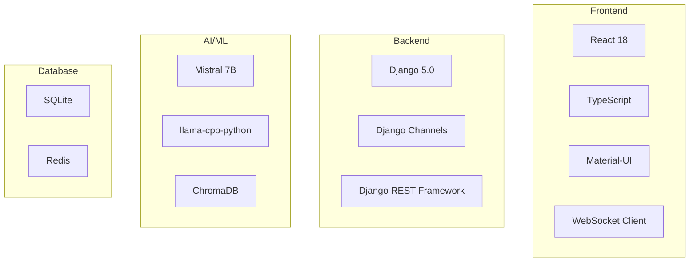

## 🏗️ 전체 시스템 아키텍처

### 시스템 구성도
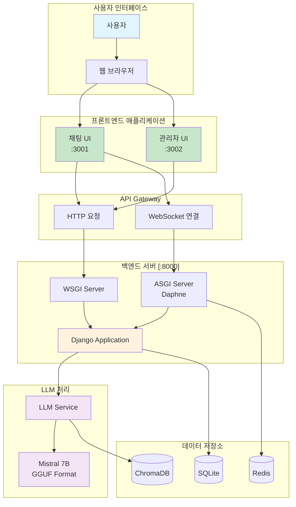

### 레이어별 책임

| 레이어 | 구성 요소 | 책임 |
|--------|-----------|------|
| **Presentation** | React UI | 사용자 인터페이스, 입력 처리, 결과 표시 |
| **API Gateway** | HTTP/WebSocket | 요청 라우팅, 프로토콜 변환 |
| **Application** | Django | 비즈니스 로직, 인증, 세션 관리 |
| **Service** | LLM Service | AI 모델 실행, 텍스트 생성 |
| **Data** | DB/Cache | 데이터 영속성, 캐싱 |

## 🤖 LLM 통합 구조

### LLM 실행 플로우
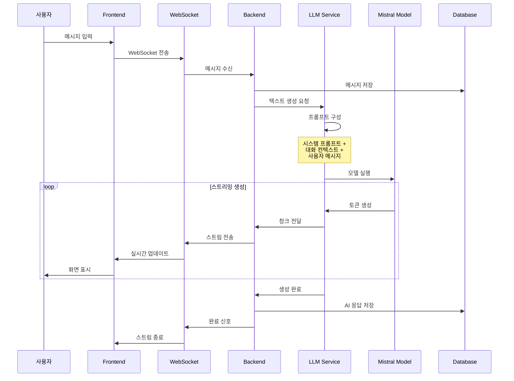

### LLM 서비스 구조
```python
# backend/llm/llm_service.py 구조

class LLMService:
    """LLM 통합 서비스"""
    
    def __init__(self):
        # 1. 모델 로드
        self.model = self._load_model()
        
        # 2. 설정 초기화
        self.config = {
            'max_tokens': 512,
            'temperature': 0.7,
            'context_length': 4096
        }
        
        # 3. 프롬프트 템플릿
        self.templates = PromptTemplates()
    
    def _load_model(self):
        """Mistral 7B 모델 로드"""
        return Llama(
            model_path="models/mistral-7b.gguf",
            n_ctx=4096,        # 컨텍스트 크기
            n_gpu_layers=32,   # GPU 레이어
            n_threads=8        # CPU 스레드
        )
    
    async def generate_stream(self, prompt, context):
        """스트리밍 텍스트 생성"""
        # 1. 프롬프트 구성
        full_prompt = self.templates.build(prompt, context)
        
        # 2. 토큰 수 확인
        if self.count_tokens(full_prompt) > 3500:
            context = self.truncate_context(context)
            full_prompt = self.templates.build(prompt, context)
        
        # 3. 스트리밍 생성
        for token in self.model(full_prompt, stream=True):
            yield token['choices'][0]['text']
```

### 모델 최적화 전략
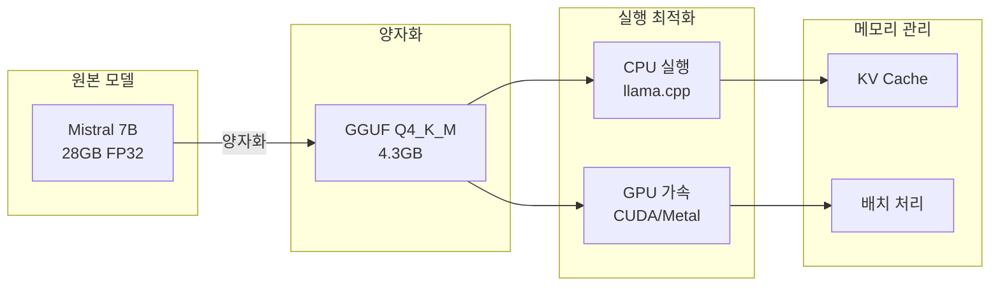

## 🔧 백엔드 구조

### Django 애플리케이션 구조
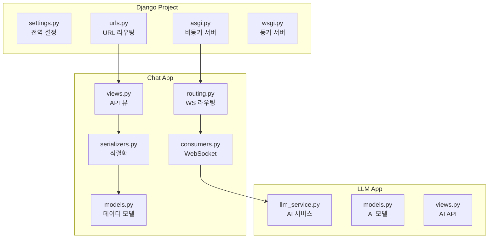

### API 엔드포인트 구조
```python
# backend/chat_project/urls.py

urlpatterns = [
    # 인증 API
    path('api/auth/register/', RegisterView.as_view()),
    path('api/auth/login/', LoginView.as_view()),
    path('api/auth/logout/', LogoutView.as_view()),
    
    # 채팅 세션 API
    path('api/sessions/', ChatSessionViewSet.as_view({
        'get': 'list',      # 세션 목록
        'post': 'create'    # 새 세션
    })),
    path('api/sessions/<int:pk>/', ChatSessionViewSet.as_view({
        'get': 'retrieve',   # 세션 상세
        'put': 'update',     # 세션 수정
        'delete': 'destroy'  # 세션 삭제
    })),
    
    # 메시지 API
    path('api/sessions/<int:session_id>/messages/', MessageViewSet.as_view({
        'get': 'list',      # 메시지 목록
        'post': 'create'    # 메시지 전송
    })),
    
    # LLM API
    path('api/llm/generate/', LLMGenerateView.as_view()),
    path('api/llm/models/', LLMModelsView.as_view()),
]

# WebSocket 라우팅
websocket_urlpatterns = [
    path('ws/chat/<int:session_id>/', ChatConsumer.as_asgi()),
]
```

### 데이터 모델 관계
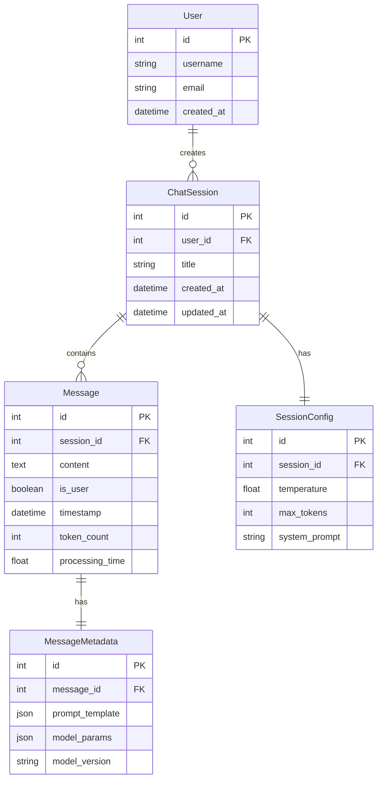

## 💻 프론트엔드 구조

### React 컴포넌트 계층
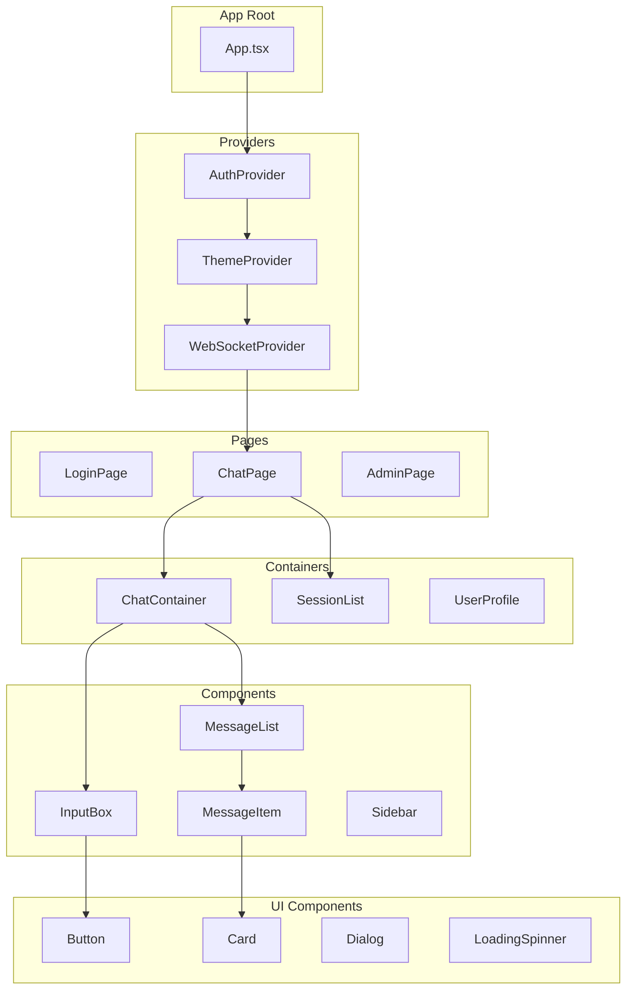

### 상태 관리 구조
```typescript
// frontend-chat/src/store/structure.ts

interface AppState {
    // 인증 상태
    auth: {
        user: User | null;
        token: string | null;
        isAuthenticated: boolean;
    };
    
    // 채팅 상태
    chat: {
        sessions: ChatSession[];
        currentSession: ChatSession | null;
        messages: Map<number, Message[]>;
        isLoading: boolean;
    };
    
    // WebSocket 상태
    websocket: {
        connection: WebSocket | null;
        status: 'connecting' | 'connected' | 'disconnected';
        reconnectAttempts: number;
    };
    
    // UI 상태
    ui: {
        theme: 'light' | 'dark';
        sidebarOpen: boolean;
        notifications: Notification[];
    };
}
```

### 서비스 레이어
```typescript
// frontend-chat/src/services/structure.ts

class APIService {
    // HTTP 통신
    async get<T>(url: string): Promise<T>
    async post<T>(url: string, data: any): Promise<T>
    async put<T>(url: string, data: any): Promise<T>
    async delete(url: string): Promise<void>
}

class WebSocketService {
    // WebSocket 통신
    connect(sessionId: number): void
    disconnect(): void
    send(message: any): void
    on(event: string, callback: Function): void
    off(event: string, callback: Function): void
}

class ChatService {
    // 채팅 비즈니스 로직
    async createSession(title: string): Promise<ChatSession>
    async loadSessions(): Promise<ChatSession[]>
    async sendMessage(content: string): Promise<void>
    subscribeToMessages(callback: Function): void
}
```

## 🔄 통신 플로우

### HTTP 통신 플로우
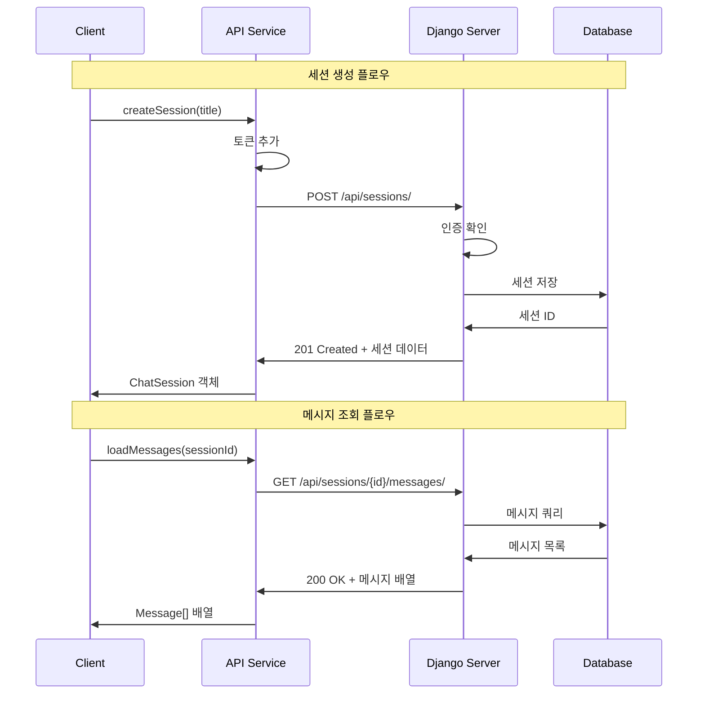

### WebSocket 통신 플로우
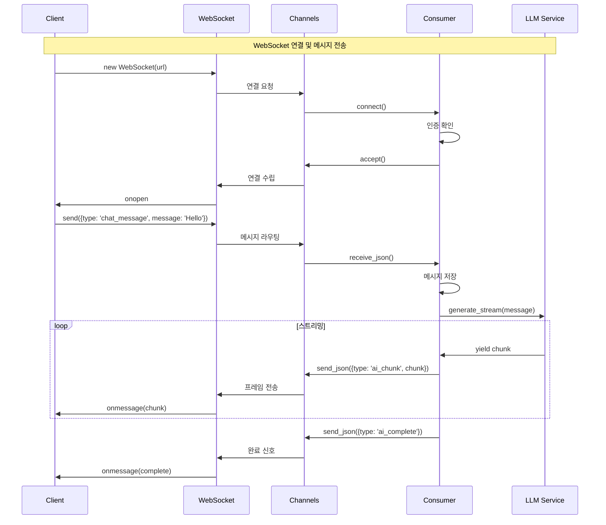

### 에러 처리 플로우
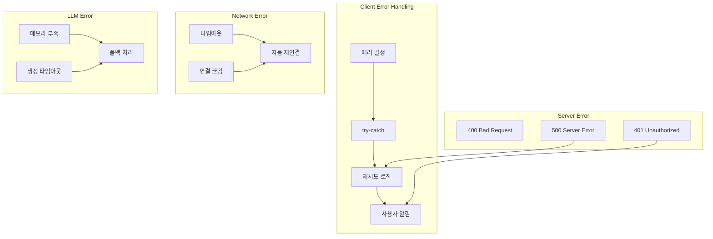

## 🎨 핵심 기능

### 1. 실시간 채팅
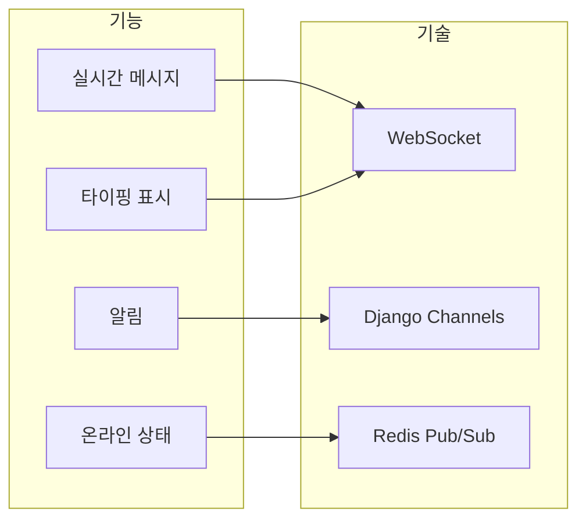

### 2. AI 응답 생성
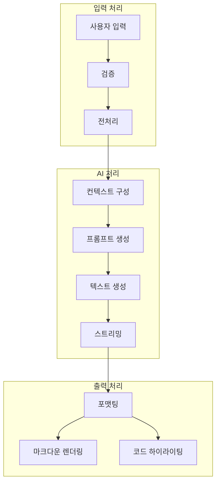

### 3. 세션 관리
```typescript
// 세션 관리 기능
interface SessionManager {
    // 세션 생성/삭제
    createSession(title: string): Promise<Session>
    deleteSession(id: number): Promise<void>
    
    // 세션 전환
    switchSession(id: number): void
    getCurrentSession(): Session | null
    
    // 세션 내보내기/가져오기
    exportSession(id: number): Promise<ExportData>
    importSession(data: ExportData): Promise<Session>
    
    // 세션 검색
    searchSessions(query: string): Session[]
    getRecentSessions(limit: number): Session[]
}
```

### 4. 사용자 관리
```python
# 사용자 관리 기능
class UserManager:
    def register(self, username: str, email: str) -> User
    def login(self, username: str) -> AuthToken
    def logout(self, token: str) -> None
    
    # 프로필 관리
    def get_profile(self, user_id: int) -> UserProfile
    def update_profile(self, user_id: int, data: dict) -> UserProfile
    
    # 사용 통계
    def get_usage_stats(self, user_id: int) -> UsageStats
    def get_message_history(self, user_id: int) -> List[Message]
```

## 📊 성능 최적화

### 백엔드 최적화
```python
# 1. 데이터베이스 쿼리 최적화
sessions = ChatSession.objects.select_related('user') \
                              .prefetch_related('messages') \
                              .filter(user=request.user)

# 2. 캐싱 전략
from django.core.cache import cache

def get_session_with_cache(session_id):
    cache_key = f'session_{session_id}'
    session = cache.get(cache_key)
    
    if session is None:
        session = ChatSession.objects.get(id=session_id)
        cache.set(cache_key, session, 300)  # 5분 캐싱
    
    return session

# 3. 비동기 처리
async def process_message_async(message):
    # 비동기 DB 쿼리
    session = await ChatSession.objects.aget(id=message.session_id)
    
    # 비동기 LLM 처리
    async for chunk in llm_service.generate_async(message.content):
        await send_to_client(chunk)
```

### 프론트엔드 최적화
```typescript
// 1. React 메모이제이션
const MessageList = React.memo(({ messages }) => {
    return messages.map(msg => <MessageItem key={msg.id} {...msg} />)
}, (prev, next) => prev.messages.length === next.messages.length);

// 2. 가상 스크롤링
import { FixedSizeList } from 'react-window';

const VirtualMessageList = ({ messages }) => (
    <FixedSizeList
        height={600}
        itemCount={messages.length}
        itemSize={80}
        width="100%"
    >
        {({ index, style }) => (
            <div style={style}>
                <MessageItem {...messages[index]} />
            </div>
        )}
    </FixedSizeList>
);

// 3. 디바운싱
const debouncedSearch = useMemo(
    () => debounce((query: string) => {
        searchSessions(query);
    }, 300),
    []
);
```

### LLM 최적화
```python
# 1. 모델 캐싱
class ModelCache:
    _instance = None
    _model = None
    
    def __new__(cls):
        if cls._instance is None:
            cls._instance = super().__new__(cls)
            cls._instance._model = Llama(model_path="model.gguf")
        return cls._instance

# 2. 배치 처리
def batch_generate(prompts: List[str]):
    results = []
    for batch in chunks(prompts, batch_size=4):
        batch_results = model.generate_batch(batch)
        results.extend(batch_results)
    return results

# 3. KV 캐시 관리
model = Llama(
    model_path="model.gguf",
    n_ctx=4096,
    use_mmap=True,      # 메모리 매핑
    use_mlock=True,     # 메모리 고정
    n_batch=512,        # 배치 크기
    n_threads=8         # 병렬 처리
)
```

## 🔒 보안 고려사항

### 인증 및 권한
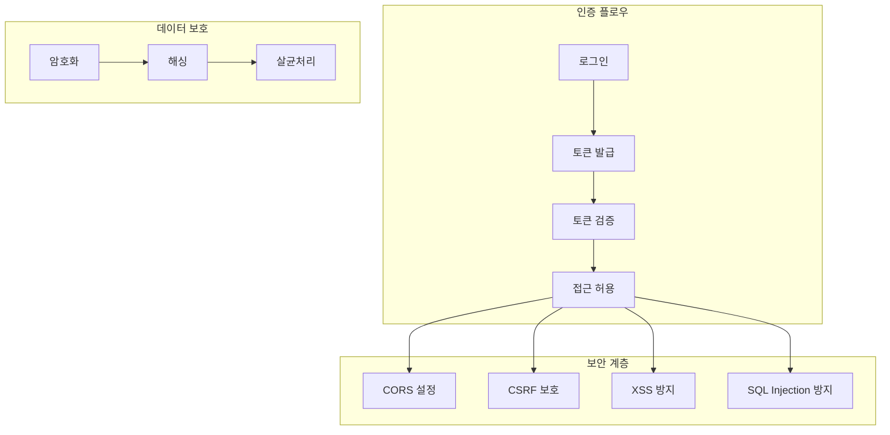

## 📚 참고 자료

### 프로젝트 문서
- [웹 개발 기초](./01-웹개발-기초개념.md)
- [네트워크와 통신](./02-네트워크와-통신-기초.md)
- [프로젝트 구조 심화](./08-프로젝트-구조-심화.md)
- [LLM 로컬 실행](./10-LLM-로컬실행-상세.md)

### 외부 참고 자료
- [Django 공식 문서](https://docs.djangoproject.com/)
- [React 공식 문서](https://react.dev/)
- [WebSocket MDN](https://developer.mozilla.org/ko/docs/Web/API/WebSocket)
- [llama.cpp GitHub](https://github.com/ggerganov/llama.cpp)

## 🎯 핵심 정리

1. **통합 아키텍처**: LLM + 백엔드 + 프론트엔드가 유기적으로 연결
2. **실시간 통신**: WebSocket을 통한 양방향 실시간 통신
3. **로컬 AI**: 프라이버시를 보장하는 로컬 LLM 실행
4. **확장 가능**: 모듈화된 구조로 기능 추가 용이
5. **최적화**: 각 레이어별 성능 최적화 적용

---

다음: [01-웹개발-기초개념.md](./01-웹개발-기초개념.md)