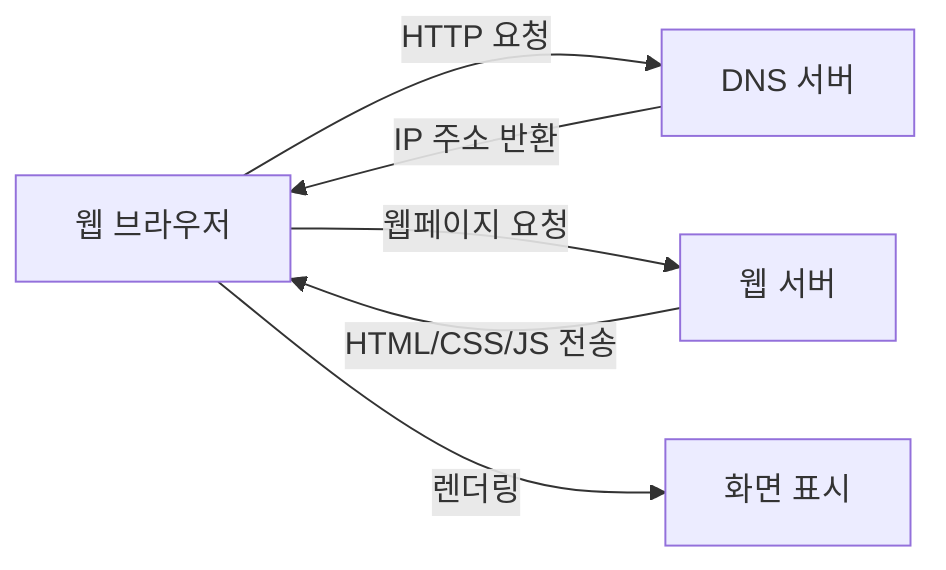
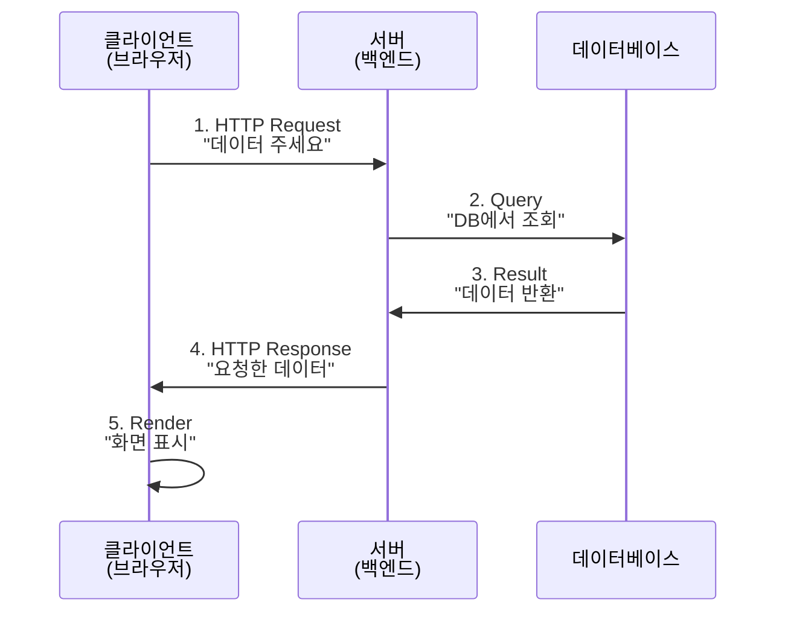
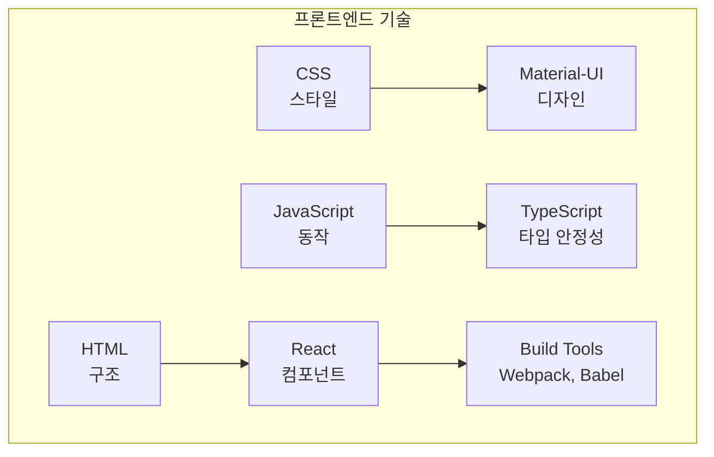
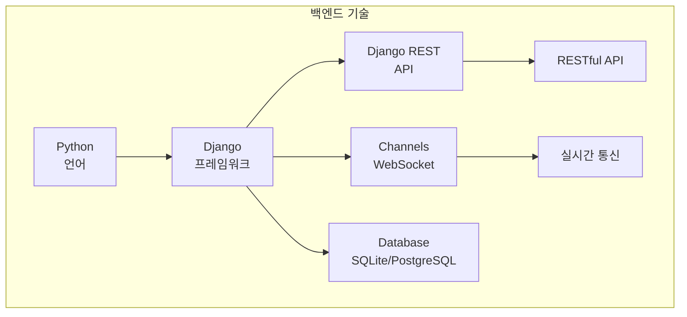
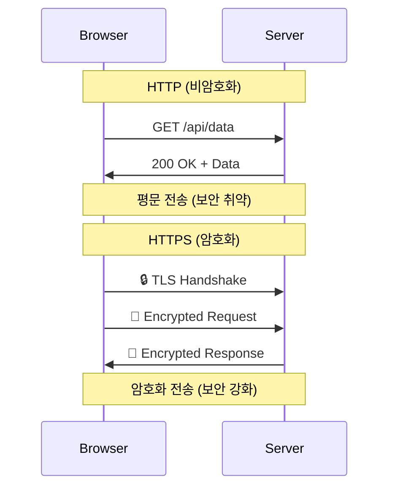
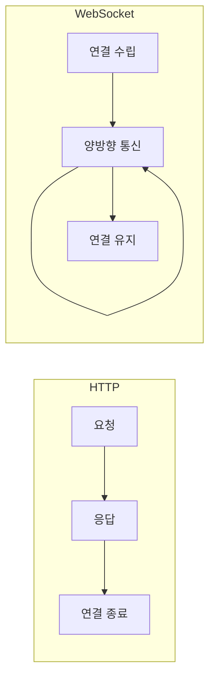
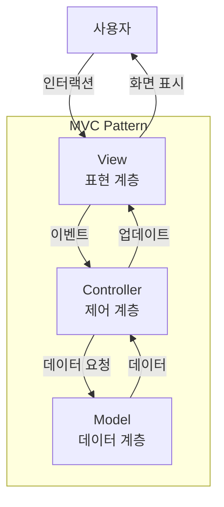

# 🌐 웹 개발 기초 개념

## 📚 목차
1. [웹의 작동 원리](#웹의-작동-원리)
2. [클라이언트-서버 아키텍처](#클라이언트-서버-아키텍처)
3. [프론트엔드 vs 백엔드](#프론트엔드-vs-백엔드)
4. [웹 표준과 프로토콜](#웹-표준과-프로토콜)
5. [웹 애플리케이션 구조](#웹-애플리케이션-구조)

---

## 🌍 웹의 작동 원리

### 인터넷과 웹의 차이
- **인터넷**: 전 세계 컴퓨터를 연결하는 네트워크 인프라
- **웹(WWW)**: 인터넷 위에서 동작하는 정보 공유 시스템

### 웹의 핵심 구성 요소


### URL 구조 분석
```
https://www.example.com:443/path/to/page?param=value#section
  │        │            │    │           │          │
  │        │            │    │           │          └─ Fragment (앵커)
  │        │            │    │           └─────────── Query String
  │        │            │    └─────────────────────── Path
  │        │            └──────────────────────────── Port
  │        └────────────────────────────────────────── Domain
  └──────────────────────────────────────────────────── Protocol
```

## 🏗️ 클라이언트-서버 아키텍처

### 기본 개념


### 요청-응답 사이클
1. **클라이언트 요청 (Request)**
   - Method: GET, POST, PUT, DELETE
   - Headers: 메타데이터
   - Body: 전송 데이터

2. **서버 처리 (Processing)**
   - 요청 검증
   - 비즈니스 로직 실행
   - 데이터베이스 조회/수정

3. **서버 응답 (Response)**
   - Status Code: 200, 404, 500 등
   - Headers: 응답 메타데이터
   - Body: 응답 데이터

### 프로젝트에서의 구현
```python
# backend/chat/views.py - 서버 측 처리
from rest_framework.decorators import api_view
from rest_framework.response import Response

@api_view(['GET'])
def get_sessions(request):
    """클라이언트 요청 처리"""
    # 1. 요청 검증
    user = request.user
    
    # 2. 데이터 조회
    sessions = ChatSession.objects.filter(user=user)
    
    # 3. 응답 반환
    return Response({
        'sessions': SessionSerializer(sessions, many=True).data
    })
```

```typescript
// frontend-chat/src/services/api.ts - 클라이언트 측 요청
export const fetchSessions = async () => {
    // 1. 서버에 요청
    const response = await fetch('/api/sessions/', {
        method: 'GET',
        headers: {
            'Authorization': `Token ${getToken()}`
        }
    });
    
    // 2. 응답 처리
    const data = await response.json();
    return data.sessions;
};
```

## 💻 프론트엔드 vs 백엔드

### 역할 비교
| 구분 | 프론트엔드 | 백엔드 |
|------|-----------|--------|
| **역할** | 사용자 인터페이스 | 서버 로직 처리 |
| **언어** | HTML, CSS, JavaScript | Python, Java, Node.js |
| **프레임워크** | React, Vue, Angular | Django, Spring, Express |
| **실행 위치** | 브라우저 | 서버 |
| **주요 관심사** | UX/UI, 반응성 | 성능, 보안, 데이터 |

### 프론트엔드 기술 스택


### 백엔드 기술 스택


## 🔧 웹 표준과 프로토콜

### HTTP/HTTPS


### REST API 원칙
1. **Stateless**: 각 요청은 독립적
2. **Resource-based**: URL로 자원 표현
3. **HTTP Methods**: 동작을 메서드로 표현
4. **JSON**: 데이터 교환 형식

```javascript
// RESTful API 예시
GET    /api/sessions/      // 목록 조회
POST   /api/sessions/      // 새로 생성
GET    /api/sessions/1/    // 특정 항목 조회
PUT    /api/sessions/1/    // 전체 수정
PATCH  /api/sessions/1/    // 부분 수정
DELETE /api/sessions/1/    // 삭제
```

### WebSocket


## 🏛️ 웹 애플리케이션 구조

### MVC 패턴


### 프로젝트의 계층 구조
```
프론트엔드 (React)
├── Components (View)
│   └── 화면 구성 요소
├── Services (Controller)
│   └── API 통신, 비즈니스 로직
└── Context/State (Model)
    └── 상태 관리

백엔드 (Django)
├── Views (Controller)
│   └── 요청 처리, 응답 생성
├── Models (Model)
│   └── 데이터 구조, DB 스키마
└── Templates/Serializers (View)
    └── 데이터 표현
```

### SPA vs MPA
| 특징 | SPA (Single Page App) | MPA (Multi Page App) |
|------|----------------------|---------------------|
| **페이지 로딩** | 초기 한 번만 | 매번 새로 로딩 |
| **라우팅** | 클라이언트 | 서버 |
| **성능** | 빠른 전환 | 페이지마다 로딩 |
| **SEO** | 어려움 | 유리함 |
| **예시** | Gmail, Facebook | Amazon, Wikipedia |

### 컴포넌트 기반 아키텍처
```typescript
// React 컴포넌트 예시
interface ChatMessageProps {
    message: string;
    sender: 'user' | 'ai';
    timestamp: Date;
}

// 재사용 가능한 컴포넌트
const ChatMessage: React.FC<ChatMessageProps> = ({ 
    message, 
    sender, 
    timestamp 
}) => {
    return (
        <div className={`message ${sender}`}>
            <div className="avatar">
                {sender === 'user' ? '👤' : '🤖'}
            </div>
            <div className="content">{message}</div>
            <div className="time">
                {timestamp.toLocaleTimeString()}
            </div>
        </div>
    );
};

// 컴포넌트 조합
const ChatWindow: React.FC = () => {
    const [messages, setMessages] = useState<Message[]>([]);
    
    return (
        <div className="chat-window">
            {messages.map((msg, idx) => (
                <ChatMessage 
                    key={idx}
                    message={msg.content}
                    sender={msg.isUser ? 'user' : 'ai'}
                    timestamp={msg.timestamp}
                />
            ))}
        </div>
    );
};
```

## 🔍 개발자 도구 활용

### 브라우저 개발자 도구
1. **Elements/Inspector**: HTML/CSS 검사
2. **Console**: JavaScript 디버깅
3. **Network**: HTTP 요청/응답 모니터링
4. **Application**: 로컬 스토리지, 쿠키
5. **Performance**: 성능 분석

### 네트워크 탭 분석
```
Name     Status  Type       Size    Time
─────────────────────────────────────────
/api/    200     xhr        1.2kb   45ms
app.js   200     script     245kb   120ms
app.css  200     stylesheet 45kb    35ms
logo.png 200     image      12kb    25ms
```

## 📊 성능 최적화 기초

### 프론트엔드 최적화
```javascript
// 1. 코드 스플리팅
const LazyComponent = React.lazy(() => import('./HeavyComponent'));

// 2. 메모이제이션
const MemoizedComponent = React.memo(ExpensiveComponent);

// 3. 디바운싱
const debouncedSearch = debounce(searchAPI, 300);
```

### 백엔드 최적화
```python
# 1. 쿼리 최적화
sessions = ChatSession.objects.select_related('user').prefetch_related('messages')

# 2. 캐싱
from django.core.cache import cache
def get_cached_data(key):
    data = cache.get(key)
    if not data:
        data = expensive_operation()
        cache.set(key, data, 3600)
    return data

# 3. 페이지네이션
from rest_framework.pagination import PageNumberPagination
class StandardPagination(PageNumberPagination):
    page_size = 20
```

## 📚 참고 자료

### 웹 기초
- [MDN Web Docs - 웹 입문](https://developer.mozilla.org/ko/docs/Learn/Getting_started_with_the_web)
- [W3Schools - Web Development](https://www.w3schools.com/)
- [웹 프로그래밍 튜토리얼](https://poiemaweb.com/)

### HTTP/HTTPS
- [HTTP 완벽 가이드](https://developer.mozilla.org/ko/docs/Web/HTTP)
- [HTTPS는 어떻게 동작하는가](https://howhttps.works/ko/)
- [REST API 튜토리얼](https://restfulapi.net/)

### 프론트엔드
- [프론트엔드 개발자 로드맵](https://roadmap.sh/frontend)
- [React 공식 문서](https://ko.react.dev/)
- [JavaScript.info](https://ko.javascript.info/)

### 백엔드
- [백엔드 개발자 로드맵](https://roadmap.sh/backend)
- [Django 공식 튜토리얼](https://docs.djangoproject.com/ko/5.0/intro/)
- [The Twelve-Factor App](https://12factor.net/ko/)

### 아키텍처
- [마틴 파울러의 아키텍처 패턴](https://martinfowler.com/architecture/)
- [System Design Primer](https://github.com/donnemartin/system-design-primer)
- [웹 아키텍처 101](https://medium.com/storyblocks-engineering/web-architecture-101-a3224e126947)

## 🎯 핵심 정리

1. **웹은 클라이언트-서버 모델**로 동작합니다
2. **HTTP/HTTPS**는 웹의 기본 통신 프로토콜입니다
3. **프론트엔드**는 사용자 인터페이스, **백엔드**는 서버 로직을 담당합니다
4. **REST API**는 프론트엔드와 백엔드를 연결하는 표준 방식입니다
5. **컴포넌트 기반 개발**로 재사용성과 유지보수성을 높입니다

---

다음: [02-네트워크와-통신-기초.md](./02-네트워크와-통신-기초.md)