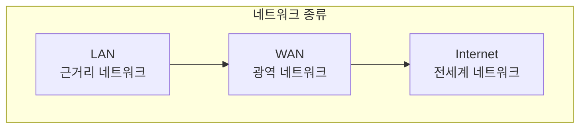
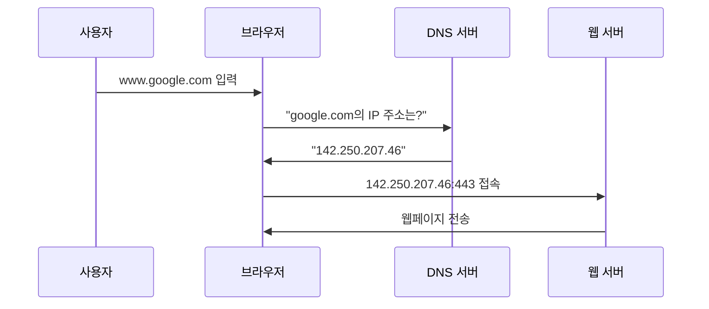
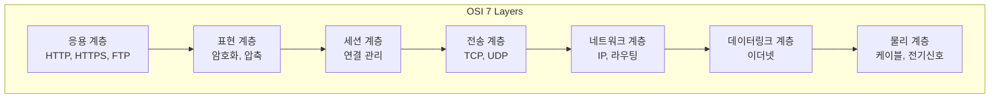
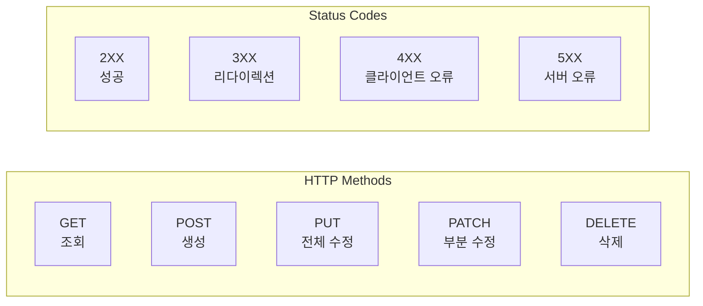
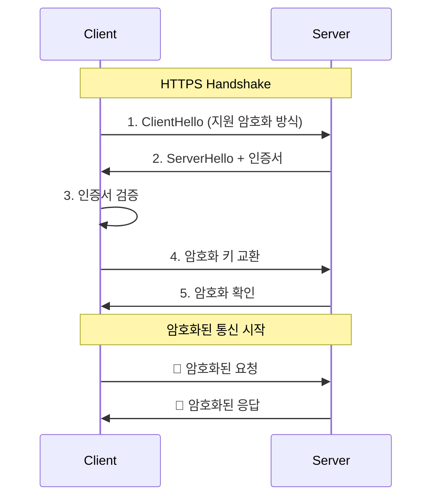
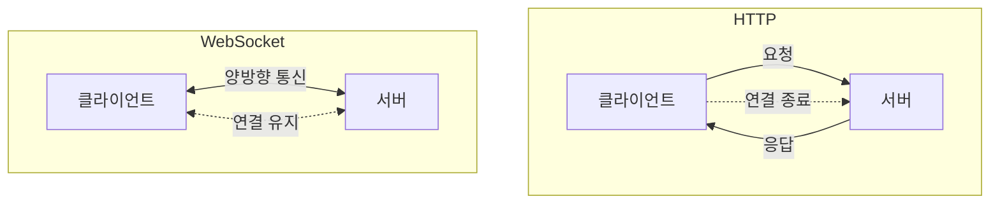
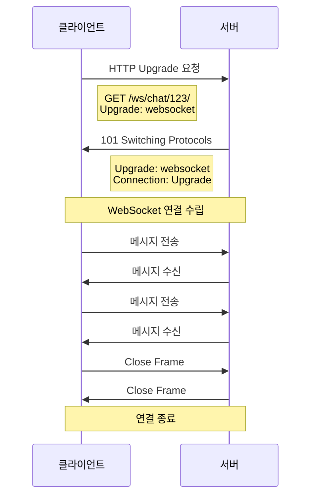
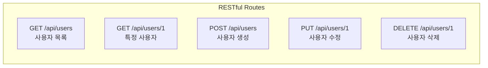

# 🌐 네트워크와 통신 기초

## 📚 목차
1. [네트워크 기본 개념](#네트워크-기본-개념)
2. [OSI 7계층과 TCP/IP](#osi-7계층과-tcpip)
3. [HTTP/HTTPS 프로토콜](#httphttps-프로토콜)
4. [WebSocket 실시간 통신](#websocket-실시간-통신)
5. [API 통신 패턴](#api-통신-패턴)

---

## 🔌 네트워크 기본 개념

### 네트워크란?
컴퓨터들이 서로 데이터를 주고받을 수 있도록 연결된 시스템



### IP 주소와 포트
```
IP 주소: 192.168.1.100  (컴퓨터의 주소)
포트: 8000              (프로그램의 문)

전체 주소: 192.168.1.100:8000
```

### DNS (Domain Name System)


## 📊 OSI 7계층과 TCP/IP

### OSI 7계층 모델


### TCP vs UDP
| 특징 | TCP | UDP |
|------|-----|-----|
| **연결** | 연결 지향 | 비연결 |
| **신뢰성** | 높음 (재전송) | 낮음 |
| **속도** | 느림 | 빠름 |
| **순서** | 보장 | 보장 안됨 |
| **용도** | 웹, 이메일 | 스트리밍, 게임 |

### 프로젝트에서의 활용
```python
# TCP 소켓 (Django 서버)
# backend/chat_project/settings.py
ALLOWED_HOSTS = ['localhost', '127.0.0.1']  # TCP 연결 허용 호스트

# WebSocket 연결 (TCP 기반)
# backend/chat/consumers.py
class ChatConsumer(AsyncWebsocketConsumer):
    async def connect(self):
        # TCP 연결 수립
        await self.accept()
```

## 🔒 HTTP/HTTPS 프로토콜

### HTTP 요청/응답 구조
```
[HTTP 요청]
POST /api/sessions/ HTTP/1.1
Host: localhost:8000
Content-Type: application/json
Authorization: Token abc123

{
    "title": "새 대화"
}

[HTTP 응답]
HTTP/1.1 201 Created
Content-Type: application/json

{
    "id": 1,
    "title": "새 대화",
    "created_at": "2024-01-01T12:00:00Z"
}
```

### HTTP 메서드와 상태 코드


### HTTPS 암호화 과정


### 프로젝트 HTTP 통신 예제
```typescript
// frontend-chat/src/services/api.ts
class APIService {
    private baseURL = 'http://localhost:8000/api';
    
    // GET 요청
    async getSessions(): Promise<Session[]> {
        const response = await fetch(`${this.baseURL}/sessions/`, {
            method: 'GET',
            headers: {
                'Authorization': `Token ${this.getToken()}`
            }
        });
        
        if (!response.ok) {
            throw new Error(`HTTP ${response.status}`);
        }
        
        return response.json();
    }
    
    // POST 요청
    async createSession(title: string): Promise<Session> {
        const response = await fetch(`${this.baseURL}/sessions/`, {
            method: 'POST',
            headers: {
                'Content-Type': 'application/json',
                'Authorization': `Token ${this.getToken()}`
            },
            body: JSON.stringify({ title })
        });
        
        return response.json();
    }
}
```

## 🔄 WebSocket 실시간 통신

### WebSocket vs HTTP


### WebSocket 연결 과정


### 프로젝트 WebSocket 구현
```python
# backend/chat/consumers.py
import json
from channels.generic.websocket import AsyncWebsocketConsumer

class ChatConsumer(AsyncWebsocketConsumer):
    async def connect(self):
        """WebSocket 연결 수립"""
        self.room_name = self.scope['url_route']['kwargs']['room_name']
        self.room_group_name = f'chat_{self.room_name}'
        
        # 그룹에 참가
        await self.channel_layer.group_add(
            self.room_group_name,
            self.channel_name
        )
        
        await self.accept()
    
    async def receive(self, text_data):
        """메시지 수신"""
        data = json.loads(text_data)
        message = data['message']
        
        # 그룹 전체에 메시지 브로드캐스트
        await self.channel_layer.group_send(
            self.room_group_name,
            {
                'type': 'chat_message',
                'message': message
            }
        )
    
    async def chat_message(self, event):
        """그룹 메시지 전송"""
        await self.send(text_data=json.dumps({
            'message': event['message']
        }))
```

```typescript
// frontend-chat/src/services/websocket.ts
class WebSocketService {
    private socket: WebSocket | null = null;
    
    connect(sessionId: string) {
        const wsUrl = `ws://localhost:8000/ws/chat/${sessionId}/`;
        this.socket = new WebSocket(wsUrl);
        
        this.socket.onopen = () => {
            console.log('WebSocket 연결됨');
        };
        
        this.socket.onmessage = (event) => {
            const data = JSON.parse(event.data);
            this.handleMessage(data);
        };
        
        this.socket.onerror = (error) => {
            console.error('WebSocket 오류:', error);
        };
        
        this.socket.onclose = () => {
            console.log('WebSocket 연결 종료');
            // 재연결 로직
            setTimeout(() => this.connect(sessionId), 3000);
        };
    }
    
    send(message: string) {
        if (this.socket?.readyState === WebSocket.OPEN) {
            this.socket.send(JSON.stringify({ message }));
        }
    }
}
```

## 📡 API 통신 패턴

### REST API


### GraphQL vs REST
| 특징 | REST | GraphQL |
|------|------|---------|
| **엔드포인트** | 여러 개 | 단일 |
| **데이터 가져오기** | 고정된 구조 | 필요한 것만 |
| **Over-fetching** | 있음 | 없음 |
| **Under-fetching** | 있음 | 없음 |

### CORS (Cross-Origin Resource Sharing)
```python
# backend/chat_project/settings.py
# CORS 설정 - 다른 도메인에서의 API 호출 허용
CORS_ALLOWED_ORIGINS = [
    "http://localhost:3000",
    "http://localhost:3001",
    "http://localhost:3002",
]

CORS_ALLOW_CREDENTIALS = True  # 쿠키 포함 허용
CORS_ALLOW_HEADERS = [
    'accept',
    'accept-encoding',
    'authorization',
    'content-type',
    'dnt',
    'origin',
    'user-agent',
    'x-csrftoken',
    'x-requested-with',
]
```

### API Rate Limiting
```python
# API 호출 제한 구현
from django.core.cache import cache
from django.http import JsonResponse
import time

def rate_limit(max_requests=100, window=3600):
    def decorator(view_func):
        def wrapped(request, *args, **kwargs):
            # IP 기반 제한
            ip = request.META.get('REMOTE_ADDR')
            key = f'rate_limit:{ip}'
            
            # 현재 요청 수 확인
            requests = cache.get(key, [])
            now = time.time()
            
            # 시간 윈도우 내의 요청만 유지
            requests = [req for req in requests if req > now - window]
            
            if len(requests) >= max_requests:
                return JsonResponse({'error': 'Rate limit exceeded'}, status=429)
            
            # 새 요청 추가
            requests.append(now)
            cache.set(key, requests, window)
            
            return view_func(request, *args, **kwargs)
        return wrapped
    return decorator
```

## 🔍 네트워크 디버깅

### 브라우저 개발자 도구
```
Network 탭에서 확인할 수 있는 정보:
- Request URL
- Request Method
- Status Code
- Response Headers
- Request Headers
- Response Body
- Timing (DNS, 연결, 응답 시간)
```

### cURL 명령어
```bash
# GET 요청
curl -X GET http://localhost:8000/api/sessions/ \
     -H "Authorization: Token abc123"

# POST 요청
curl -X POST http://localhost:8000/api/sessions/ \
     -H "Content-Type: application/json" \
     -H "Authorization: Token abc123" \
     -d '{"title": "새 세션"}'

# WebSocket 테스트
curl -i -N \
     -H "Connection: Upgrade" \
     -H "Upgrade: websocket" \
     -H "Sec-WebSocket-Version: 13" \
     -H "Sec-WebSocket-Key: dGhlIHNhbXBsZSBub25jZQ==" \
     http://localhost:8000/ws/chat/123/
```

### 네트워크 성능 최적화
```typescript
// 1. HTTP/2 활용
// 여러 요청을 동시에 처리

// 2. 요청 배치
async function batchRequests() {
    const [sessions, users, messages] = await Promise.all([
        fetch('/api/sessions/'),
        fetch('/api/users/'),
        fetch('/api/messages/')
    ]);
}

// 3. 캐싱 활용
const cachedFetch = async (url: string) => {
    const cached = localStorage.getItem(url);
    if (cached) {
        const { data, timestamp } = JSON.parse(cached);
        if (Date.now() - timestamp < 60000) {  // 1분 캐시
            return data;
        }
    }
    
    const response = await fetch(url);
    const data = await response.json();
    
    localStorage.setItem(url, JSON.stringify({
        data,
        timestamp: Date.now()
    }));
    
    return data;
};
```

## 📚 참고 자료

### 네트워크 기초
- [네트워크 기초 이론](https://www.cloudflare.com/ko-kr/learning/network-layer/what-is-the-network-layer/)
- [TCP/IP 완벽 가이드](https://www.tcpipguide.com/)
- [컴퓨터 네트워크 강의](https://www.youtube.com/playlist?list=PL0d8NnikouEWcF1jJueLdjRIC4HsUlULi)

### HTTP/HTTPS
- [MDN - HTTP 개요](https://developer.mozilla.org/ko/docs/Web/HTTP/Overview)
- [HTTPS는 어떻게 동작하는가?](https://howhttps.works/ko/)
- [HTTP/2 소개](https://developers.google.com/web/fundamentals/performance/http2?hl=ko)

### WebSocket
- [MDN - WebSocket API](https://developer.mozilla.org/ko/docs/Web/API/WebSocket)
- [WebSocket 프로토콜 RFC 6455](https://datatracker.ietf.org/doc/html/rfc6455)
- [Socket.IO 문서](https://socket.io/docs/v4/)

### API 설계
- [RESTful API 설계 가이드](https://restfulapi.net/)
- [GraphQL 공식 문서](https://graphql.org/learn/)
- [API 설계 모범 사례](https://swagger.io/resources/articles/best-practices-in-api-design/)

### 네트워크 도구
- [Postman 사용법](https://learning.postman.com/docs/getting-started/introduction/)
- [Wireshark 튜토리얼](https://www.wireshark.org/docs/wsug_html/)
- [Chrome DevTools Network](https://developer.chrome.com/docs/devtools/network/)

## 🎯 핵심 정리

1. **네트워크**는 OSI 7계층 모델로 구조화됩니다
2. **HTTP/HTTPS**는 웹의 기본 통신 프로토콜입니다
3. **WebSocket**은 실시간 양방향 통신을 제공합니다
4. **REST API**는 리소스 기반 아키텍처 스타일입니다
5. **CORS**는 다른 도메인 간 리소스 공유를 제어합니다

---

다음: [03-데이터베이스-기초.md](./03-데이터베이스-기초.md)