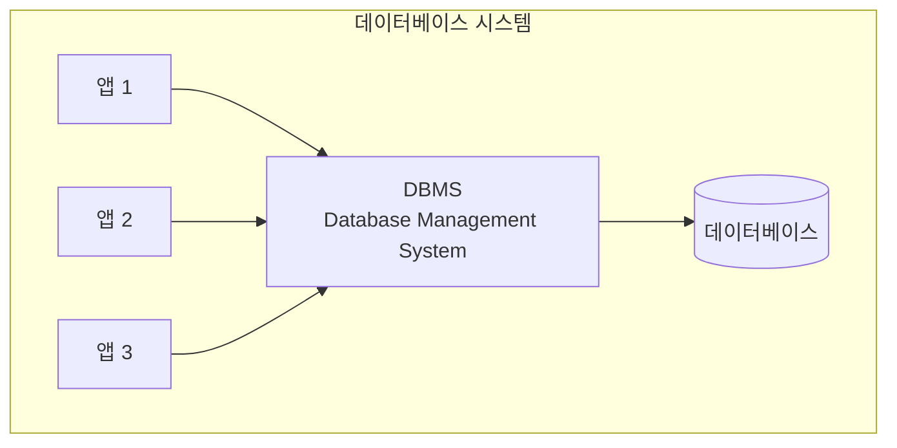
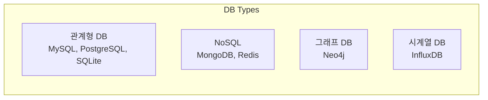
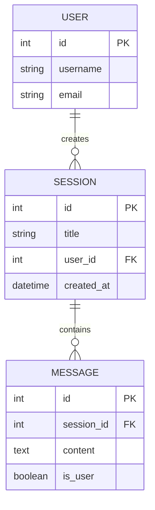
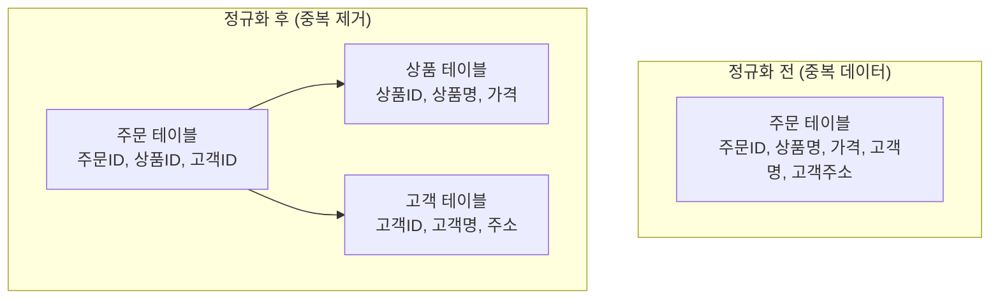
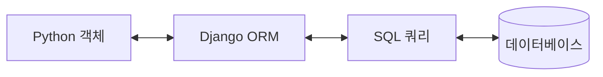
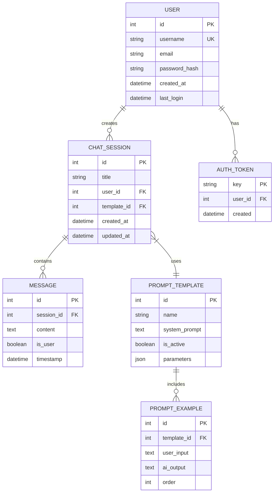

# 💾 데이터베이스 기초

## 📚 목차
1. [데이터베이스 개념](#데이터베이스-개념)
2. [관계형 데이터베이스](#관계형-데이터베이스)
3. [SQL 기초](#sql-기초)
4. [Django ORM](#django-orm)
5. [데이터베이스 설계](#데이터베이스-설계)

---

## 🗄️ 데이터베이스 개념

### 데이터베이스란?
체계적으로 구조화된 데이터의 집합으로, 여러 사용자가 공유하고 접근할 수 있는 저장소



### 데이터베이스 종류


### ACID 특성
| 특성 | 설명 | 예시 |
|------|------|------|
| **Atomicity** | 원자성 - 전부 성공 또는 전부 실패 | 송금: 출금과 입금이 모두 성공해야 함 |
| **Consistency** | 일관성 - 규칙 유지 | 잔액은 항상 0 이상이어야 함 |
| **Isolation** | 격리성 - 동시 처리 시 독립성 | 두 사용자가 동시에 수정해도 안전 |
| **Durability** | 지속성 - 영구 저장 | 시스템 재시작해도 데이터 유지 |

## 📊 관계형 데이터베이스

### 테이블 구조
```
┌─────────────────────────────────────┐
│           users 테이블               │
├────┬──────────┬──────────┬──────────┤
│ id │ username │  email   │ created  │
├────┼──────────┼──────────┼──────────┤
│ 1  │  alice   │ a@ex.com │ 2024-01  │
│ 2  │  bob     │ b@ex.com │ 2024-02  │
└────┴──────────┴──────────┴──────────┘
```

### 관계 (Relationships)


### 정규화 (Normalization)


### 프로젝트 데이터베이스 스키마
```python
# backend/chat/models.py
from django.db import models
from django.contrib.auth.models import User

class ChatSession(models.Model):
    """채팅 세션 테이블"""
    title = models.CharField(max_length=200)
    user = models.ForeignKey(User, on_delete=models.CASCADE)
    created_at = models.DateTimeField(auto_now_add=True)
    updated_at = models.DateTimeField(auto_now=True)
    
    class Meta:
        db_table = 'chat_sessions'  # 실제 테이블명
        ordering = ['-created_at']  # 정렬 기준

class Message(models.Model):
    """메시지 테이블"""
    session = models.ForeignKey(
        ChatSession, 
        on_delete=models.CASCADE,
        related_name='messages'  # 역참조 이름
    )
    content = models.TextField()
    is_user = models.BooleanField(default=True)
    timestamp = models.DateTimeField(auto_now_add=True)
    
    class Meta:
        db_table = 'messages'
        indexes = [
            models.Index(fields=['session', 'timestamp']),
        ]
```

## 📝 SQL 기초

### 기본 SQL 명령어
```sql
-- 1. CREATE: 테이블 생성
CREATE TABLE users (
    id INTEGER PRIMARY KEY AUTOINCREMENT,
    username VARCHAR(100) UNIQUE NOT NULL,
    email VARCHAR(255) NOT NULL,
    created_at TIMESTAMP DEFAULT CURRENT_TIMESTAMP
);

-- 2. INSERT: 데이터 삽입
INSERT INTO users (username, email) 
VALUES ('alice', 'alice@example.com');

-- 3. SELECT: 데이터 조회
SELECT * FROM users WHERE username = 'alice';
SELECT username, email FROM users ORDER BY created_at DESC;

-- 4. UPDATE: 데이터 수정
UPDATE users 
SET email = 'newalice@example.com' 
WHERE username = 'alice';

-- 5. DELETE: 데이터 삭제
DELETE FROM users WHERE id = 1;
```

### JOIN 연산
```sql
-- INNER JOIN: 양쪽 모두 있는 데이터
SELECT 
    s.title,
    COUNT(m.id) as message_count
FROM chat_sessions s
INNER JOIN messages m ON s.id = m.session_id
GROUP BY s.id;

-- LEFT JOIN: 왼쪽 테이블 전체 + 오른쪽 매칭
SELECT 
    u.username,
    COUNT(s.id) as session_count
FROM users u
LEFT JOIN chat_sessions s ON u.id = s.user_id
GROUP BY u.id;
```

### 집계 함수
```sql
-- 통계 쿼리
SELECT 
    COUNT(*) as total_messages,
    AVG(LENGTH(content)) as avg_length,
    MAX(timestamp) as last_message,
    MIN(timestamp) as first_message
FROM messages
WHERE session_id = 1;

-- GROUP BY와 HAVING
SELECT 
    session_id,
    COUNT(*) as msg_count
FROM messages
GROUP BY session_id
HAVING COUNT(*) > 10;
```

## 🔧 Django ORM

### ORM이란?
Object-Relational Mapping - 객체와 데이터베이스를 연결



### 기본 ORM 쿼리
```python
# 1. 생성 (CREATE)
session = ChatSession.objects.create(
    title="새 대화",
    user=request.user
)

# 2. 조회 (SELECT)
# 전체 조회
all_sessions = ChatSession.objects.all()

# 필터링
user_sessions = ChatSession.objects.filter(user=request.user)

# 단일 조회
session = ChatSession.objects.get(id=1)

# 3. 수정 (UPDATE)
session.title = "수정된 제목"
session.save()

# 또는 한번에
ChatSession.objects.filter(id=1).update(title="수정된 제목")

# 4. 삭제 (DELETE)
session.delete()
# 또는
ChatSession.objects.filter(id=1).delete()
```

### 고급 ORM 쿼리
```python
from django.db.models import Count, Q, F, Avg
from django.utils import timezone
from datetime import timedelta

# 1. 관계 쿼리
# select_related: 1:1, N:1 관계 (JOIN)
sessions = ChatSession.objects.select_related('user').all()

# prefetch_related: 1:N, N:N 관계
sessions = ChatSession.objects.prefetch_related('messages').all()

# 2. 집계 쿼리
# 메시지 개수와 함께 세션 조회
sessions = ChatSession.objects.annotate(
    message_count=Count('messages')
)

# 3. 복잡한 필터링
# Q 객체를 사용한 OR 조건
from django.db.models import Q
sessions = ChatSession.objects.filter(
    Q(title__contains='Python') | Q(title__contains='Django')
)

# 4. F 객체를 사용한 필드 비교
# 생성일과 수정일이 다른 세션
sessions = ChatSession.objects.exclude(
    created_at=F('updated_at')
)

# 5. 날짜 필터링
# 최근 7일 내 생성된 세션
recent = ChatSession.objects.filter(
    created_at__gte=timezone.now() - timedelta(days=7)
)

# 6. Raw SQL
from django.db import connection

with connection.cursor() as cursor:
    cursor.execute("""
        SELECT s.*, COUNT(m.id) as msg_count
        FROM chat_sessions s
        LEFT JOIN messages m ON s.id = m.session_id
        GROUP BY s.id
    """)
    results = cursor.fetchall()
```

### 마이그레이션
```bash
# 1. 모델 변경 감지
python manage.py makemigrations

# 2. SQL 확인
python manage.py sqlmigrate chat 0001

# 3. 마이그레이션 적용
python manage.py migrate

# 4. 마이그레이션 롤백
python manage.py migrate chat 0001
```

## 🏗️ 데이터베이스 설계

### ER 다이어그램 (Entity-Relationship)


### 인덱스 설계
```python
class Message(models.Model):
    # ... 필드 정의 ...
    
    class Meta:
        indexes = [
            # 단일 인덱스
            models.Index(fields=['session_id']),
            models.Index(fields=['timestamp']),
            
            # 복합 인덱스
            models.Index(fields=['session_id', 'timestamp']),
            
            # 조건부 인덱스 (PostgreSQL)
            models.Index(
                fields=['session_id'],
                condition=Q(is_user=True),
                name='user_messages_idx'
            ),
        ]
```

### 데이터베이스 최적화
```python
# 1. 쿼리 최적화
# 나쁜 예 - N+1 문제
sessions = ChatSession.objects.all()
for session in sessions:
    print(session.messages.count())  # 각각 쿼리 실행

# 좋은 예 - 한 번의 쿼리
sessions = ChatSession.objects.annotate(
    msg_count=Count('messages')
)
for session in sessions:
    print(session.msg_count)  # 추가 쿼리 없음

# 2. 벌크 연산
# 나쁜 예
for data in large_dataset:
    Message.objects.create(**data)

# 좋은 예
Message.objects.bulk_create([
    Message(**data) for data in large_dataset
])

# 3. 쿼리셋 캐싱
sessions = ChatSession.objects.filter(user=user)
# 첫 번째 평가 - DB 쿼리 실행
list(sessions)
# 두 번째 평가 - 캐시 사용
list(sessions)
```

## 🔍 트랜잭션 관리

### 트랜잭션이란?
여러 데이터베이스 작업을 하나의 작업 단위로 묶는 것

```python
from django.db import transaction

# 1. 데코레이터 사용
@transaction.atomic
def transfer_money(from_account, to_account, amount):
    from_account.balance -= amount
    from_account.save()
    
    to_account.balance += amount
    to_account.save()
    
    # 오류 발생 시 자동 롤백

# 2. 컨텍스트 매니저 사용
def create_session_with_messages(user, messages_data):
    try:
        with transaction.atomic():
            session = ChatSession.objects.create(
                title="New Chat",
                user=user
            )
            
            for msg_data in messages_data:
                Message.objects.create(
                    session=session,
                    **msg_data
                )
            
            # 모든 작업 성공 시 커밋
    except Exception as e:
        # 자동 롤백
        print(f"Error: {e}")
```

## 🗂️ NoSQL과 벡터 데이터베이스

### 프로젝트의 ChromaDB (벡터 DB)
```python
# backend/llm/rag_service.py
import chromadb
from chromadb.utils import embedding_functions

class VectorDatabase:
    def __init__(self):
        # 벡터 데이터베이스 초기화
        self.client = chromadb.PersistentClient(
            path="./chroma_db"
        )
        
        # 임베딩 함수 설정
        self.embedding_fn = embedding_functions.SentenceTransformerEmbeddingFunction(
            model_name="all-MiniLM-L6-v2"
        )
        
        # 컬렉션 생성
        self.collection = self.client.get_or_create_collection(
            name="documents",
            embedding_function=self.embedding_fn
        )
    
    def add_document(self, text: str, metadata: dict = None):
        """문서를 벡터로 변환하여 저장"""
        self.collection.add(
            documents=[text],
            metadatas=[metadata or {}],
            ids=[f"doc_{self.collection.count() + 1}"]
        )
    
    def search(self, query: str, n_results: int = 5):
        """유사도 검색"""
        results = self.collection.query(
            query_texts=[query],
            n_results=n_results
        )
        return results
```

## 📈 데이터베이스 모니터링

### Django Debug Toolbar
```python
# settings.py
if DEBUG:
    INSTALLED_APPS += ['debug_toolbar']
    MIDDLEWARE += ['debug_toolbar.middleware.DebugToolbarMiddleware']

# SQL 쿼리 로깅
LOGGING = {
    'version': 1,
    'handlers': {
        'console': {
            'class': 'logging.StreamHandler',
        },
    },
    'loggers': {
        'django.db.backends': {
            'handlers': ['console'],
            'level': 'DEBUG',
        },
    },
}
```

### 성능 모니터링
```python
from django.db import connection
from django.test.utils import override_settings
import time

def measure_query_performance():
    """쿼리 성능 측정"""
    start = time.time()
    
    # 쿼리 실행
    sessions = ChatSession.objects.select_related('user').prefetch_related('messages').all()
    list(sessions)  # 평가 강제
    
    end = time.time()
    
    # 실행된 쿼리 확인
    queries = connection.queries
    print(f"실행 시간: {end - start:.3f}초")
    print(f"쿼리 수: {len(queries)}")
    
    for query in queries:
        print(f"SQL: {query['sql'][:100]}...")
        print(f"Time: {query['time']}")
```

## 📚 참고 자료

### 데이터베이스 기초
- [데이터베이스 개론](https://www.db-book.com/)
- [SQL 튜토리얼](https://www.w3schools.com/sql/)
- [SQLite 공식 문서](https://www.sqlite.org/docs.html)

### Django ORM
- [Django ORM 공식 문서](https://docs.djangoproject.com/ko/5.0/topics/db/)
- [Django ORM Cookbook](https://books.agiliq.com/projects/django-orm-cookbook/en/latest/)
- [효율적인 Django ORM](https://www.revsys.com/tidbits/django-orm-performance-tips/)

### SQL 학습
- [SQLBolt - 대화형 SQL 튜토리얼](https://sqlbolt.com/)
- [HackerRank SQL](https://www.hackerrank.com/domains/sql)
- [PostgreSQL 튜토리얼](https://www.postgresqltutorial.com/)

### NoSQL & 벡터 DB
- [MongoDB University](https://university.mongodb.com/)
- [Redis 문서](https://redis.io/documentation)
- [ChromaDB 문서](https://docs.trychroma.com/)

### 데이터베이스 설계
- [데이터베이스 정규화](https://www.guru99.com/database-normalization.html)
- [ER 다이어그램 가이드](https://www.lucidchart.com/pages/er-diagrams)
- [인덱스 설계 모범 사례](https://use-the-index-luke.com/)

## 🎯 핵심 정리

1. **데이터베이스**는 구조화된 데이터의 저장소입니다
2. **관계형 DB**는 테이블과 관계로 데이터를 구성합니다
3. **Django ORM**은 Python 코드로 DB를 조작하게 해줍니다
4. **인덱스**는 쿼리 성능을 크게 향상시킵니다
5. **트랜잭션**은 데이터 일관성을 보장합니다

---

다음: [04-프로그래밍-패러다임.md](./04-프로그래밍-패러다임.md)