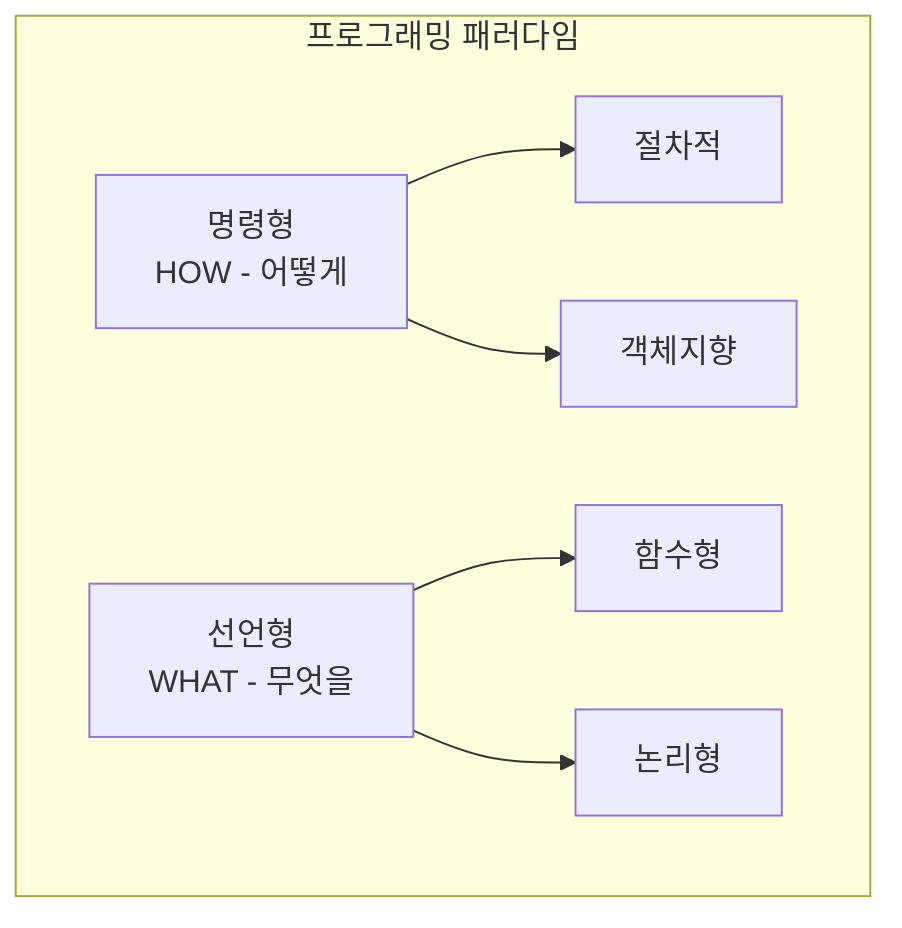
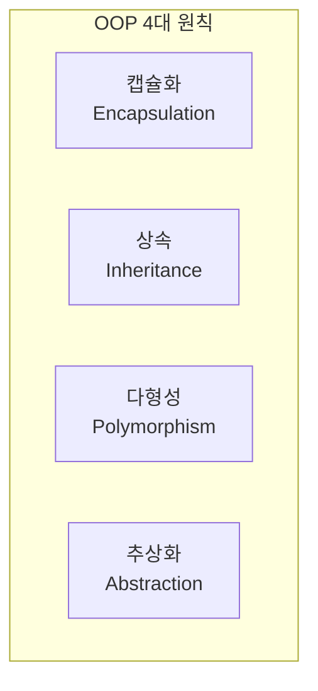
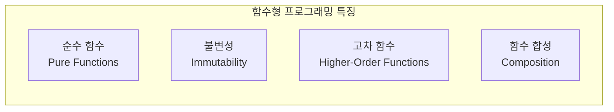

# 🎯 프로그래밍 패러다임과 설계 원칙

## 📚 목차
1. [프로그래밍 패러다임](#프로그래밍-패러다임)
2. [객체지향 프로그래밍 (OOP)](#객체지향-프로그래밍-oop)
3. [함수형 프로그래밍](#함수형-프로그래밍)
4. [디자인 패턴](#디자인-패턴)
5. [클린 코드와 리팩토링](#클린-코드와-리팩토링)

---

## 🌟 프로그래밍 패러다임

### 패러다임이란?
프로그래밍을 바라보는 관점과 문제를 해결하는 방식



### 패러다임 비교
```python
# 명령형 (Imperative) - 어떻게 할지 설명
def sum_imperative(numbers):
    total = 0
    for num in numbers:
        total += num
    return total

# 선언형 (Declarative) - 무엇을 원하는지 설명
def sum_declarative(numbers):
    return sum(numbers)

# 함수형 (Functional)
from functools import reduce
def sum_functional(numbers):
    return reduce(lambda x, y: x + y, numbers, 0)
```

## 🏗️ 객체지향 프로그래밍 (OOP)

### OOP 핵심 개념


### 프로젝트에서의 OOP 구현
```python
# backend/chat/models.py
from django.db import models
from abc import ABC, abstractmethod

# 1. 추상화 (Abstraction)
class BaseModel(models.Model):
    """추상 기본 모델"""
    created_at = models.DateTimeField(auto_now_add=True)
    updated_at = models.DateTimeField(auto_now=True)
    
    class Meta:
        abstract = True  # 추상 클래스

# 2. 상속 (Inheritance)
class ChatSession(BaseModel):
    """BaseModel을 상속받은 채팅 세션"""
    title = models.CharField(max_length=200)
    user = models.ForeignKey('auth.User', on_delete=models.CASCADE)
    
    # 3. 캡슐화 (Encapsulation)
    def __str__(self):
        return self.title
    
    def _calculate_message_count(self):
        """내부 메서드 (프라이빗)"""
        return self.messages.count()
    
    @property
    def message_count(self):
        """외부 인터페이스 (퍼블릭)"""
        return self._calculate_message_count()

# 4. 다형성 (Polymorphism)
class Message(BaseModel):
    """메시지 모델"""
    content = models.TextField()
    session = models.ForeignKey(ChatSession, on_delete=models.CASCADE)
    
    def render(self):
        """기본 렌더링"""
        return self.content

class AIMessage(Message):
    """AI 메시지 - 다형성 구현"""
    model_name = models.CharField(max_length=100)
    
    def render(self):
        """오버라이딩 - AI 메시지 렌더링"""
        return f"🤖 {self.content}"

class UserMessage(Message):
    """사용자 메시지 - 다형성 구현"""
    def render(self):
        """오버라이딩 - 사용자 메시지 렌더링"""
        return f"👤 {self.content}"
```

### SOLID 원칙
```python
# 1. SRP (Single Responsibility Principle) - 단일 책임
class MessageValidator:
    """메시지 검증만 담당"""
    def validate(self, message):
        if not message:
            raise ValueError("메시지가 비어있습니다")
        if len(message) > 1000:
            raise ValueError("메시지가 너무 깁니다")

class MessageSaver:
    """메시지 저장만 담당"""
    def save(self, message):
        Message.objects.create(content=message)

# 2. OCP (Open/Closed Principle) - 개방/폐쇄
class BaseProcessor:
    def process(self, data):
        raise NotImplementedError

class TextProcessor(BaseProcessor):
    def process(self, data):
        return data.strip()

class ImageProcessor(BaseProcessor):
    def process(self, data):
        return f"[이미지: {data}]"

# 3. LSP (Liskov Substitution Principle) - 리스코프 치환
class Bird:
    def fly(self):
        return "Flying"

class Sparrow(Bird):
    def fly(self):
        return "Sparrow flying"  # 부모 대체 가능

# 4. ISP (Interface Segregation Principle) - 인터페이스 분리
class Readable:
    def read(self):
        pass

class Writable:
    def write(self):
        pass

class File(Readable, Writable):
    def read(self):
        return "Reading file"
    
    def write(self):
        return "Writing file"

# 5. DIP (Dependency Inversion Principle) - 의존성 역전
class MessageService:
    def __init__(self, storage):
        self.storage = storage  # 추상화에 의존
    
    def save_message(self, content):
        self.storage.save(content)

class DatabaseStorage:
    def save(self, content):
        # DB에 저장

class FileStorage:
    def save(self, content):
        # 파일에 저장
```

## 🔄 함수형 프로그래밍

### 핵심 개념


### React에서의 함수형 프로그래밍
```typescript
// frontend-chat/src/components/ChatInterface.tsx

// 1. 순수 함수 (Pure Function)
const formatMessage = (message: string): string => {
    // 같은 입력 → 같은 출력, 부작용 없음
    return message.trim().toLowerCase();
};

// 2. 불변성 (Immutability)
const ChatInterface: React.FC = () => {
    const [messages, setMessages] = useState<Message[]>([]);
    
    const addMessage = (newMessage: Message) => {
        // 원본 배열 변경 X, 새 배열 생성
        setMessages(prev => [...prev, newMessage]);
    };
    
    const updateMessage = (id: string, content: string) => {
        // map으로 새 배열 생성
        setMessages(prev => 
            prev.map(msg => 
                msg.id === id 
                    ? { ...msg, content }  // 새 객체
                    : msg
            )
        );
    };
};

// 3. 고차 함수 (Higher-Order Functions)
const withAuth = (Component: React.FC) => {
    return (props: any) => {
        const { user } = useAuth();
        
        if (!user) {
            return <Login />;
        }
        
        return <Component {...props} user={user} />;
    };
};

// 4. 함수 합성 (Composition)
const pipe = (...fns: Function[]) => (x: any) =>
    fns.reduce((v, f) => f(v), x);

const processMessage = pipe(
    trimWhitespace,
    convertToLowerCase,
    removeSpecialChars,
    addTimestamp
);

// 5. React Hooks - 함수형 상태 관리
const useMessages = () => {
    const [messages, setMessages] = useState<Message[]>([]);
    const [loading, setLoading] = useState(false);
    
    const fetchMessages = useCallback(async () => {
        setLoading(true);
        try {
            const data = await api.getMessages();
            setMessages(data);
        } finally {
            setLoading(false);
        }
    }, []);
    
    return { messages, loading, fetchMessages };
};
```

### Python에서의 함수형 프로그래밍
```python
from functools import reduce, partial
from typing import List, Callable

# 1. 람다 함수
square = lambda x: x ** 2
numbers = [1, 2, 3, 4, 5]
squared = list(map(square, numbers))  # [1, 4, 9, 16, 25]

# 2. map, filter, reduce
# Map: 각 요소 변환
doubled = list(map(lambda x: x * 2, numbers))

# Filter: 조건에 맞는 요소 선택
evens = list(filter(lambda x: x % 2 == 0, numbers))

# Reduce: 누적 연산
total = reduce(lambda x, y: x + y, numbers)

# 3. 함수 합성
def compose(*functions):
    def inner(arg):
        result = arg
        for f in reversed(functions):
            result = f(result)
        return result
    return inner

# 사용 예
process = compose(
    lambda x: x.strip(),
    lambda x: x.lower(),
    lambda x: x.replace(' ', '_')
)

result = process("  Hello World  ")  # "hello_world"

# 4. 부분 적용 (Partial Application)
def multiply(x, y):
    return x * y

double = partial(multiply, 2)
triple = partial(multiply, 3)

print(double(5))  # 10
print(triple(5))  # 15

# 5. 제너레이터 (지연 평가)
def fibonacci():
    a, b = 0, 1
    while True:
        yield a
        a, b = b, a + b

# 필요할 때만 계산
fib = fibonacci()
first_10 = [next(fib) for _ in range(10)]
```

## 🎨 디자인 패턴

### 생성 패턴 (Creational)
```python
# 1. 싱글톤 패턴 - 인스턴스 하나만 생성
class LLMService:
    _instance = None
    
    def __new__(cls):
        if cls._instance is None:
            cls._instance = super().__new__(cls)
            cls._instance.model = None
        return cls._instance
    
    def load_model(self):
        if self.model is None:
            self.model = load_llm_model()
        return self.model

# 2. 팩토리 패턴 - 객체 생성 로직 분리
class MessageFactory:
    @staticmethod
    def create_message(type: str, content: str):
        if type == 'user':
            return UserMessage(content)
        elif type == 'ai':
            return AIMessage(content)
        else:
            raise ValueError(f"Unknown type: {type}")

# 3. 빌더 패턴 - 복잡한 객체 단계별 생성
class SessionBuilder:
    def __init__(self):
        self.session = ChatSession()
    
    def set_title(self, title):
        self.session.title = title
        return self
    
    def set_user(self, user):
        self.session.user = user
        return self
    
    def add_template(self, template):
        self.session.template = template
        return self
    
    def build(self):
        return self.session

# 사용
session = (SessionBuilder()
    .set_title("Python 질문")
    .set_user(user)
    .add_template(coding_template)
    .build())
```

### 구조 패턴 (Structural)
```typescript
// 1. 어댑터 패턴 - 인터페이스 변환
class WebSocketAdapter {
    private ws: WebSocket;
    
    constructor(url: string) {
        this.ws = new WebSocket(url);
    }
    
    // Promise 기반 인터페이스로 변환
    async send(message: string): Promise<void> {
        return new Promise((resolve, reject) => {
            if (this.ws.readyState === WebSocket.OPEN) {
                this.ws.send(message);
                resolve();
            } else {
                reject(new Error('WebSocket not connected'));
            }
        });
    }
}

// 2. 데코레이터 패턴 - 기능 추가
function withLogging(target: any, key: string, descriptor: PropertyDescriptor) {
    const original = descriptor.value;
    
    descriptor.value = async function(...args: any[]) {
        console.log(`Calling ${key} with args:`, args);
        const result = await original.apply(this, args);
        console.log(`Result:`, result);
        return result;
    };
    
    return descriptor;
}

class APIService {
    @withLogging
    async fetchData(url: string) {
        return fetch(url);
    }
}

// 3. 프록시 패턴 - 대리 객체
class CachedAPIProxy {
    private cache = new Map();
    private api: APIService;
    
    constructor(api: APIService) {
        this.api = api;
    }
    
    async get(url: string) {
        if (this.cache.has(url)) {
            return this.cache.get(url);
        }
        
        const data = await this.api.get(url);
        this.cache.set(url, data);
        return data;
    }
}
```

### 행위 패턴 (Behavioral)
```python
# 1. 옵저버 패턴 - 이벤트 구독/발행
class EventEmitter:
    def __init__(self):
        self.listeners = {}
    
    def on(self, event, callback):
        if event not in self.listeners:
            self.listeners[event] = []
        self.listeners[event].append(callback)
    
    def emit(self, event, data=None):
        if event in self.listeners:
            for callback in self.listeners[event]:
                callback(data)

# 사용
emitter = EventEmitter()
emitter.on('message', lambda data: print(f"New message: {data}"))
emitter.emit('message', 'Hello!')

# 2. 전략 패턴 - 알고리즘 교체
class ResponseStrategy:
    def generate(self, prompt):
        raise NotImplementedError

class SimpleStrategy(ResponseStrategy):
    def generate(self, prompt):
        return f"Simple response to: {prompt}"

class AdvancedStrategy(ResponseStrategy):
    def generate(self, prompt):
        # LLM 사용
        return llm.generate(prompt)

class ChatBot:
    def __init__(self, strategy: ResponseStrategy):
        self.strategy = strategy
    
    def respond(self, message):
        return self.strategy.generate(message)

# 3. 커맨드 패턴 - 요청을 객체로
class Command:
    def execute(self):
        pass
    
    def undo(self):
        pass

class SendMessageCommand(Command):
    def __init__(self, chat, message):
        self.chat = chat
        self.message = message
        self.sent_message = None
    
    def execute(self):
        self.sent_message = self.chat.send(self.message)
    
    def undo(self):
        if self.sent_message:
            self.chat.delete(self.sent_message)

class CommandHistory:
    def __init__(self):
        self.history = []
    
    def execute(self, command):
        command.execute()
        self.history.append(command)
    
    def undo_last(self):
        if self.history:
            command = self.history.pop()
            command.undo()
```

## 🧹 클린 코드와 리팩토링

### 클린 코드 원칙
```python
# 1. 의미 있는 이름
# 나쁜 예
def calc(x, y):
    return x * 0.1 + y

# 좋은 예
def calculate_total_with_tax(price, tax_amount):
    TAX_RATE = 0.1
    return price * TAX_RATE + tax_amount

# 2. 함수는 한 가지 일만
# 나쁜 예
def process_user_data(user_data):
    # 검증
    if not user_data.get('email'):
        raise ValueError("Email required")
    
    # 저장
    user = User.objects.create(**user_data)
    
    # 이메일 전송
    send_welcome_email(user.email)
    
    return user

# 좋은 예
def validate_user_data(user_data):
    if not user_data.get('email'):
        raise ValueError("Email required")

def create_user(user_data):
    return User.objects.create(**user_data)

def process_new_user(user_data):
    validate_user_data(user_data)
    user = create_user(user_data)
    send_welcome_email(user.email)
    return user

# 3. DRY (Don't Repeat Yourself)
# 나쁜 예
def get_user_sessions(user_id):
    sessions = ChatSession.objects.filter(user_id=user_id)
    return [{'id': s.id, 'title': s.title} for s in sessions]

def get_recent_sessions(user_id):
    sessions = ChatSession.objects.filter(user_id=user_id)[:10]
    return [{'id': s.id, 'title': s.title} for s in sessions]

# 좋은 예
def serialize_sessions(sessions):
    return [{'id': s.id, 'title': s.title} for s in sessions]

def get_user_sessions(user_id):
    sessions = ChatSession.objects.filter(user_id=user_id)
    return serialize_sessions(sessions)

def get_recent_sessions(user_id):
    sessions = ChatSession.objects.filter(user_id=user_id)[:10]
    return serialize_sessions(sessions)
```

### 리팩토링 기법
```typescript
// 1. 조건문 단순화
// Before
function getDiscount(user: User): number {
    if (user.type === 'premium') {
        if (user.years > 5) {
            return 0.3;
        } else {
            return 0.2;
        }
    } else {
        if (user.years > 5) {
            return 0.1;
        } else {
            return 0;
        }
    }
}

// After - 조기 반환
function getDiscount(user: User): number {
    if (user.type !== 'premium' && user.years <= 5) return 0;
    if (user.type !== 'premium' && user.years > 5) return 0.1;
    if (user.type === 'premium' && user.years <= 5) return 0.2;
    return 0.3;
}

// 2. 매직 넘버 제거
// Before
if (message.length > 1000) {
    throw new Error('Message too long');
}

// After
const MAX_MESSAGE_LENGTH = 1000;
if (message.length > MAX_MESSAGE_LENGTH) {
    throw new Error(`Message exceeds ${MAX_MESSAGE_LENGTH} characters`);
}

// 3. 복잡한 표현식 분해
// Before
if (user.age >= 18 && user.hasLicense && !user.suspended && user.points < 12) {
    allowDriving();
}

// After
const isAdult = user.age >= 18;
const hasValidLicense = user.hasLicense && !user.suspended;
const hasGoodRecord = user.points < 12;

if (isAdult && hasValidLicense && hasGoodRecord) {
    allowDriving();
}
```

### 테스트 주도 개발 (TDD)
```python
# 1. 테스트 먼저 작성
import pytest
from django.test import TestCase

class TestMessageValidation(TestCase):
    def test_empty_message_raises_error(self):
        """빈 메시지는 에러를 발생시켜야 함"""
        with self.assertRaises(ValueError):
            validate_message("")
    
    def test_long_message_raises_error(self):
        """너무 긴 메시지는 에러를 발생시켜야 함"""
        long_message = "a" * 1001
        with self.assertRaises(ValueError):
            validate_message(long_message)
    
    def test_valid_message_passes(self):
        """유효한 메시지는 통과해야 함"""
        result = validate_message("Hello, world!")
        self.assertTrue(result)

# 2. 구현
def validate_message(message: str) -> bool:
    if not message:
        raise ValueError("Message cannot be empty")
    
    if len(message) > 1000:
        raise ValueError("Message too long")
    
    return True

# 3. 리팩토링
class MessageValidator:
    MAX_LENGTH = 1000
    
    def validate(self, message: str) -> bool:
        self._check_not_empty(message)
        self._check_length(message)
        return True
    
    def _check_not_empty(self, message: str):
        if not message:
            raise ValueError("Message cannot be empty")
    
    def _check_length(self, message: str):
        if len(message) > self.MAX_LENGTH:
            raise ValueError(f"Message exceeds {self.MAX_LENGTH} characters")
```

## 📚 참고 자료

### 프로그래밍 패러다임
- [프로그래밍 패러다임 개요](https://en.wikipedia.org/wiki/Programming_paradigm)
- [함수형 프로그래밍 입문](https://github.com/MostlyAdequate/mostly-adequate-guide)
- [OOP vs FP 비교](https://www.educative.io/blog/object-oriented-programming-vs-functional-programming)

### 객체지향 프로그래밍
- [SOLID 원칙 설명](https://www.digitalocean.com/community/conceptual-articles/s-o-l-i-d-the-first-five-principles-of-object-oriented-design)
- [Python OOP 튜토리얼](https://realpython.com/python3-object-oriented-programming/)
- [TypeScript OOP](https://www.typescriptlang.org/docs/handbook/2/classes.html)

### 디자인 패턴
- [Refactoring Guru - 디자인 패턴](https://refactoring.guru/design-patterns)
- [Python 디자인 패턴](https://python-patterns.guide/)
- [JavaScript 디자인 패턴](https://www.patterns.dev/)

### 클린 코드
- [클린 코드 요약](https://gist.github.com/wojteklu/73c6914cc446146b8b533c0988cf8d29)
- [리팩토링 카탈로그](https://refactoring.com/catalog/)
- [마틴 파울러의 리팩토링](https://martinfowler.com/books/refactoring.html)

### TDD
- [TDD 실천법과 도구](https://github.com/testdouble/contributing-tests/wiki/Test-Driven-Development)
- [Django 테스팅 가이드](https://docs.djangoproject.com/en/5.0/topics/testing/)
- [Jest 테스팅 (React)](https://jestjs.io/docs/tutorial-react)

## 🎯 핵심 정리

1. **프로그래밍 패러다임**은 문제 해결의 관점을 제공합니다
2. **OOP**는 현실 세계를 모델링하여 복잡성을 관리합니다
3. **함수형 프로그래밍**은 부작용을 최소화하고 예측 가능성을 높입니다
4. **디자인 패턴**은 반복되는 문제에 대한 검증된 해결책입니다
5. **클린 코드**는 읽기 쉽고 유지보수하기 좋은 코드입니다

---

다음: [05-보안과-인증-기초.md](./05-보안과-인증-기초.md)