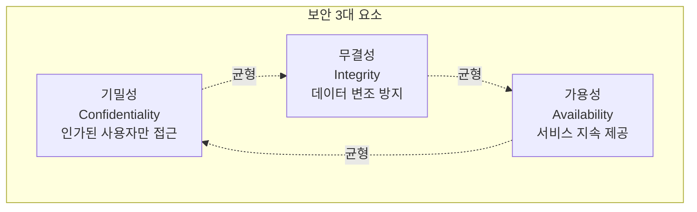
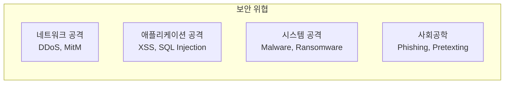
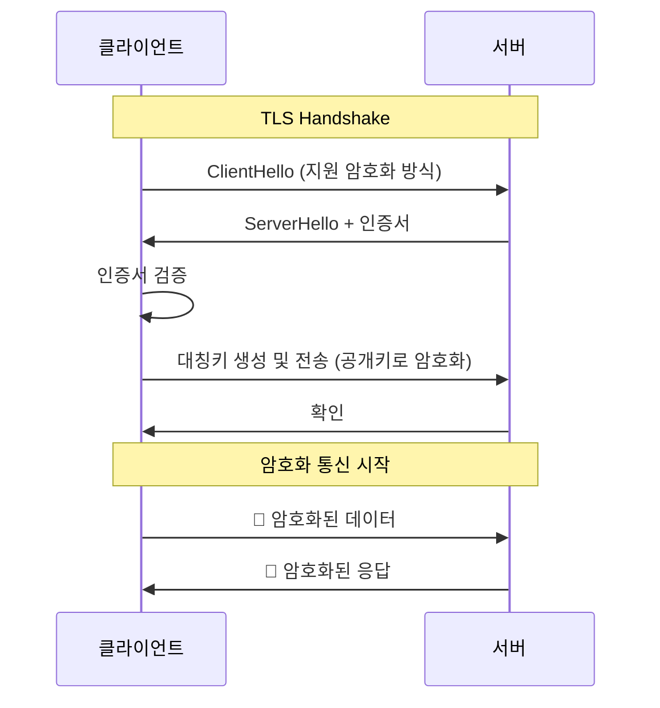
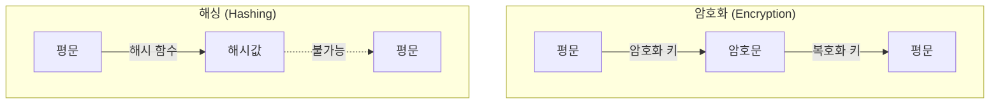

# 🔐 보안과 인증 기초

## 📚 목차
1. [웹 보안 기초](#웹-보안-기초)
2. [인증과 인가](#인증과-인가)
3. [암호화와 해싱](#암호화와-해싱)
4. [일반적인 보안 취약점](#일반적인-보안-취약점)
5. [보안 모범 사례](#보안-모범-사례)

---

## 🛡️ 웹 보안 기초

### 보안의 3대 요소 (CIA Triad)


### 보안 위협 유형


### HTTPS와 TLS/SSL


## 🔑 인증과 인가

### 인증 vs 인가
| 구분 | 인증 (Authentication) | 인가 (Authorization) |
|------|----------------------|---------------------|
| **목적** | 신원 확인 | 권한 확인 |
| **질문** | "당신은 누구입니까?" | "무엇을 할 수 있습니까?" |
| **시점** | 먼저 | 인증 후 |
| **예시** | 로그인 | 페이지 접근 권한 |

### 프로젝트의 인증 시스템
```python
# backend/chat/authentication.py
from django.contrib.auth import authenticate
from rest_framework.authtoken.models import Token
from rest_framework.authentication import TokenAuthentication
from rest_framework.permissions import IsAuthenticated

# 1. 사용자 인증 (로그인)
class AuthService:
    @staticmethod
    def login(username: str, password: str = None):
        """간단한 사용자명 기반 인증"""
        # 실제로는 패스워드 검증 필요
        user, created = User.objects.get_or_create(
            username=username
        )
        
        # 토큰 생성 또는 가져오기
        token, created = Token.objects.get_or_create(
            user=user
        )
        
        return {
            'token': token.key,
            'user_id': user.id,
            'username': user.username
        }

# 2. 토큰 인증 미들웨어
class CustomTokenAuthentication(TokenAuthentication):
    def authenticate_credentials(self, key):
        try:
            token = Token.objects.select_related('user').get(key=key)
        except Token.DoesNotExist:
            raise exceptions.AuthenticationFailed('Invalid token')
        
        if not token.user.is_active:
            raise exceptions.AuthenticationFailed('User inactive')
        
        return (token.user, token)

# 3. 권한 검증 (인가)
class IsOwnerOrReadOnly(permissions.BasePermission):
    """소유자만 수정 가능"""
    def has_object_permission(self, request, view, obj):
        # 읽기 권한은 모두에게
        if request.method in permissions.SAFE_METHODS:
            return True
        
        # 쓰기 권한은 소유자에게만
        return obj.user == request.user
```

### JWT (JSON Web Token)
```typescript
// frontend-chat/src/services/auth.ts

// JWT 구조: header.payload.signature
interface JWTPayload {
    user_id: number;
    username: string;
    exp: number;  // 만료 시간
    iat: number;  // 발급 시간
}

class JWTService {
    private readonly TOKEN_KEY = 'auth_token';
    
    // 토큰 저장
    saveToken(token: string): void {
        localStorage.setItem(this.TOKEN_KEY, token);
    }
    
    // 토큰 가져오기
    getToken(): string | null {
        return localStorage.getItem(this.TOKEN_KEY);
    }
    
    // 토큰 디코딩
    decodeToken(token: string): JWTPayload | null {
        try {
            const base64Url = token.split('.')[1];
            const base64 = base64Url.replace(/-/g, '+').replace(/_/g, '/');
            const jsonPayload = decodeURIComponent(
                atob(base64)
                    .split('')
                    .map(c => '%' + ('00' + c.charCodeAt(0).toString(16)).slice(-2))
                    .join('')
            );
            
            return JSON.parse(jsonPayload);
        } catch (error) {
            console.error('Invalid token');
            return null;
        }
    }
    
    // 토큰 만료 확인
    isTokenExpired(token: string): boolean {
        const payload = this.decodeToken(token);
        if (!payload) return true;
        
        const currentTime = Date.now() / 1000;
        return payload.exp < currentTime;
    }
    
    // 자동 갱신
    async refreshToken(): Promise<string | null> {
        const currentToken = this.getToken();
        if (!currentToken || !this.isTokenExpired(currentToken)) {
            return currentToken;
        }
        
        try {
            const response = await fetch('/api/auth/refresh/', {
                method: 'POST',
                headers: {
                    'Authorization': `Bearer ${currentToken}`
                }
            });
            
            const data = await response.json();
            this.saveToken(data.token);
            return data.token;
        } catch (error) {
            console.error('Token refresh failed');
            return null;
        }
    }
}
```

### OAuth 2.0
```python
# OAuth 2.0 플로우 구현 예시
from urllib.parse import urlencode
import requests

class OAuth2Service:
    def __init__(self, client_id, client_secret, redirect_uri):
        self.client_id = client_id
        self.client_secret = client_secret
        self.redirect_uri = redirect_uri
    
    def get_authorization_url(self, state):
        """인증 URL 생성"""
        params = {
            'client_id': self.client_id,
            'redirect_uri': self.redirect_uri,
            'response_type': 'code',
            'scope': 'read:user',
            'state': state  # CSRF 방지
        }
        return f"https://oauth.provider.com/authorize?{urlencode(params)}"
    
    def exchange_code_for_token(self, code):
        """인증 코드를 액세스 토큰으로 교환"""
        response = requests.post(
            'https://oauth.provider.com/token',
            data={
                'client_id': self.client_id,
                'client_secret': self.client_secret,
                'code': code,
                'redirect_uri': self.redirect_uri,
                'grant_type': 'authorization_code'
            }
        )
        return response.json()
```

## 🔐 암호화와 해싱

### 암호화 vs 해싱


### 패스워드 해싱
```python
# backend/utils/security.py
import hashlib
import secrets
from django.contrib.auth.hashers import make_password, check_password

class PasswordManager:
    @staticmethod
    def hash_password(password: str) -> str:
        """Django의 기본 해싱 사용 (PBKDF2)"""
        return make_password(password)
    
    @staticmethod
    def verify_password(password: str, hashed: str) -> bool:
        """패스워드 검증"""
        return check_password(password, hashed)
    
    @staticmethod
    def custom_hash_with_salt(password: str) -> tuple:
        """커스텀 해싱 (예시)"""
        # 솔트 생성
        salt = secrets.token_hex(32)
        
        # 패스워드 + 솔트 해싱
        pwd_hash = hashlib.pbkdf2_hmac(
            'sha256',
            password.encode('utf-8'),
            salt.encode('utf-8'),
            100000  # 반복 횟수
        )
        
        return pwd_hash.hex(), salt

# bcrypt 사용 예시
import bcrypt

def hash_password_bcrypt(password: str) -> str:
    salt = bcrypt.gensalt()
    hashed = bcrypt.hashpw(password.encode('utf-8'), salt)
    return hashed.decode('utf-8')

def verify_bcrypt(password: str, hashed: str) -> bool:
    return bcrypt.checkpw(
        password.encode('utf-8'),
        hashed.encode('utf-8')
    )
```

### 대칭키 vs 비대칭키 암호화
```python
from cryptography.fernet import Fernet
from cryptography.hazmat.primitives import hashes
from cryptography.hazmat.primitives.asymmetric import rsa, padding

# 1. 대칭키 암호화 (AES)
class SymmetricEncryption:
    def __init__(self):
        self.key = Fernet.generate_key()
        self.cipher = Fernet(self.key)
    
    def encrypt(self, message: str) -> bytes:
        return self.cipher.encrypt(message.encode())
    
    def decrypt(self, encrypted: bytes) -> str:
        return self.cipher.decrypt(encrypted).decode()

# 2. 비대칭키 암호화 (RSA)
class AsymmetricEncryption:
    def __init__(self):
        self.private_key = rsa.generate_private_key(
            public_exponent=65537,
            key_size=2048
        )
        self.public_key = self.private_key.public_key()
    
    def encrypt(self, message: str) -> bytes:
        """공개키로 암호화"""
        return self.public_key.encrypt(
            message.encode(),
            padding.OAEP(
                mgf=padding.MGF1(algorithm=hashes.SHA256()),
                algorithm=hashes.SHA256(),
                label=None
            )
        )
    
    def decrypt(self, encrypted: bytes) -> str:
        """개인키로 복호화"""
        return self.private_key.decrypt(
            encrypted,
            padding.OAEP(
                mgf=padding.MGF1(algorithm=hashes.SHA256()),
                algorithm=hashes.SHA256(),
                label=None
            )
        ).decode()
```

## ⚠️ 일반적인 보안 취약점

### 1. SQL Injection
```python
# 취약한 코드
def get_user_unsafe(username):
    query = f"SELECT * FROM users WHERE username = '{username}'"
    # username = "admin' OR '1'='1" 입력 시 모든 사용자 반환
    return execute_query(query)

# 안전한 코드
def get_user_safe(username):
    # Django ORM 사용 (자동 이스케이핑)
    return User.objects.filter(username=username)
    
    # 또는 파라미터화된 쿼리
    cursor.execute(
        "SELECT * FROM users WHERE username = %s",
        [username]
    )
```

### 2. XSS (Cross-Site Scripting)
```typescript
// 취약한 코드
const UserComment: React.FC<{comment: string}> = ({comment}) => {
    return <div dangerouslySetInnerHTML={{__html: comment}} />;
};

// 안전한 코드
const UserComment: React.FC<{comment: string}> = ({comment}) => {
    return <div>{comment}</div>;  // React가 자동 이스케이핑
};

// 필요시 sanitization
import DOMPurify from 'dompurify';

const SafeHTML: React.FC<{html: string}> = ({html}) => {
    const cleanHTML = DOMPurify.sanitize(html);
    return <div dangerouslySetInnerHTML={{__html: cleanHTML}} />;
};
```

### 3. CSRF (Cross-Site Request Forgery)
```python
# Django CSRF 보호
# settings.py
MIDDLEWARE = [
    'django.middleware.csrf.CsrfViewMiddleware',
    # ...
]

# views.py
from django.views.decorators.csrf import csrf_exempt, ensure_csrf_cookie

@ensure_csrf_cookie
def get_csrf_token(request):
    """CSRF 토큰 발급"""
    return JsonResponse({'csrfToken': get_token(request)})

# API에서 CSRF 토큰 검증
class CSRFExemptSessionAuthentication(SessionAuthentication):
    def enforce_csrf(self, request):
        return  # CSRF 검증 비활성화 (API용)
```

```typescript
// Frontend CSRF 토큰 처리
class APIClient {
    private csrfToken: string | null = null;
    
    async getCSRFToken(): Promise<string> {
        const response = await fetch('/api/csrf/');
        const data = await response.json();
        this.csrfToken = data.csrfToken;
        return this.csrfToken;
    }
    
    async post(url: string, data: any) {
        if (!this.csrfToken) {
            await this.getCSRFToken();
        }
        
        return fetch(url, {
            method: 'POST',
            headers: {
                'Content-Type': 'application/json',
                'X-CSRFToken': this.csrfToken!
            },
            body: JSON.stringify(data)
        });
    }
}
```

### 4. 안전하지 않은 직접 객체 참조
```python
# 취약한 코드
@api_view(['GET'])
def get_session(request, session_id):
    # 권한 검증 없이 직접 접근
    session = ChatSession.objects.get(id=session_id)
    return Response(SessionSerializer(session).data)

# 안전한 코드
@api_view(['GET'])
@permission_classes([IsAuthenticated])
def get_session(request, session_id):
    # 소유자 확인
    try:
        session = ChatSession.objects.get(
            id=session_id,
            user=request.user  # 소유자 검증
        )
    except ChatSession.DoesNotExist:
        return Response({'error': 'Not found'}, status=404)
    
    return Response(SessionSerializer(session).data)
```

## 🛡️ 보안 모범 사례

### 1. 입력 검증
```python
from django.core.validators import validate_email
from django.core.exceptions import ValidationError
import re

class InputValidator:
    @staticmethod
    def validate_username(username: str) -> bool:
        """사용자명 검증"""
        if not username or len(username) < 3:
            raise ValidationError("Username too short")
        
        if len(username) > 30:
            raise ValidationError("Username too long")
        
        if not re.match(r'^[a-zA-Z0-9_]+$', username):
            raise ValidationError("Invalid characters in username")
        
        return True
    
    @staticmethod
    def validate_message(message: str) -> str:
        """메시지 검증 및 정제"""
        # HTML 태그 제거
        clean = re.sub(r'<[^>]*>', '', message)
        
        # 스크립트 태그 제거
        clean = re.sub(r'<script.*?</script>', '', clean, flags=re.DOTALL)
        
        # 길이 제한
        if len(clean) > 1000:
            clean = clean[:1000]
        
        return clean
```

### 2. 보안 헤더 설정
```python
# Django 보안 설정
# settings.py

# HTTPS 강제
SECURE_SSL_REDIRECT = True
SESSION_COOKIE_SECURE = True
CSRF_COOKIE_SECURE = True

# 보안 헤더
SECURE_BROWSER_XSS_FILTER = True
SECURE_CONTENT_TYPE_NOSNIFF = True
X_FRAME_OPTIONS = 'DENY'

# HSTS (HTTP Strict Transport Security)
SECURE_HSTS_SECONDS = 31536000
SECURE_HSTS_INCLUDE_SUBDOMAINS = True
SECURE_HSTS_PRELOAD = True

# CSP (Content Security Policy)
CSP_DEFAULT_SRC = ("'self'",)
CSP_SCRIPT_SRC = ("'self'", "'unsafe-inline'")
CSP_STYLE_SRC = ("'self'", "'unsafe-inline'")
```

### 3. Rate Limiting
```python
from django.core.cache import cache
from django.http import JsonResponse
import time

def rate_limit(max_requests=100, window=3600):
    """API Rate Limiting 데코레이터"""
    def decorator(view_func):
        def wrapped(request, *args, **kwargs):
            # IP 기반 제한
            ip = request.META.get('REMOTE_ADDR')
            key = f'rate_limit:{ip}'
            
            # 현재 시간 윈도우의 요청 수
            current = cache.get(key, 0)
            
            if current >= max_requests:
                return JsonResponse(
                    {'error': 'Rate limit exceeded'},
                    status=429
                )
            
            # 카운터 증가
            cache.set(key, current + 1, window)
            
            return view_func(request, *args, **kwargs)
        return wrapped
    return decorator

# 사용 예
@rate_limit(max_requests=10, window=60)  # 분당 10회
def api_endpoint(request):
    return JsonResponse({'status': 'ok'})
```

### 4. 로깅과 모니터링
```python
import logging
from django.contrib.auth.signals import user_logged_in, user_login_failed

logger = logging.getLogger('security')

# 로그인 이벤트 로깅
def log_user_login(sender, user, request, **kwargs):
    logger.info(f"User login: {user.username} from {request.META.get('REMOTE_ADDR')}")

def log_user_login_failed(sender, credentials, request, **kwargs):
    logger.warning(f"Failed login attempt: {credentials.get('username')} from {request.META.get('REMOTE_ADDR')}")

user_logged_in.connect(log_user_login)
user_login_failed.connect(log_user_login_failed)

# 보안 이벤트 로깅
class SecurityLogger:
    @staticmethod
    def log_suspicious_activity(request, reason):
        logger.warning(f"Suspicious activity: {reason} from {request.META.get('REMOTE_ADDR')}")
    
    @staticmethod
    def log_authorization_failure(request, resource):
        logger.warning(f"Authorization failed: User {request.user} tried to access {resource}")
```

### 5. 환경 변수 관리
```python
# .env 파일 (절대 커밋하지 않음)
SECRET_KEY=your-secret-key-here
DATABASE_PASSWORD=your-db-password
API_KEY=your-api-key

# settings.py
from dotenv import load_dotenv
import os

load_dotenv()

SECRET_KEY = os.getenv('SECRET_KEY')
if not SECRET_KEY:
    raise ValueError("SECRET_KEY not set")

# 민감한 정보 숨기기
DEBUG = os.getenv('DEBUG', 'False') == 'True'

DATABASES = {
    'default': {
        'ENGINE': 'django.db.backends.postgresql',
        'NAME': os.getenv('DB_NAME'),
        'USER': os.getenv('DB_USER'),
        'PASSWORD': os.getenv('DB_PASSWORD'),
        'HOST': os.getenv('DB_HOST', 'localhost'),
        'PORT': os.getenv('DB_PORT', '5432'),
    }
}
```

## 🔍 보안 테스팅

### 보안 테스트 체크리스트
```python
# tests/test_security.py
from django.test import TestCase, Client
from django.contrib.auth.models import User

class SecurityTestCase(TestCase):
    def setUp(self):
        self.client = Client()
        self.user = User.objects.create_user('testuser', 'test@example.com', 'password')
    
    def test_sql_injection(self):
        """SQL Injection 테스트"""
        response = self.client.get('/api/users/', {
            'username': "admin' OR '1'='1"
        })
        self.assertEqual(response.status_code, 200)
        self.assertEqual(len(response.json()), 0)  # 인젝션 실패 확인
    
    def test_xss_prevention(self):
        """XSS 방지 테스트"""
        malicious = "<script>alert('XSS')</script>"
        response = self.client.post('/api/messages/', {
            'content': malicious
        })
        # 응답에 스크립트가 그대로 포함되지 않았는지 확인
        self.assertNotIn('<script>', response.content.decode())
    
    def test_unauthorized_access(self):
        """권한 없는 접근 테스트"""
        response = self.client.get('/api/admin/')
        self.assertEqual(response.status_code, 401)
    
    def test_rate_limiting(self):
        """Rate Limiting 테스트"""
        for i in range(11):
            response = self.client.get('/api/limited/')
        
        self.assertEqual(response.status_code, 429)
```

## 📚 참고 자료

### 웹 보안
- [OWASP Top 10](https://owasp.org/www-project-top-ten/)
- [MDN Web Security](https://developer.mozilla.org/en-US/docs/Web/Security)
- [PortSwigger Web Security Academy](https://portswigger.net/web-security)

### 인증/인가
- [OAuth 2.0 설명](https://oauth.net/2/)
- [JWT 소개](https://jwt.io/introduction)
- [Auth0 문서](https://auth0.com/docs)

### 암호화
- [암호화 기초](https://www.cloudflare.com/learning/ssl/what-is-encryption/)
- [Python Cryptography](https://cryptography.io/en/latest/)
- [bcrypt 설명](https://auth0.com/blog/hashing-in-action-understanding-bcrypt/)

### Django 보안
- [Django 보안 문서](https://docs.djangoproject.com/en/5.0/topics/security/)
- [Django Security Best Practices](https://django-security.readthedocs.io/)
- [Two Scoops of Django](https://www.feldroy.com/books/two-scoops-of-django-3-x)

### 보안 도구
- [Burp Suite](https://portswigger.net/burp)
- [OWASP ZAP](https://www.zaproxy.org/)
- [Metasploit](https://www.metasploit.com/)

## 🎯 핵심 정리

1. **보안은 다층 방어**가 중요합니다 (Defense in Depth)
2. **입력은 항상 검증**하고 출력은 이스케이프합니다
3. **최소 권한 원칙**을 따릅니다
4. **민감한 데이터는 암호화**하고 안전하게 저장합니다
5. **정기적인 보안 업데이트**와 모니터링이 필수입니다

---

다음: [06-AI-ML-기초개념.md](./06-AI-ML-기초개념.md)