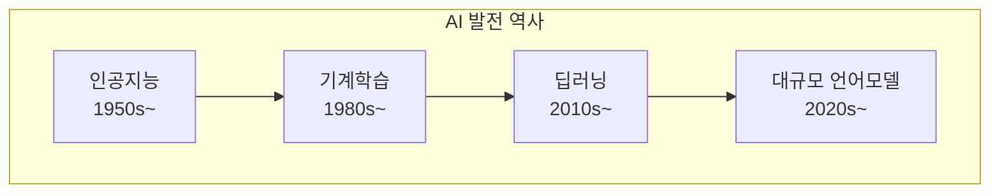
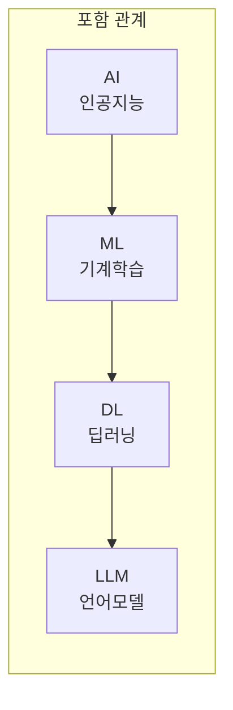
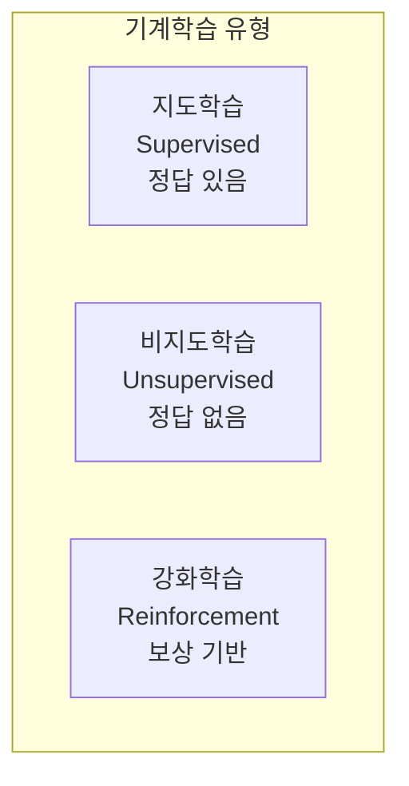
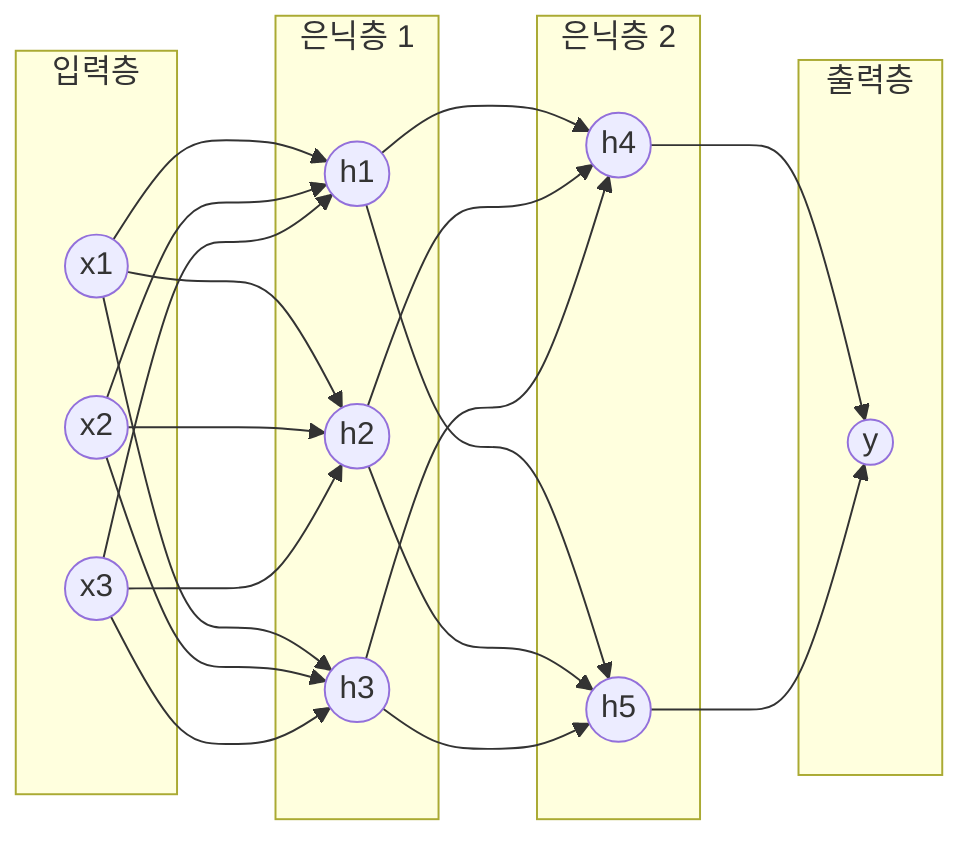
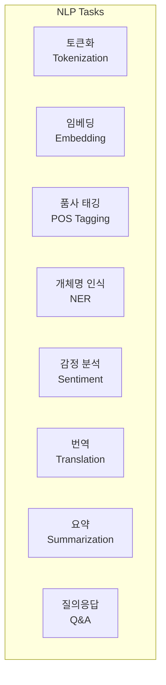
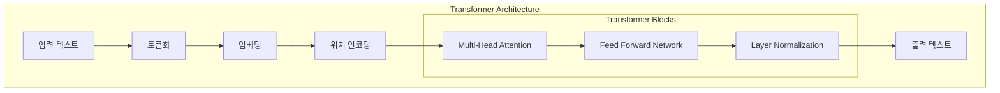

# 🤖 AI/ML 기초 개념

## 📚 목차
1. [인공지능 개요](#인공지능-개요)
2. [기계학습 기초](#기계학습-기초)
3. [딥러닝과 신경망](#딥러닝과-신경망)
4. [자연어 처리 (NLP)](#자연어-처리-nlp)
5. [대규모 언어 모델 (LLM)](#대규모-언어-모델-llm)

---

## 🧠 인공지능 개요

### AI의 발전 단계


### AI vs ML vs DL


| 구분 | 설명 | 예시 |
|------|------|------|
| **AI** | 인간의 지능을 모방 | 체스 AI, 음성 인식 |
| **ML** | 데이터로부터 학습 | 스팸 필터, 추천 시스템 |
| **DL** | 신경망을 이용한 학습 | 이미지 인식, 번역 |
| **LLM** | 대규모 텍스트 학습 | GPT, Claude, Mistral |

## 📊 기계학습 기초

### 학습 유형


### 지도학습 예시
```python
# 간단한 선형 회귀 예시
import numpy as np
from sklearn.linear_model import LinearRegression

# 데이터 준비 (집 크기 -> 가격)
X = np.array([[30], [50], [70], [100], [150]])  # 평수
y = np.array([1, 2, 3, 4, 5])  # 가격 (억원)

# 모델 학습
model = LinearRegression()
model.fit(X, y)

# 예측
new_house = np.array([[80]])
predicted_price = model.predict(new_house)
print(f"80평 집의 예상 가격: {predicted_price[0]:.2f}억원")

# 분류 예시 (스팸 필터)
from sklearn.naive_bayes import MultinomialNB
from sklearn.feature_extraction.text import CountVectorizer

# 훈련 데이터
emails = [
    "무료 쿠폰 받으세요",
    "회의 일정 확인",
    "당첨되셨습니다 클릭하세요",
    "프로젝트 진행 상황"
]
labels = [1, 0, 1, 0]  # 1: 스팸, 0: 정상

# 텍스트를 벡터로 변환
vectorizer = CountVectorizer()
X = vectorizer.fit_transform(emails)

# 모델 학습
classifier = MultinomialNB()
classifier.fit(X, labels)

# 새 이메일 분류
new_email = ["특별 할인 이벤트"]
new_X = vectorizer.transform(new_email)
prediction = classifier.predict(new_X)
print(f"스팸 여부: {'스팸' if prediction[0] == 1 else '정상'}")
```

### 모델 평가
```python
from sklearn.model_selection import train_test_split
from sklearn.metrics import accuracy_score, confusion_matrix

# 데이터 분할
X_train, X_test, y_train, y_test = train_test_split(
    X, y, test_size=0.2, random_state=42
)

# 모델 학습
model.fit(X_train, y_train)

# 예측 및 평가
y_pred = model.predict(X_test)
accuracy = accuracy_score(y_test, y_pred)

print(f"정확도: {accuracy:.2%}")

# 혼동 행렬
cm = confusion_matrix(y_test, y_pred)
print("혼동 행렬:")
print(cm)
```

## 🔮 딥러닝과 신경망

### 신경망 구조


### 활성화 함수
```python
import numpy as np
import matplotlib.pyplot as plt

# 주요 활성화 함수
def sigmoid(x):
    return 1 / (1 + np.exp(-x))

def relu(x):
    return np.maximum(0, x)

def tanh(x):
    return np.tanh(x)

def softmax(x):
    exp_x = np.exp(x - np.max(x))
    return exp_x / exp_x.sum()

# 시각화
x = np.linspace(-5, 5, 100)

plt.figure(figsize=(12, 3))

plt.subplot(1, 3, 1)
plt.plot(x, sigmoid(x))
plt.title('Sigmoid')

plt.subplot(1, 3, 2)
plt.plot(x, relu(x))
plt.title('ReLU')

plt.subplot(1, 3, 3)
plt.plot(x, tanh(x))
plt.title('Tanh')

plt.show()
```

### 간단한 신경망 구현
```python
import torch
import torch.nn as nn
import torch.optim as optim

# PyTorch로 간단한 신경망 정의
class SimpleNN(nn.Module):
    def __init__(self, input_size, hidden_size, output_size):
        super(SimpleNN, self).__init__()
        self.fc1 = nn.Linear(input_size, hidden_size)
        self.relu = nn.ReLU()
        self.fc2 = nn.Linear(hidden_size, output_size)
        self.softmax = nn.Softmax(dim=1)
    
    def forward(self, x):
        x = self.fc1(x)
        x = self.relu(x)
        x = self.fc2(x)
        x = self.softmax(x)
        return x

# 모델 생성
model = SimpleNN(input_size=10, hidden_size=20, output_size=3)

# 손실 함수와 옵티마이저
criterion = nn.CrossEntropyLoss()
optimizer = optim.Adam(model.parameters(), lr=0.001)

# 학습 과정
def train_step(model, data, target):
    # 순전파
    output = model(data)
    loss = criterion(output, target)
    
    # 역전파
    optimizer.zero_grad()
    loss.backward()
    optimizer.step()
    
    return loss.item()
```

## 📝 자연어 처리 (NLP)

### NLP 주요 작업


### 텍스트 전처리
```python
import re
from konlpy.tag import Okt  # 한국어 처리

class TextPreprocessor:
    def __init__(self):
        self.okt = Okt()
    
    def clean_text(self, text):
        """텍스트 정제"""
        # HTML 태그 제거
        text = re.sub(r'<[^>]+>', '', text)
        
        # 특수문자 제거
        text = re.sub(r'[^\w\s]', '', text)
        
        # 공백 정규화
        text = ' '.join(text.split())
        
        return text.lower()
    
    def tokenize_korean(self, text):
        """한국어 토큰화"""
        return self.okt.morphs(text)
    
    def tokenize_english(self, text):
        """영어 토큰화"""
        return text.lower().split()

# 사용 예
preprocessor = TextPreprocessor()
text = "안녕하세요! NLP를 공부하고 있습니다."
tokens = preprocessor.tokenize_korean(text)
print(tokens)  # ['안녕', '하', '세요', '!', 'NLP', '를', '공부', '하고', '있습니다', '.']
```

### 워드 임베딩
```python
# Word2Vec 예시
from gensim.models import Word2Vec

# 문장 데이터
sentences = [
    ['나는', '파이썬을', '좋아한다'],
    ['나는', '머신러닝을', '공부한다'],
    ['파이썬은', '프로그래밍', '언어다'],
    ['머신러닝은', '인공지능의', '한', '분야다']
]

# Word2Vec 모델 학습
model = Word2Vec(
    sentences,
    vector_size=100,  # 임베딩 차원
    window=5,          # 컨텍스트 윈도우
    min_count=1,       # 최소 등장 횟수
    workers=4          # 병렬 처리
)

# 단어 벡터 얻기
vector = model.wv['파이썬']
print(f"'파이썬' 벡터 차원: {vector.shape}")

# 유사 단어 찾기
similar_words = model.wv.most_similar('파이썬', topn=3)
print(f"'파이썬'과 유사한 단어: {similar_words}")
```

## 🚀 대규모 언어 모델 (LLM)

### LLM 아키텍처


### 프로젝트의 LLM 구현
```python
# backend/llm/llm_service.py
from llama_cpp import Llama
import json

class LLMService:
    def __init__(self, model_path="models/mistral-7b-instruct-v0.2.Q4_K_M.gguf"):
        """Mistral 7B 모델 초기화"""
        self.model = Llama(
            model_path=model_path,
            n_ctx=4096,        # 컨텍스트 길이
            n_threads=4,       # CPU 스레드
            n_gpu_layers=32,   # GPU 레이어 (가속)
            verbose=False
        )
        
        # 생성 파라미터
        self.default_params = {
            'max_tokens': 512,
            'temperature': 0.7,
            'top_p': 0.95,
            'top_k': 40,
            'repeat_penalty': 1.1
        }
    
    def generate(self, prompt, **kwargs):
        """텍스트 생성"""
        # 파라미터 병합
        params = {**self.default_params, **kwargs}
        
        # 프롬프트 템플릿 적용
        formatted_prompt = self._apply_template(prompt)
        
        # 생성
        response = self.model(formatted_prompt, **params)
        
        return response['choices'][0]['text']
    
    def _apply_template(self, prompt):
        """Mistral Instruct 템플릿"""
        return f"<s>[INST] {prompt} [/INST]"
    
    def generate_stream(self, prompt, **kwargs):
        """스트리밍 생성"""
        params = {**self.default_params, **kwargs, 'stream': True}
        formatted_prompt = self._apply_template(prompt)
        
        for output in self.model(formatted_prompt, **params):
            yield output['choices'][0]['text']
```

### 프롬프트 엔지니어링
```python
class PromptEngineering:
    """효과적인 프롬프트 작성 기법"""
    
    @staticmethod
    def zero_shot(task, input_text):
        """Zero-shot: 예시 없이"""
        return f"{task}\n\n입력: {input_text}\n출력:"
    
    @staticmethod
    def few_shot(task, examples, input_text):
        """Few-shot: 몇 가지 예시 제공"""
        prompt = f"{task}\n\n"
        
        for ex in examples:
            prompt += f"입력: {ex['input']}\n"
            prompt += f"출력: {ex['output']}\n\n"
        
        prompt += f"입력: {input_text}\n출력:"
        return prompt
    
    @staticmethod
    def chain_of_thought(question):
        """Chain-of-Thought: 단계별 사고"""
        return f"""질문: {question}

단계별로 생각해봅시다:
1. 먼저 문제를 이해합니다.
2. 필요한 정보를 파악합니다.
3. 논리적으로 추론합니다.
4. 결론을 도출합니다.

답변:"""
    
    @staticmethod
    def role_play(role, task):
        """역할 부여"""
        return f"""당신은 {role}입니다.
당신의 특징:
- 전문적이고 정확한 답변
- 친절하고 이해하기 쉬운 설명
- 실용적인 예시 제공

작업: {task}"""

# 사용 예시
prompt_eng = PromptEngineering()

# Zero-shot
prompt = prompt_eng.zero_shot(
    "다음 문장의 감정을 분석하세요",
    "오늘 정말 기분이 좋아요!"
)

# Few-shot
examples = [
    {"input": "맛있다", "output": "긍정"},
    {"input": "별로야", "output": "부정"}
]
prompt = prompt_eng.few_shot(
    "감정 분류",
    examples,
    "정말 훌륭해요"
)
```

### RAG (Retrieval-Augmented Generation)
```python
# backend/llm/rag_service.py
import chromadb
from chromadb.utils import embedding_functions

class RAGService:
    """검색 증강 생성"""
    
    def __init__(self):
        # 벡터 DB 초기화
        self.client = chromadb.PersistentClient(path="./chroma_db")
        
        # 임베딩 함수
        self.embedding_fn = embedding_functions.SentenceTransformerEmbeddingFunction(
            model_name="all-MiniLM-L6-v2"
        )
        
        # 컬렉션 생성
        self.collection = self.client.get_or_create_collection(
            name="knowledge_base",
            embedding_function=self.embedding_fn
        )
    
    def add_document(self, text, metadata=None):
        """문서 추가"""
        doc_id = f"doc_{self.collection.count() + 1}"
        
        self.collection.add(
            documents=[text],
            metadatas=[metadata or {}],
            ids=[doc_id]
        )
        
        return doc_id
    
    def search(self, query, n_results=3):
        """유사 문서 검색"""
        results = self.collection.query(
            query_texts=[query],
            n_results=n_results
        )
        
        return results['documents'][0]
    
    def generate_with_context(self, query, llm_service):
        """컨텍스트 기반 생성"""
        # 1. 관련 문서 검색
        relevant_docs = self.search(query)
        
        # 2. 컨텍스트 구성
        context = "\n".join(relevant_docs)
        
        # 3. 프롬프트 생성
        prompt = f"""다음 정보를 참고하여 질문에 답하세요:

참고 정보:
{context}

질문: {query}

답변:"""
        
        # 4. LLM 생성
        response = llm_service.generate(prompt)
        
        return response
```

### 모델 파인튜닝
```python
# Fine-tuning 데이터 준비
class FineTuningDataset:
    def __init__(self):
        self.data = []
    
    def add_example(self, instruction, input_text, output):
        """학습 데이터 추가"""
        self.data.append({
            "instruction": instruction,
            "input": input_text,
            "output": output
        })
    
    def save_jsonl(self, filepath):
        """JSONL 형식으로 저장"""
        import json
        
        with open(filepath, 'w', encoding='utf-8') as f:
            for item in self.data:
                f.write(json.dumps(item, ensure_ascii=False) + '\n')

# 데이터셋 생성
dataset = FineTuningDataset()

# 예시 추가
dataset.add_example(
    instruction="다음 코드의 버그를 찾아주세요",
    input_text="def add(a, b): return a - b",
    output="버그: 함수명은 add인데 뺄셈을 수행합니다. 'return a + b'로 수정해야 합니다."
)

dataset.add_example(
    instruction="파이썬 코드를 설명해주세요",
    input_text="lambda x: x**2",
    output="입력값 x를 받아서 x의 제곱을 반환하는 람다 함수입니다."
)

# 저장
dataset.save_jsonl("training_data.jsonl")
```

### 모델 성능 평가
```python
from typing import List, Dict
import numpy as np
from sklearn.metrics.pairwise import cosine_similarity

class LLMEvaluator:
    """LLM 평가 메트릭"""
    
    @staticmethod
    def perplexity(model, text):
        """Perplexity 계산"""
        # 토큰화
        tokens = model.tokenize(text)
        
        # 로그 확률 계산
        log_probs = []
        for i in range(1, len(tokens)):
            context = tokens[:i]
            target = tokens[i]
            
            # 다음 토큰 확률
            probs = model.get_token_probabilities(context)
            log_prob = np.log(probs[target])
            log_probs.append(log_prob)
        
        # Perplexity
        avg_log_prob = np.mean(log_probs)
        perplexity = np.exp(-avg_log_prob)
        
        return perplexity
    
    @staticmethod
    def bleu_score(reference: str, hypothesis: str) -> float:
        """BLEU 스코어 계산"""
        from nltk.translate.bleu_score import sentence_bleu
        
        reference_tokens = reference.split()
        hypothesis_tokens = hypothesis.split()
        
        score = sentence_bleu(
            [reference_tokens],
            hypothesis_tokens
        )
        
        return score
    
    @staticmethod
    def semantic_similarity(text1: str, text2: str, embedding_model) -> float:
        """의미적 유사도"""
        # 임베딩 생성
        emb1 = embedding_model.encode([text1])
        emb2 = embedding_model.encode([text2])
        
        # 코사인 유사도
        similarity = cosine_similarity(emb1, emb2)[0][0]
        
        return similarity
```

## 🔬 모델 최적화

### Quantization (양자화)
```python
"""
모델 크기 줄이기
- FP32 (32bit) → FP16 (16bit) → INT8 (8bit) → INT4 (4bit)
- 크기 감소, 속도 향상, 약간의 정확도 손실
"""

# Mistral 7B 모델 크기 비교
model_sizes = {
    "Original (FP32)": "28 GB",
    "FP16": "14 GB",
    "Q8_0": "7.7 GB",
    "Q5_K_M": "5.1 GB",
    "Q4_K_M": "4.4 GB",  # 프로젝트에서 사용
    "Q3_K_M": "3.5 GB"
}

print("Mistral 7B 양자화별 크기:")
for quant, size in model_sizes.items():
    print(f"  {quant}: {size}")
```

### 추론 최적화
```python
class InferenceOptimizer:
    """추론 속도 최적화"""
    
    @staticmethod
    def batch_inference(model, prompts: List[str], batch_size=4):
        """배치 처리"""
        results = []
        
        for i in range(0, len(prompts), batch_size):
            batch = prompts[i:i+batch_size]
            batch_results = model.generate_batch(batch)
            results.extend(batch_results)
        
        return results
    
    @staticmethod
    def caching_layer(model, cache_size=100):
        """캐싱"""
        from functools import lru_cache
        
        @lru_cache(maxsize=cache_size)
        def cached_generate(prompt):
            return model.generate(prompt)
        
        return cached_generate
    
    @staticmethod
    def gpu_acceleration(model_path):
        """GPU 가속"""
        import torch
        
        device = "cuda" if torch.cuda.is_available() else "cpu"
        print(f"Using device: {device}")
        
        if device == "cuda":
            # GPU 레이어 설정
            n_gpu_layers = 32
        else:
            n_gpu_layers = 0
        
        return n_gpu_layers
```

## 📚 참고 자료

### AI/ML 기초
- [Andrew Ng의 Machine Learning 코스](https://www.coursera.org/learn/machine-learning)
- [Deep Learning Specialization](https://www.deeplearning.ai/)
- [Fast.ai 실용 딥러닝](https://www.fast.ai/)

### NLP & LLM
- [Hugging Face Course](https://huggingface.co/learn/nlp-course)
- [The Illustrated Transformer](https://jalammar.github.io/illustrated-transformer/)
- [LangChain 문서](https://python.langchain.com/)

### 한국어 NLP
- [KoNLPy 문서](https://konlpy.org/)
- [KoGPT 프로젝트](https://github.com/kakaobrain/kogpt)
- [한국어 임베딩](https://ratsgo.github.io/embedding/)

### LLM 모델
- [Mistral AI](https://mistral.ai/)
- [LLaMA 모델](https://ai.meta.com/llama/)
- [OpenAI GPT](https://platform.openai.com/docs)

### 실습 자료
- [Google Colab](https://colab.research.google.com/)
- [Kaggle Learn](https://www.kaggle.com/learn)
- [Papers with Code](https://paperswithcode.com/)

## 🎯 핵심 정리

1. **AI/ML**은 데이터로부터 패턴을 학습합니다
2. **딥러닝**은 신경망을 통해 복잡한 패턴을 학습합니다
3. **LLM**은 대규모 텍스트로 학습된 언어 이해 모델입니다
4. **프롬프트 엔지니어링**으로 LLM 성능을 최적화합니다
5. **RAG**는 외부 지식을 활용해 정확도를 높입니다

---

다음: [07-개발도구와-환경설정.md](./07-개발도구와-환경설정.md)