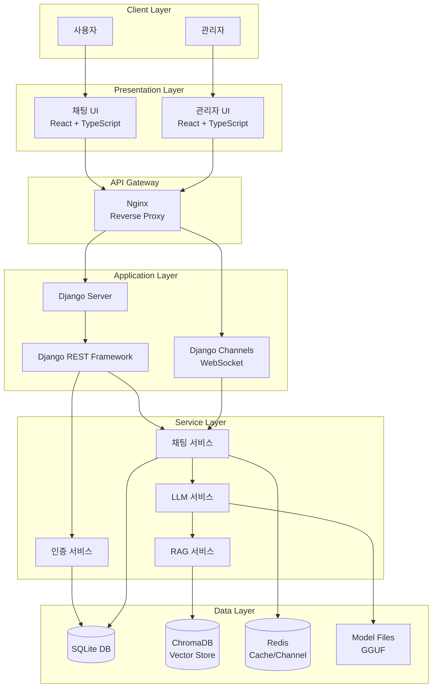
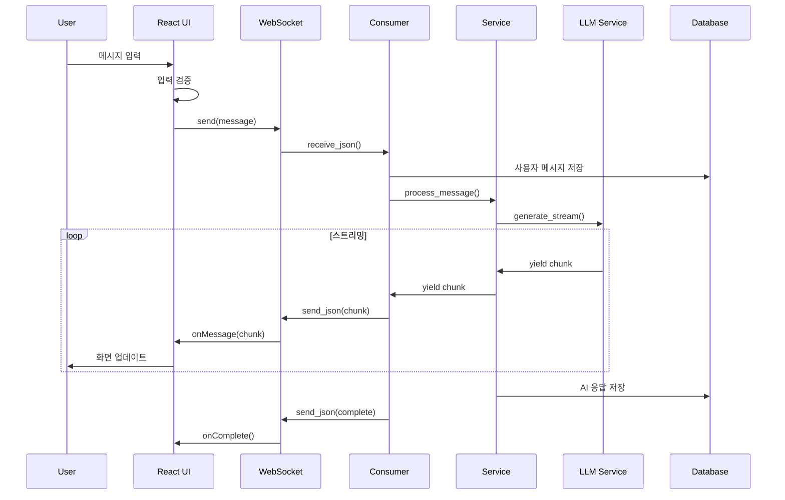

# 🏗️ 프로젝트 구조 심화 분석

## 📚 목차
1. [프로젝트 아키텍처 전체 분석](#프로젝트-아키텍처-전체-분석)
2. [백엔드 상세 구조](#백엔드-상세-구조)
3. [프론트엔드 상세 구조](#프론트엔드-상세-구조)
4. [데이터 플로우 분석](#데이터-플로우-분석)
5. [확장성과 유지보수](#확장성과-유지보수)

---

## 🎯 프로젝트 아키텍처 전체 분석

### 시스템 아키텍처 개요


### 디렉터리 구조 분석
```
bdworld-chat-codefair/
├── 📁 backend/                 # 백엔드 루트
│   ├── 📁 chat_project/       # Django 프로젝트 설정
│   │   ├── settings.py        # 전역 설정
│   │   ├── urls.py           # URL 라우팅
│   │   ├── asgi.py           # ASGI 설정 (WebSocket)
│   │   └── wsgi.py           # WSGI 설정 (HTTP)
│   │
│   ├── 📁 chat/               # 채팅 앱 (도메인)
│   │   ├── models.py         # 데이터 모델
│   │   ├── views.py          # API 뷰
│   │   ├── serializers.py    # 직렬화
│   │   ├── consumers.py      # WebSocket 핸들러
│   │   ├── routing.py        # WebSocket 라우팅
│   │   └── tests/            # 테스트
│   │
│   ├── 📁 llm/                # AI 모델 앱 (도메인)
│   │   ├── llm_service.py    # LLM 서비스 로직
│   │   ├── models.py         # AI 관련 모델
│   │   ├── views.py          # AI API
│   │   └── management/       # 관리 명령어
│   │
│   ├── 📁 models/             # AI 모델 파일
│   ├── 📁 datasets/           # 학습 데이터
│   └── manage.py             # Django 관리 스크립트
│
├── 📁 frontend-chat/          # 채팅 프론트엔드
│   ├── 📁 src/
│   │   ├── 📁 components/    # UI 컴포넌트
│   │   ├── 📁 services/      # API 서비스
│   │   ├── 📁 contexts/      # React Context
│   │   └── 📁 types/         # TypeScript 타입
│   │
│   └── 📁 public/            # 정적 파일
│
└── 📁 frontend-admin/         # 관리자 프론트엔드
    └── 📁 src/
        ├── 📁 pages/         # 페이지 컴포넌트
        └── 📁 components/    # 공통 컴포넌트
```

## 🔧 백엔드 상세 구조

### Django 앱 구조와 책임
```python
# 각 앱의 책임과 역할

# 1. chat 앱 - 채팅 도메인
"""
책임:
- 채팅 세션 관리
- 메시지 저장 및 조회
- 실시간 통신 처리
- 사용자 인증
"""

# 2. llm 앱 - AI 도메인
"""
책임:
- LLM 모델 로드 및 관리
- 텍스트 생성
- 프롬프트 템플릿 관리
- RAG 통합
- Fine-tuning
"""
```

### 모델 계층 구조
```python
# backend/chat/models.py
from django.db import models
from django.contrib.auth.models import AbstractUser

# 도메인 모델 정의
class User(AbstractUser):
    """확장된 사용자 모델"""
    created_at = models.DateTimeField(auto_now_add=True)
    
    class Meta:
        db_table = 'users'

class ChatSession(models.Model):
    """채팅 세션 - Aggregate Root"""
    title = models.CharField(max_length=200)
    user = models.ForeignKey(User, on_delete=models.CASCADE)
    created_at = models.DateTimeField(auto_now_add=True)
    updated_at = models.DateTimeField(auto_now=True)
    
    # 비즈니스 로직
    def add_message(self, content: str, is_user: bool):
        """메시지 추가"""
        return self.messages.create(
            content=content,
            is_user=is_user
        )
    
    def get_context(self, limit: int = 10):
        """최근 대화 컨텍스트 반환"""
        messages = self.messages.order_by('-timestamp')[:limit]
        return list(reversed(messages))
    
    class Meta:
        db_table = 'chat_sessions'
        ordering = ['-created_at']

class Message(models.Model):
    """메시지 - Entity"""
    session = models.ForeignKey(
        ChatSession,
        on_delete=models.CASCADE,
        related_name='messages'
    )
    content = models.TextField()
    is_user = models.BooleanField(default=True)
    timestamp = models.DateTimeField(auto_now_add=True)
    
    # 메타데이터
    token_count = models.IntegerField(null=True)
    processing_time = models.FloatField(null=True)
    
    class Meta:
        db_table = 'messages'
        indexes = [
            models.Index(fields=['session', '-timestamp']),
        ]
```

### 서비스 계층 패턴
```python
# backend/chat/services.py
from typing import Optional, List
from django.db import transaction
from .models import ChatSession, Message
from llm.llm_service import LLMService

class ChatService:
    """채팅 비즈니스 로직"""
    
    def __init__(self):
        self.llm_service = LLMService()
    
    @transaction.atomic
    def create_session(self, user, title: str) -> ChatSession:
        """새 채팅 세션 생성"""
        session = ChatSession.objects.create(
            user=user,
            title=title
        )
        
        # 초기 시스템 메시지
        session.add_message(
            content="안녕하세요! 무엇을 도와드릴까요?",
            is_user=False
        )
        
        return session
    
    async def process_message(
        self,
        session: ChatSession,
        user_message: str
    ) -> AsyncGenerator[str, None]:
        """메시지 처리 및 AI 응답 생성"""
        
        # 1. 사용자 메시지 저장
        user_msg = session.add_message(
            content=user_message,
            is_user=True
        )
        
        # 2. 컨텍스트 준비
        context = self._prepare_context(session)
        
        # 3. AI 응답 생성 (스트리밍)
        ai_response = ""
        async for chunk in self.llm_service.generate_stream(
            prompt=user_message,
            context=context
        ):
            ai_response += chunk
            yield chunk
        
        # 4. AI 응답 저장
        ai_msg = session.add_message(
            content=ai_response,
            is_user=False
        )
        
        # 5. 메타데이터 업데이트
        ai_msg.token_count = self.llm_service.count_tokens(ai_response)
        ai_msg.save()
    
    def _prepare_context(self, session: ChatSession) -> str:
        """대화 컨텍스트 준비"""
        messages = session.get_context(limit=10)
        
        context = ""
        for msg in messages:
            role = "User" if msg.is_user else "Assistant"
            context += f"{role}: {msg.content}\n\n"
        
        return context
```

### API 뷰 구조
```python
# backend/chat/views.py
from rest_framework import viewsets, status
from rest_framework.decorators import action
from rest_framework.response import Response
from rest_framework.permissions import IsAuthenticated
from .models import ChatSession
from .serializers import ChatSessionSerializer
from .services import ChatService

class ChatSessionViewSet(viewsets.ModelViewSet):
    """채팅 세션 API"""
    serializer_class = ChatSessionSerializer
    permission_classes = [IsAuthenticated]
    service = ChatService()
    
    def get_queryset(self):
        """사용자별 세션 필터링"""
        return ChatSession.objects.filter(
            user=self.request.user
        ).prefetch_related('messages')
    
    def perform_create(self, serializer):
        """세션 생성"""
        session = self.service.create_session(
            user=self.request.user,
            title=serializer.validated_data['title']
        )
        serializer.instance = session
    
    @action(detail=True, methods=['post'])
    def clear_messages(self, request, pk=None):
        """메시지 초기화"""
        session = self.get_object()
        session.messages.all().delete()
        return Response({'status': 'cleared'})
    
    @action(detail=True, methods=['get'])
    def export(self, request, pk=None):
        """대화 내보내기"""
        session = self.get_object()
        messages = session.messages.values(
            'content', 'is_user', 'timestamp'
        )
        
        return Response({
            'session': session.title,
            'messages': list(messages)
        })
```

### WebSocket Consumer 구조
```python
# backend/chat/consumers.py
import json
from channels.generic.websocket import AsyncWebsocketConsumer
from channels.db import database_sync_to_async
from .services import ChatService

class ChatConsumer(AsyncWebsocketConsumer):
    """WebSocket 채팅 핸들러"""
    
    def __init__(self, *args, **kwargs):
        super().__init__(*args, **kwargs)
        self.session_id = None
        self.room_group_name = None
        self.service = ChatService()
    
    async def connect(self):
        """연결 수립"""
        # URL에서 세션 ID 추출
        self.session_id = self.scope['url_route']['kwargs']['session_id']
        self.room_group_name = f'chat_{self.session_id}'
        
        # 권한 확인
        if not await self.check_permission():
            await self.close()
            return
        
        # 채널 그룹 참가
        await self.channel_layer.group_add(
            self.room_group_name,
            self.channel_name
        )
        
        await self.accept()
        
        # 연결 메시지
        await self.send_json({
            'type': 'connection',
            'message': '연결되었습니다'
        })
    
    async def receive_json(self, content):
        """메시지 수신"""
        message_type = content.get('type')
        
        if message_type == 'chat_message':
            await self.handle_chat_message(content)
        elif message_type == 'typing':
            await self.handle_typing(content)
    
    async def handle_chat_message(self, content):
        """채팅 메시지 처리"""
        user_message = content['message']
        
        # 사용자 메시지 브로드캐스트
        await self.channel_layer.group_send(
            self.room_group_name,
            {
                'type': 'chat_message',
                'message': user_message,
                'is_user': True
            }
        )
        
        # AI 응답 생성 (스트리밍)
        session = await self.get_session()
        
        async for chunk in self.service.process_message(
            session,
            user_message
        ):
            # 각 청크 전송
            await self.send_json({
                'type': 'ai_chunk',
                'chunk': chunk
            })
        
        # 완료 신호
        await self.send_json({
            'type': 'ai_complete'
        })
    
    @database_sync_to_async
    def get_session(self):
        """세션 조회"""
        from .models import ChatSession
        return ChatSession.objects.get(id=self.session_id)
    
    @database_sync_to_async
    def check_permission(self):
        """권한 확인"""
        user = self.scope['user']
        if not user.is_authenticated:
            return False
        
        from .models import ChatSession
        return ChatSession.objects.filter(
            id=self.session_id,
            user=user
        ).exists()
```

## 💻 프론트엔드 상세 구조

### 컴포넌트 아키텍처
```typescript
// frontend-chat/src/components/architecture.ts

// 1. Presentational Components (UI)
// 순수한 UI 렌더링만 담당
interface ButtonProps {
    label: string;
    onClick: () => void;
    variant?: 'primary' | 'secondary';
}

const Button: React.FC<ButtonProps> = ({ label, onClick, variant = 'primary' }) => {
    return (
        <button className={`btn btn-${variant}`} onClick={onClick}>
            {label}
        </button>
    );
};

// 2. Container Components (Logic)
// 비즈니스 로직과 상태 관리
const ChatContainer: React.FC = () => {
    const [messages, setMessages] = useState<Message[]>([]);
    const { user } = useAuth();
    const ws = useWebSocket();
    
    const sendMessage = (content: string) => {
        ws.send({ type: 'chat_message', message: content });
    };
    
    return (
        <ChatInterface
            messages={messages}
            onSendMessage={sendMessage}
            currentUser={user}
        />
    );
};

// 3. Higher-Order Components (HOC)
// 컴포넌트 기능 확장
const withAuth = <P extends object>(
    Component: React.ComponentType<P>
): React.FC<P> => {
    return (props: P) => {
        const { isAuthenticated } = useAuth();
        
        if (!isAuthenticated) {
            return <Navigate to="/login" />;
        }
        
        return <Component {...props} />;
    };
};

// 4. Custom Hooks
// 재사용 가능한 로직
const useChat = (sessionId: string) => {
    const [messages, setMessages] = useState<Message[]>([]);
    const [loading, setLoading] = useState(false);
    const [error, setError] = useState<string | null>(null);
    
    useEffect(() => {
        fetchMessages(sessionId)
            .then(setMessages)
            .catch(err => setError(err.message));
    }, [sessionId]);
    
    return { messages, loading, error };
};
```

### 상태 관리 패턴
```typescript
// frontend-chat/src/store/index.ts

// 1. Context API 패턴
interface AppState {
    user: User | null;
    sessions: ChatSession[];
    currentSession: ChatSession | null;
}

const AppContext = createContext<{
    state: AppState;
    dispatch: Dispatch<AppAction>;
}>({
    state: initialState,
    dispatch: () => null
});

// 2. Reducer 패턴
type AppAction =
    | { type: 'SET_USER'; payload: User }
    | { type: 'ADD_SESSION'; payload: ChatSession }
    | { type: 'SELECT_SESSION'; payload: string }
    | { type: 'ADD_MESSAGE'; payload: Message };

function appReducer(state: AppState, action: AppAction): AppState {
    switch (action.type) {
        case 'SET_USER':
            return { ...state, user: action.payload };
        
        case 'ADD_SESSION':
            return {
                ...state,
                sessions: [...state.sessions, action.payload]
            };
        
        case 'SELECT_SESSION':
            return {
                ...state,
                currentSession: state.sessions.find(
                    s => s.id === action.payload
                ) || null
            };
        
        case 'ADD_MESSAGE':
            if (!state.currentSession) return state;
            
            return {
                ...state,
                currentSession: {
                    ...state.currentSession,
                    messages: [
                        ...state.currentSession.messages,
                        action.payload
                    ]
                }
            };
        
        default:
            return state;
    }
}

// 3. Custom Hook for State
const useAppState = () => {
    const context = useContext(AppContext);
    
    if (!context) {
        throw new Error('useAppState must be used within AppProvider');
    }
    
    return context;
};
```

### 서비스 레이어
```typescript
// frontend-chat/src/services/api.service.ts

class APIService {
    private baseURL: string;
    private token: string | null;
    
    constructor() {
        this.baseURL = process.env.REACT_APP_API_URL || 'http://localhost:8000/api';
        this.token = localStorage.getItem('auth_token');
    }
    
    // HTTP 인터셉터
    private async request<T>(
        url: string,
        options: RequestInit = {}
    ): Promise<T> {
        const headers = {
            'Content-Type': 'application/json',
            ...(this.token && { 'Authorization': `Token ${this.token}` }),
            ...options.headers
        };
        
        try {
            const response = await fetch(`${this.baseURL}${url}`, {
                ...options,
                headers
            });
            
            if (!response.ok) {
                throw new APIError(response.status, await response.text());
            }
            
            return await response.json();
        } catch (error) {
            this.handleError(error);
            throw error;
        }
    }
    
    // 에러 처리
    private handleError(error: any) {
        if (error.status === 401) {
            // 토큰 만료 - 재로그인
            this.logout();
        } else if (error.status === 429) {
            // Rate limiting
            console.error('Too many requests');
        }
    }
    
    // API 메서드
    async login(username: string): Promise<AuthResponse> {
        const response = await this.request<AuthResponse>('/auth/login/', {
            method: 'POST',
            body: JSON.stringify({ username })
        });
        
        this.token = response.token;
        localStorage.setItem('auth_token', response.token);
        
        return response;
    }
    
    async getSessions(): Promise<ChatSession[]> {
        return this.request<ChatSession[]>('/sessions/');
    }
    
    async createSession(title: string): Promise<ChatSession> {
        return this.request<ChatSession>('/sessions/', {
            method: 'POST',
            body: JSON.stringify({ title })
        });
    }
}

// Singleton 패턴
export default new APIService();
```

## 🔄 데이터 플로우 분석

### 메시지 전송 플로우


### 상태 동기화 패턴
```typescript
// 로컬 상태와 서버 상태 동기화
class StateSync {
    private localState: Map<string, any> = new Map();
    private pendingSync: Set<string> = new Set();
    
    // Optimistic Update
    async updateOptimistic<T>(
        key: string,
        value: T,
        syncFn: () => Promise<T>
    ): Promise<T> {
        // 1. 로컬 상태 즉시 업데이트
        this.localState.set(key, value);
        this.notifySubscribers(key, value);
        
        // 2. 서버 동기화 표시
        this.pendingSync.add(key);
        
        try {
            // 3. 서버 동기화
            const serverValue = await syncFn();
            
            // 4. 서버 응답으로 업데이트
            this.localState.set(key, serverValue);
            this.pendingSync.delete(key);
            this.notifySubscribers(key, serverValue);
            
            return serverValue;
        } catch (error) {
            // 5. 실패 시 롤백
            this.localState.delete(key);
            this.pendingSync.delete(key);
            this.notifySubscribers(key, null);
            throw error;
        }
    }
    
    private notifySubscribers(key: string, value: any) {
        // Observer 패턴으로 구독자에게 알림
        this.subscribers.get(key)?.forEach(callback => {
            callback(value);
        });
    }
}
```

## 🔧 확장성과 유지보수

### 모듈화 전략
```python
# backend/core/base.py
# 공통 기능 추상화

from abc import ABC, abstractmethod
from typing import Generic, TypeVar, List, Optional

T = TypeVar('T')

class BaseRepository(ABC, Generic[T]):
    """리포지토리 패턴"""
    
    @abstractmethod
    async def get(self, id: int) -> Optional[T]:
        pass
    
    @abstractmethod
    async def list(self, **filters) -> List[T]:
        pass
    
    @abstractmethod
    async def create(self, data: dict) -> T:
        pass
    
    @abstractmethod
    async def update(self, id: int, data: dict) -> T:
        pass
    
    @abstractmethod
    async def delete(self, id: int) -> bool:
        pass

class BaseService(ABC):
    """서비스 패턴"""
    
    def __init__(self, repository: BaseRepository):
        self.repository = repository
    
    async def execute(self, *args, **kwargs):
        """템플릿 메서드 패턴"""
        self.validate(*args, **kwargs)
        result = await self.process(*args, **kwargs)
        await self.post_process(result)
        return result
    
    @abstractmethod
    def validate(self, *args, **kwargs):
        pass
    
    @abstractmethod
    async def process(self, *args, **kwargs):
        pass
    
    async def post_process(self, result):
        """후처리 - 선택적 오버라이드"""
        pass
```

### 플러그인 아키텍처
```python
# backend/plugins/base.py
class PluginBase:
    """플러그인 인터페이스"""
    
    name: str = "Base Plugin"
    version: str = "1.0.0"
    
    def initialize(self, app):
        """플러그인 초기화"""
        pass
    
    def process_message(self, message: str) -> str:
        """메시지 처리 훅"""
        return message
    
    def cleanup(self):
        """정리 작업"""
        pass

# backend/plugins/manager.py
class PluginManager:
    """플러그인 관리자"""
    
    def __init__(self):
        self.plugins: List[PluginBase] = []
    
    def register(self, plugin: PluginBase):
        """플러그인 등록"""
        self.plugins.append(plugin)
        plugin.initialize(self)
    
    def process_message(self, message: str) -> str:
        """모든 플러그인에서 메시지 처리"""
        for plugin in self.plugins:
            message = plugin.process_message(message)
        return message

# 사용 예
from plugins.translation import TranslationPlugin
from plugins.moderation import ModerationPlugin

manager = PluginManager()
manager.register(TranslationPlugin())
manager.register(ModerationPlugin())
```

### 성능 최적화 전략
```python
# 1. 데이터베이스 쿼리 최적화
from django.db.models import Prefetch, Count, Q

class OptimizedQuerySet:
    @staticmethod
    def get_sessions_with_messages(user):
        """N+1 문제 해결"""
        return ChatSession.objects.filter(user=user)\
            .select_related('user')\
            .prefetch_related(
                Prefetch(
                    'messages',
                    queryset=Message.objects.order_by('-timestamp')[:50]
                )
            )\
            .annotate(
                message_count=Count('messages'),
                unread_count=Count('messages', filter=Q(messages__is_read=False))
            )

# 2. 캐싱 전략
from django.core.cache import cache
from functools import wraps

def cache_result(timeout=300):
    """결과 캐싱 데코레이터"""
    def decorator(func):
        @wraps(func)
        def wrapper(*args, **kwargs):
            # 캐시 키 생성
            cache_key = f"{func.__name__}:{str(args)}:{str(kwargs)}"
            
            # 캐시 확인
            result = cache.get(cache_key)
            if result is not None:
                return result
            
            # 실행 및 캐싱
            result = func(*args, **kwargs)
            cache.set(cache_key, result, timeout)
            
            return result
        return wrapper
    return decorator

# 3. 비동기 처리
import asyncio
from concurrent.futures import ThreadPoolExecutor

class AsyncProcessor:
    def __init__(self):
        self.executor = ThreadPoolExecutor(max_workers=4)
    
    async def process_batch(self, items):
        """배치 비동기 처리"""
        loop = asyncio.get_event_loop()
        
        tasks = [
            loop.run_in_executor(self.executor, self.process_item, item)
            for item in items
        ]
        
        results = await asyncio.gather(*tasks)
        return results
    
    def process_item(self, item):
        """개별 항목 처리"""
        # CPU 집약적 작업
        return expensive_operation(item)
```

### 테스트 전략
```python
# backend/tests/test_integration.py
import pytest
from django.test import TestCase
from channels.testing import WebsocketCommunicator
from chat.consumers import ChatConsumer

class ChatIntegrationTest(TestCase):
    """통합 테스트"""
    
    @pytest.mark.asyncio
    async def test_chat_flow(self):
        """전체 채팅 플로우 테스트"""
        # 1. WebSocket 연결
        communicator = WebsocketCommunicator(
            ChatConsumer.as_asgi(),
            "/ws/chat/123/"
        )
        
        connected, _ = await communicator.connect()
        assert connected
        
        # 2. 메시지 전송
        await communicator.send_json_to({
            "type": "chat_message",
            "message": "Hello AI"
        })
        
        # 3. 응답 수신
        response = await communicator.receive_json_from()
        assert response["type"] == "ai_chunk"
        
        # 4. 연결 종료
        await communicator.disconnect()

# frontend-chat/src/components/__tests__/ChatInterface.test.tsx
import { render, screen, fireEvent, waitFor } from '@testing-library/react';
import { ChatInterface } from '../ChatInterface';
import { WebSocketService } from '../../services/websocket';

// Mock WebSocket
jest.mock('../../services/websocket');

describe('ChatInterface', () => {
    it('should send message on button click', async () => {
        const mockSend = jest.fn();
        (WebSocketService as jest.Mock).mockImplementation(() => ({
            send: mockSend,
            connect: jest.fn()
        }));
        
        render(<ChatInterface />);
        
        const input = screen.getByPlaceholderText('메시지 입력...');
        const button = screen.getByText('전송');
        
        fireEvent.change(input, { target: { value: 'Test message' } });
        fireEvent.click(button);
        
        await waitFor(() => {
            expect(mockSend).toHaveBeenCalledWith('Test message');
        });
    });
});
```

## 📚 참고 자료

### 아키텍처 패턴
- [마틴 파울러의 엔터프라이즈 애플리케이션 아키텍처 패턴](https://martinfowler.com/eaaCatalog/)
- [Clean Architecture](https://blog.cleancoder.com/uncle-bob/2012/08/13/the-clean-architecture.html)
- [Domain-Driven Design](https://www.domainlanguage.com/ddd/)

### Django 아키텍처
- [Django Design Philosophies](https://docs.djangoproject.com/en/5.0/misc/design-philosophies/)
- [Two Scoops of Django](https://www.feldroy.com/books/two-scoops-of-django-3-x)
- [Django Best Practices](https://django-best-practices.readthedocs.io/)

### React 아키텍처
- [React 패턴](https://www.patterns.dev/react)
- [React 아키텍처 모범 사례](https://www.robinwieruch.de/react-architecture/)
- [Bulletproof React](https://github.com/alan2207/bulletproof-react)

### 성능 최적화
- [Django 성능 최적화](https://docs.djangoproject.com/en/5.0/topics/performance/)
- [React 성능 최적화](https://react.dev/learn/render-and-commit)
- [웹 성능 최적화](https://web.dev/performance/)

## 🎯 핵심 정리

1. **계층화된 아키텍처**로 관심사를 분리합니다
2. **도메인 중심 설계**로 비즈니스 로직을 명확히 합니다
3. **서비스 패턴**으로 비즈니스 로직을 캡슐화합니다
4. **리포지토리 패턴**으로 데이터 접근을 추상화합니다
5. **테스트 가능한 구조**로 품질을 보장합니다

---

다음: [09-문제해결과-디버깅.md](./09-문제해결과-디버깅.md)