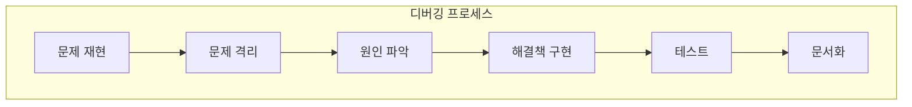

# 🔍 문제 해결과 디버깅 가이드

## 📚 목차
1. [디버깅 기초](#디버깅-기초)
2. [일반적인 오류와 해결법](#일반적인-오류와-해결법)
3. [디버깅 도구와 기법](#디버깅-도구와-기법)
4. [성능 문제 해결](#성능-문제-해결)
5. [트러블슈팅 체크리스트](#트러블슈팅-체크리스트)

---

## 🐛 디버깅 기초

### 디버깅 마인드셋


### 오류 메시지 읽기
```python
# Python 오류 메시지 구조
"""
Traceback (most recent call last):        # 호출 스택 시작
  File "app.py", line 10, in <module>     # 파일명, 라인, 함수
    result = divide(10, 0)                # 문제가 발생한 코드
  File "app.py", line 5, in divide        # 호출 경로
    return a / b                           # 실제 오류 발생 위치
ZeroDivisionError: division by zero       # 오류 타입과 메시지
"""

# 오류 메시지 해석
def parse_error_message(error):
    """오류 메시지 분석"""
    print(f"오류 타입: {type(error).__name__}")
    print(f"오류 메시지: {str(error)}")
    print(f"발생 위치: {error.__traceback__.tb_frame.f_code.co_filename}")
    print(f"라인 번호: {error.__traceback__.tb_lineno}")
```

## 🚨 일반적인 오류와 해결법

### 1. Python/Django 오류

#### ImportError
```python
# 문제
ImportError: cannot import name 'ChatConsumer' from 'chat.consumers'

# 원인
# 1. 모듈이 설치되지 않음
# 2. 순환 import
# 3. 오타

# 해결
# 1. 패키지 설치 확인
pip list | grep package-name

# 2. 순환 import 해결
# bad - circular import
# file1.py
from file2 import func2

# file2.py
from file1 import func1

# good - lazy import
# file1.py
def func1():
    from file2 import func2
    return func2()
```

#### Django Migration 오류
```python
# 문제
django.db.utils.OperationalError: no such table: chat_session

# 해결
# 1. 마이그레이션 생성
python manage.py makemigrations

# 2. 마이그레이션 적용
python manage.py migrate

# 3. 마이그레이션 상태 확인
python manage.py showmigrations

# 4. 마이그레이션 초기화 (주의!)
python manage.py migrate app_name zero
```

#### WebSocket 연결 오류
```python
# 문제
WebSocket connection failed: Error in connection establishment

# 디버깅
# 1. ASGI 서버 확인
import django
django.setup()

from channels.layers import get_channel_layer
channel_layer = get_channel_layer()
print(channel_layer)  # 설정 확인

# 2. 라우팅 확인
from django.urls import get_resolver
resolver = get_resolver()
print(resolver.reverse_dict.keys())

# 3. CORS 설정 확인
# settings.py
CORS_ALLOWED_ORIGINS = [
    "http://localhost:3000",
    "http://localhost:3001",
]
```

### 2. JavaScript/React 오류

#### TypeError
```javascript
// 문제
TypeError: Cannot read property 'map' of undefined

// 원인 - 데이터가 아직 로드되지 않음
const Component = () => {
    const [data, setData] = useState();  // undefined
    
    return (
        <div>
            {data.map(item => ...)}  // 오류!
        </div>
    );
};

// 해결 1 - 초기값 설정
const [data, setData] = useState([]);

// 해결 2 - 조건부 렌더링
return (
    <div>
        {data && data.map(item => ...)}
    </div>
);

// 해결 3 - 옵셔널 체이닝
return (
    <div>
        {data?.map(item => ...)}
    </div>
);
```

#### React Hook 오류
```javascript
// 문제
Invalid hook call. Hooks can only be called inside function components.

// 원인
// 1. 조건문 안에서 Hook 호출
if (condition) {
    useState();  // 오류!
}

// 2. 일반 함수에서 Hook 호출
function helper() {
    useState();  // 오류!
}

// 해결
// 1. Hook을 최상위에서만 호출
const Component = () => {
    const [state, setState] = useState();  // 올바른 위치
    
    if (condition) {
        setState(newValue);  // 상태 업데이트는 OK
    }
};

// 2. Custom Hook 만들기
function useHelper() {  // use로 시작
    const [state, setState] = useState();
    return state;
}
```

#### 비동기 처리 오류
```typescript
// 문제 - Race Condition
const Component = () => {
    const [data, setData] = useState(null);
    
    useEffect(() => {
        fetchData().then(setData);  // 컴포넌트 언마운트 후 setState
    }, []);
};

// 해결 - Cleanup
useEffect(() => {
    let cancelled = false;
    
    fetchData().then(result => {
        if (!cancelled) {
            setData(result);
        }
    });
    
    return () => {
        cancelled = true;
    };
}, []);

// 더 나은 해결 - AbortController
useEffect(() => {
    const controller = new AbortController();
    
    fetch(url, { signal: controller.signal })
        .then(res => res.json())
        .then(setData)
        .catch(err => {
            if (err.name !== 'AbortError') {
                console.error(err);
            }
        });
    
    return () => controller.abort();
}, []);
```

## 🛠️ 디버깅 도구와 기법

### Python 디버깅

#### pdb (Python Debugger)
```python
import pdb

def problematic_function(x, y):
    # 중단점 설정
    pdb.set_trace()
    
    result = x / y
    return result

# pdb 명령어
# n (next) - 다음 줄 실행
# s (step) - 함수 내부로 들어가기
# c (continue) - 계속 실행
# l (list) - 현재 코드 보기
# p variable - 변수 값 출력
# pp variable - 예쁘게 출력
# h (help) - 도움말
```

#### Django Debug Toolbar
```python
# settings.py
if DEBUG:
    INSTALLED_APPS += ['debug_toolbar']
    MIDDLEWARE += ['debug_toolbar.middleware.DebugToolbarMiddleware']
    INTERNAL_IPS = ['127.0.0.1']

# urls.py
if settings.DEBUG:
    import debug_toolbar
    urlpatterns = [
        path('__debug__/', include(debug_toolbar.urls)),
    ] + urlpatterns
```

#### 로깅
```python
import logging

# 로거 설정
logging.basicConfig(
    level=logging.DEBUG,
    format='%(asctime)s - %(name)s - %(levelname)s - %(message)s'
)
logger = logging.getLogger(__name__)

def debug_function(data):
    logger.debug(f"입력 데이터: {data}")
    
    try:
        result = process(data)
        logger.info(f"처리 성공: {result}")
        return result
    except Exception as e:
        logger.error(f"처리 실패: {e}", exc_info=True)
        raise

# 조건부 로깅
if logger.isEnabledFor(logging.DEBUG):
    logger.debug(f"상세 정보: {expensive_debug_info()}")
```

### JavaScript 디버깅

#### Chrome DevTools
```javascript
// 1. console 메서드들
console.log('일반 로그');
console.error('오류');
console.warn('경고');
console.table(arrayOfObjects);  // 테이블 형태로 출력
console.time('timer');           // 시간 측정 시작
console.timeEnd('timer');        // 시간 측정 종료
console.trace();                 // 스택 트레이스

// 2. debugger 문
function problematicFunction() {
    debugger;  // 브라우저가 여기서 중단
    // 코드...
}

// 3. 조건부 중단점
if (condition) {
    debugger;
}
```

#### React DevTools
```javascript
// React DevTools로 확인할 수 있는 것들
// 1. Component 트리
// 2. Props와 State
// 3. Hooks
// 4. 렌더링 성능

// Profiler API
import { Profiler } from 'react';

function onRenderCallback(id, phase, actualDuration) {
    console.log(`${id} (${phase}) took ${actualDuration}ms`);
}

<Profiler id="Chat" onRender={onRenderCallback}>
    <ChatInterface />
</Profiler>
```

## ⚡ 성능 문제 해결

### 성능 프로파일링

#### Python 프로파일링
```python
import cProfile
import pstats
from io import StringIO

def profile_function(func):
    """함수 프로파일링 데코레이터"""
    def wrapper(*args, **kwargs):
        profiler = cProfile.Profile()
        profiler.enable()
        
        result = func(*args, **kwargs)
        
        profiler.disable()
        
        # 결과 출력
        stream = StringIO()
        stats = pstats.Stats(profiler, stream=stream)
        stats.sort_stats('cumulative')
        stats.print_stats(10)  # 상위 10개
        
        print(stream.getvalue())
        return result
    
    return wrapper

@profile_function
def slow_function():
    # 코드...
    pass
```

#### Django 쿼리 최적화
```python
# 1. N+1 문제 확인
from django.db import connection
from django.conf import settings

# 쿼리 로깅 활성화
settings.DEBUG = True

# 쿼리 수 확인
initial_queries = len(connection.queries)

# 작업 수행
sessions = ChatSession.objects.all()
for session in sessions:
    print(session.messages.count())  # N+1 문제!

print(f"쿼리 수: {len(connection.queries) - initial_queries}")

# 2. 해결 - select_related / prefetch_related
sessions = ChatSession.objects.select_related('user').prefetch_related('messages')

# 3. 쿼리 분석
from django.db import connection

with connection.cursor() as cursor:
    cursor.execute("EXPLAIN ANALYZE SELECT * FROM chat_session")
    print(cursor.fetchall())
```

#### React 성능 최적화
```javascript
// 1. React.memo로 불필요한 리렌더링 방지
const ExpensiveComponent = React.memo(({ data }) => {
    console.log('렌더링됨');
    return <div>{/* 복잡한 렌더링 */}</div>;
}, (prevProps, nextProps) => {
    // true를 반환하면 리렌더링 스킵
    return prevProps.data.id === nextProps.data.id;
});

// 2. useMemo로 계산 결과 캐싱
const Component = ({ items }) => {
    const expensiveValue = useMemo(() => {
        console.log('계산 수행');
        return items.reduce((sum, item) => sum + item.value, 0);
    }, [items]);  // items가 변경될 때만 재계산
    
    return <div>{expensiveValue}</div>;
};

// 3. useCallback으로 함수 캐싱
const Component = ({ id }) => {
    const handleClick = useCallback(() => {
        console.log(`Clicked ${id}`);
    }, [id]);  // id가 변경될 때만 함수 재생성
    
    return <Button onClick={handleClick} />;
};

// 4. 가상화로 긴 리스트 최적화
import { FixedSizeList } from 'react-window';

const VirtualList = ({ items }) => (
    <FixedSizeList
        height={600}
        itemCount={items.length}
        itemSize={50}
        width='100%'
    >
        {({ index, style }) => (
            <div style={style}>
                {items[index].name}
            </div>
        )}
    </FixedSizeList>
);
```

### 메모리 누수 해결

#### Python 메모리 누수
```python
import gc
import tracemalloc

# 메모리 추적 시작
tracemalloc.start()

# 작업 수행
do_something()

# 스냅샷 생성
snapshot = tracemalloc.take_snapshot()
top_stats = snapshot.statistics('lineno')

# 상위 10개 메모리 사용 위치
for stat in top_stats[:10]:
    print(stat)

# 가비지 컬렉션 강제 실행
gc.collect()

# 순환 참조 확인
import weakref

class Node:
    def __init__(self):
        self.parent = None
        self.children = []
    
    def add_child(self, child):
        self.children.append(child)
        child.parent = weakref.ref(self)  # 약한 참조 사용
```

#### JavaScript 메모리 누수
```javascript
// 1. 이벤트 리스너 정리
useEffect(() => {
    const handler = (e) => console.log(e);
    
    window.addEventListener('resize', handler);
    
    // Cleanup
    return () => {
        window.removeEventListener('resize', handler);
    };
}, []);

// 2. 타이머 정리
useEffect(() => {
    const timer = setInterval(() => {
        console.log('tick');
    }, 1000);
    
    return () => clearInterval(timer);
}, []);

// 3. 구독 정리
useEffect(() => {
    const subscription = dataService.subscribe(data => {
        setData(data);
    });
    
    return () => subscription.unsubscribe();
}, []);

// 4. Chrome DevTools Memory Profiler
// - Heap Snapshot: 메모리 사용 현황
// - Allocation Timeline: 시간별 메모리 할당
// - Allocation Profiler: 함수별 메모리 사용
```

## 📋 트러블슈팅 체크리스트

### 프로젝트 시작 문제

#### 환경 설정 체크리스트
```bash
# 1. Python 버전 확인
python --version  # 3.9+ 필요

# 2. Node.js 버전 확인
node --version   # 16+ 필요

# 3. 가상환경 활성화 확인
which python     # venv 경로여야 함

# 4. 환경 변수 확인
echo $DATABASE_URL
echo $SECRET_KEY

# 5. 의존성 설치 확인
pip list
npm list

# 6. 데이터베이스 마이그레이션
python manage.py showmigrations
python manage.py migrate

# 7. 정적 파일 수집 (프로덕션)
python manage.py collectstatic
```

### 일반적인 문제 해결

#### CORS 오류
```python
# 증상
Access to fetch at 'http://localhost:8000/api/' from origin 'http://localhost:3000' has been blocked by CORS policy

# 해결
# backend/settings.py
CORS_ALLOWED_ORIGINS = [
    "http://localhost:3000",
    "http://localhost:3001",
    "http://localhost:3002",
]

# 또는 개발 환경에서
CORS_ALLOW_ALL_ORIGINS = True  # 주의: 개발용만!
```

#### 포트 충돌
```bash
# 증상
Error: bind: address already in use

# 해결
# 1. 사용 중인 포트 확인
lsof -i :8000  # Mac/Linux
netstat -ano | findstr :8000  # Windows

# 2. 프로세스 종료
kill -9 <PID>  # Mac/Linux
taskkill /PID <PID> /F  # Windows

# 3. 다른 포트 사용
python manage.py runserver 8001
PORT=3002 npm start
```

#### 모듈 import 오류
```python
# 증상
ModuleNotFoundError: No module named 'module_name'

# 해결 순서
# 1. 설치 확인
pip show module_name

# 2. 설치
pip install module_name

# 3. 경로 확인
import sys
print(sys.path)

# 4. PYTHONPATH 설정
export PYTHONPATH="${PYTHONPATH}:/path/to/module"
```

### 디버깅 팁

#### 로그 레벨 활용
```python
# 개발/프로덕션 환경별 로그 레벨
import os
import logging

if os.getenv('DEBUG') == 'True':
    logging.basicConfig(level=logging.DEBUG)
else:
    logging.basicConfig(level=logging.WARNING)

# 상황별 로그 레벨
logger.debug("상세 디버깅 정보")      # 개발 시
logger.info("일반 정보")              # 중요 이벤트
logger.warning("경고")                # 잠재적 문제
logger.error("오류")                  # 오류 발생
logger.critical("심각한 오류")        # 시스템 중단 위험
```

#### 이진 탐색 디버깅
```python
def binary_search_debug(problematic_function):
    """문제 위치를 이진 탐색으로 찾기"""
    # 1. 함수를 반으로 나누기
    # 2. 각 절반에서 문제 확인
    # 3. 문제가 있는 절반을 다시 나누기
    # 4. 반복
    
    print("시작")
    
    # 전반부
    part1()
    print("전반부 완료")  # 여기까지 출력되면 전반부는 OK
    
    # 후반부
    part2()
    print("후반부 완료")
```

## 🔍 문제 해결 리소스

### 오류 검색 팁
```
1. 오류 메시지 그대로 검색
   "TypeError: Cannot read property 'map' of undefined"

2. 프레임워크/라이브러리 + 오류
   "Django OperationalError no such table"

3. Stack Overflow 검색
   site:stackoverflow.com "your error message"

4. GitHub Issues 검색
   site:github.com "your error message"

5. 공식 문서 확인
   - Django: https://docs.djangoproject.com/
   - React: https://react.dev/
   - Python: https://docs.python.org/
```

### 커뮤니티 리소스
- [Stack Overflow](https://stackoverflow.com/)
- [Reddit r/django](https://www.reddit.com/r/django/)
- [Reddit r/reactjs](https://www.reddit.com/r/reactjs/)
- [Django Forum](https://forum.djangoproject.com/)
- [Reactiflux Discord](https://www.reactiflux.com/)

## 📚 참고 자료

### 디버깅
- [Python 디버깅 가이드](https://realpython.com/python-debugging-pdb/)
- [Chrome DevTools 문서](https://developer.chrome.com/docs/devtools/)
- [VS Code 디버깅](https://code.visualstudio.com/docs/editor/debugging)

### 성능 최적화
- [Django 성능 최적화](https://docs.djangoproject.com/en/5.0/topics/performance/)
- [React 성능 최적화](https://react.dev/learn/render-and-commit)
- [Web Vitals](https://web.dev/vitals/)

### 트러블슈팅
- [Django 트러블슈팅](https://docs.djangoproject.com/en/5.0/howto/error-reporting/)
- [React 에러 경계](https://react.dev/reference/react/Component#catching-rendering-errors-with-an-error-boundary)
- [Python 예외 처리](https://docs.python.org/3/tutorial/errors.html)

## 🎯 핵심 정리

1. **체계적인 접근**으로 문제를 해결합니다
2. **오류 메시지를 꼼꼼히** 읽습니다
3. **로깅과 디버거**를 적극 활용합니다
4. **작은 단위로 테스트**하며 문제를 격리합니다
5. **문서화**로 같은 문제 반복을 방지합니다

---

마지막 문서 완료!