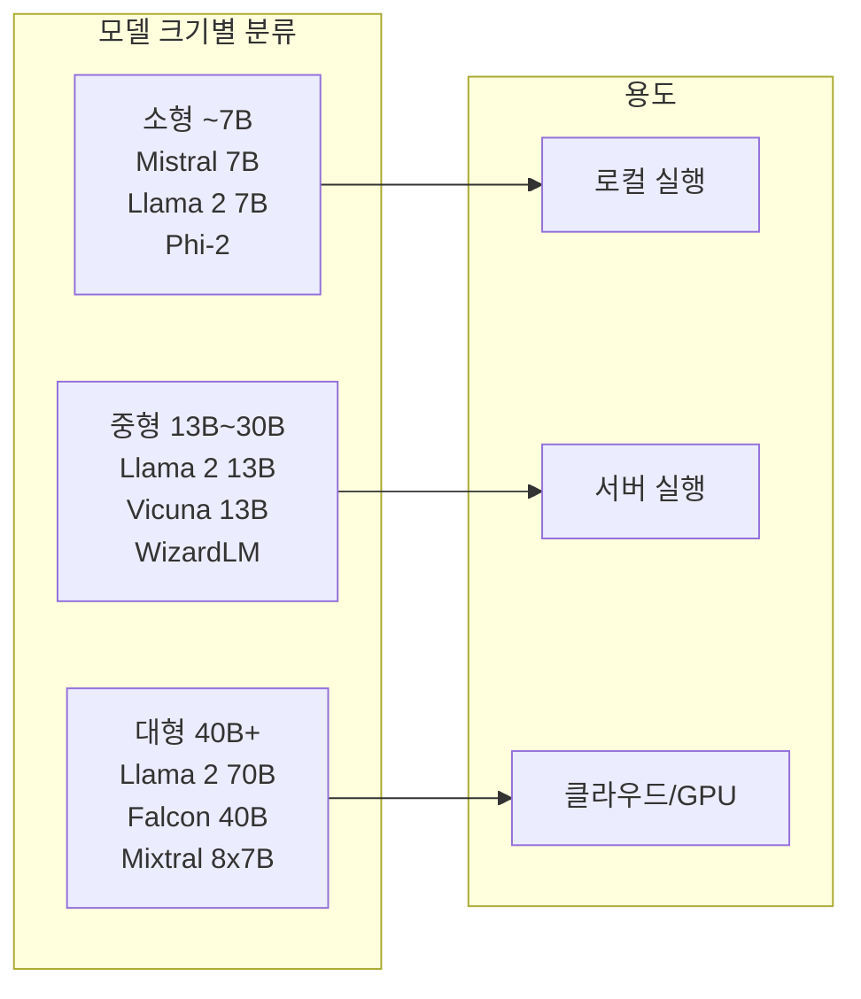
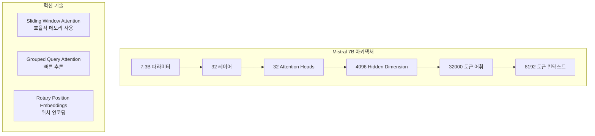

# 🤖 LLM 로컬 실행 상세 가이드

## 📚 목차
1. [LLM의 작동 원리](#llm의-작동-원리)
2. [LLM 모델의 종류와 특징](#llm-모델의-종류와-특징)
3. [Mistral 7B 모델 상세](#mistral-7b-모델-상세)
4. [로컬 실행 환경 구성](#로컬-실행-환경-구성)
5. [모델 최적화와 양자화](#모델-최적화와-양자화)

---

## 🧠 LLM의 작동 원리

### Transformer 아키텍처
```mermaid
graph TB
    subgraph "Transformer 구조"
        INPUT[입력 텍스트]
        
        subgraph "Tokenization"
            TOK[토큰화<br/>"안녕" → [1234, 5678]]
        end
        
        subgraph "Embedding"
            EMB[임베딩<br/>토큰 → 벡터]
            POS[위치 인코딩]
        end
        
        subgraph "Attention Layers"
            SELF[Self-Attention<br/>문맥 이해]
            MULTI[Multi-Head Attention<br/>다각도 분석]
            FFN[Feed Forward<br/>특징 추출]
        end
        
        subgraph "Output"
            LOGITS[로짓 계산]
            SOFTMAX[확률 분포]
            SAMPLE[토큰 샘플링]
        end
        
        OUTPUT[출력 텍스트]
        
        INPUT --> TOK
        TOK --> EMB
        EMB --> POS
        POS --> SELF
        SELF --> MULTI
        MULTI --> FFN
        FFN --> LOGITS
        LOGITS --> SOFTMAX
        SOFTMAX --> SAMPLE
        SAMPLE --> OUTPUT
    end
```

### 텍스트 생성 과정
```python
"""
LLM의 텍스트 생성 과정 (Autoregressive Generation)

1. 입력 처리
   "한국의 수도는" → [토큰1, 토큰2, 토큰3]

2. 다음 토큰 예측
   P(다음토큰 | 이전토큰들) 계산
   
3. 샘플링
   확률 분포에서 토큰 선택
   
4. 반복
   생성된 토큰을 입력에 추가하고 반복
"""

class SimpleLLM:
    def generate_text(self, prompt, max_tokens=100):
        tokens = self.tokenize(prompt)
        
        for _ in range(max_tokens):
            # 1. 현재까지의 토큰으로 다음 토큰 예측
            logits = self.forward(tokens)
            
            # 2. 확률 분포 계산
            probs = self.softmax(logits[-1] / temperature)
            
            # 3. 샘플링
            next_token = self.sample(probs)
            
            # 4. 종료 조건 확인
            if next_token == self.eos_token:
                break
            
            # 5. 토큰 추가
            tokens.append(next_token)
        
        return self.decode(tokens)
```

### Attention 메커니즘
```python
import numpy as np

def scaled_dot_product_attention(Q, K, V):
    """
    Attention 계산
    Q: Query (무엇을 찾을 것인가)
    K: Key (어디서 찾을 것인가)
    V: Value (무엇을 가져올 것인가)
    """
    # 1. Q와 K의 유사도 계산
    scores = np.matmul(Q, K.T)
    
    # 2. 스케일링 (gradient vanishing 방지)
    d_k = K.shape[-1]
    scores = scores / np.sqrt(d_k)
    
    # 3. Softmax로 확률화
    attention_weights = np.exp(scores) / np.sum(np.exp(scores), axis=-1, keepdims=True)
    
    # 4. Value에 가중치 적용
    output = np.matmul(attention_weights, V)
    
    return output, attention_weights

# 예시: "나는 학교에 간다"에서 각 단어가 서로를 얼마나 주목하는지
words = ["나는", "학교에", "간다"]
attention_matrix = [
    [0.7, 0.2, 0.1],  # "나는"이 각 단어를 보는 정도
    [0.3, 0.5, 0.2],  # "학교에"가 각 단어를 보는 정도
    [0.2, 0.4, 0.4],  # "간다"가 각 단어를 보는 정도
]
```

## 📊 LLM 모델의 종류와 특징

### 주요 오픈소스 LLM 비교


### 모델 상세 비교표
| 모델 | 크기 | 특징 | 필요 메모리 | 라이선스 |
|------|------|------|------------|----------|
| **Mistral 7B** | 7B | 빠른 속도, 좋은 성능 | 4-8GB | Apache 2.0 |
| **Llama 2 7B** | 7B | Meta 개발, 다국어 지원 | 4-8GB | Custom (상업적 제한) |
| **Llama 2 13B** | 13B | 더 나은 추론 능력 | 8-16GB | Custom |
| **Phi-2** | 2.7B | Microsoft, 초소형 | 2-4GB | MIT |
| **Vicuna 13B** | 13B | ChatGPT 스타일 튜닝 | 8-16GB | Llama 기반 |
| **WizardLM** | 7B/13B | 코딩 특화 | 4-16GB | Llama 기반 |
| **Mixtral 8x7B** | 47B | MoE 아키텍처 | 24-32GB | Apache 2.0 |
| **Falcon** | 7B/40B | 다국어 강점 | 4-24GB | Apache 2.0 |

### 모델 선택 기준
```python
def select_model(requirements):
    """프로젝트 요구사항에 따른 모델 선택"""
    
    models = {
        'mistral-7b': {
            'size': 7e9,
            'memory': 8,  # GB
            'speed': 'fast',
            'quality': 'good',
            'license': 'apache2',
            'multilingual': True,
            'use_cases': ['chat', 'qa', 'summarization']
        },
        'llama2-7b': {
            'size': 7e9,
            'memory': 8,
            'speed': 'fast',
            'quality': 'good',
            'license': 'custom',
            'multilingual': True,
            'use_cases': ['chat', 'creative', 'translation']
        },
        'phi-2': {
            'size': 2.7e9,
            'memory': 4,
            'speed': 'very_fast',
            'quality': 'moderate',
            'license': 'mit',
            'multilingual': False,
            'use_cases': ['simple_chat', 'classification']
        }
    }
    
    # 요구사항 체크
    if requirements['memory_limit'] < 8:
        return 'phi-2'
    elif requirements['commercial_use'] and requirements['quality'] == 'high':
        return 'mistral-7b'
    elif requirements['creative_writing']:
        return 'llama2-7b'
    else:
        return 'mistral-7b'  # 기본값
```

## 🎯 Mistral 7B 모델 상세

### Mistral 7B 특징


### 왜 Mistral 7B를 선택했나?
```python
"""
프로젝트에서 Mistral 7B를 선택한 이유:

1. 성능 대비 크기
   - 7B 크기로 13B 모델 수준의 성능
   - 로컬 실행 가능한 크기

2. 라이선스
   - Apache 2.0 (상업적 사용 가능)
   - 제약 없는 배포

3. 한국어 지원
   - 다국어 학습으로 한국어 처리 가능
   - Fine-tuning으로 성능 개선 가능

4. 효율성
   - Sliding Window Attention으로 메모리 효율적
   - 빠른 추론 속도

5. 커뮤니티
   - 활발한 개발과 지원
   - 다양한 양자화 버전 제공
"""

class MistralConfig:
    # 모델 아키텍처 설정
    model_type = "mistral"
    vocab_size = 32000
    hidden_size = 4096
    intermediate_size = 14336
    num_hidden_layers = 32
    num_attention_heads = 32
    num_key_value_heads = 8  # GQA
    hidden_act = "silu"
    max_position_embeddings = 8192
    initializer_range = 0.02
    rms_norm_eps = 1e-5
    use_cache = True
    rope_theta = 10000.0
    sliding_window = 4096  # Mistral 특징
```

### Mistral Instruct 템플릿
```python
def format_mistral_prompt(instruction: str, system: str = None) -> str:
    """
    Mistral Instruct 모델용 프롬프트 포맷
    """
    if system:
        prompt = f"<s>[INST] {system}\n\n{instruction} [/INST]"
    else:
        prompt = f"<s>[INST] {instruction} [/INST]"
    
    return prompt

# 사용 예시
prompt = format_mistral_prompt(
    instruction="Python으로 빠른 정렬 알고리즘을 구현해주세요.",
    system="당신은 전문 프로그래머입니다. 코드는 깔끔하고 주석을 포함해야 합니다."
)
```

## 💻 로컬 실행 환경 구성

### llama.cpp와 GGUF 형식
```python
"""
GGUF (GPT-Generated Unified Format)
- llama.cpp에서 사용하는 모델 형식
- CPU/GPU 모두에서 효율적 실행
- 다양한 양자화 옵션 지원
"""

# llama-cpp-python 설치
import platform
import subprocess

def install_llama_cpp():
    system = platform.system()
    
    if system == "Darwin":  # macOS
        # Metal 가속 지원
        subprocess.run([
            "CMAKE_ARGS='-DLLAMA_METAL=on'",
            "pip", "install", "llama-cpp-python"
        ])
    
    elif system == "Linux":
        if has_cuda():
            # CUDA 가속 지원
            subprocess.run([
                "CMAKE_ARGS='-DLLAMA_CUDA=on'",
                "pip", "install", "llama-cpp-python"
            ])
        else:
            # CPU only
            subprocess.run(["pip", "install", "llama-cpp-python"])
    
    elif system == "Windows":
        # Windows는 기본 CPU
        subprocess.run(["pip", "install", "llama-cpp-python"])
```

### 모델 로딩과 실행
```python
from llama_cpp import Llama
import psutil
import GPUtil

class LocalLLM:
    def __init__(self, model_path: str):
        """로컬 LLM 초기화"""
        
        # 시스템 리소스 확인
        self.check_system_resources()
        
        # 최적 설정 계산
        n_gpu_layers = self.calculate_gpu_layers()
        n_threads = self.calculate_threads()
        
        # 모델 로드
        self.model = Llama(
            model_path=model_path,
            n_ctx=4096,           # 컨텍스트 크기
            n_batch=512,          # 배치 크기
            n_gpu_layers=n_gpu_layers,  # GPU 레이어
            n_threads=n_threads,  # CPU 스레드
            verbose=False
        )
        
        print(f"✅ 모델 로드 완료")
        print(f"   - GPU 레이어: {n_gpu_layers}")
        print(f"   - CPU 스레드: {n_threads}")
    
    def check_system_resources(self):
        """시스템 리소스 확인"""
        # RAM 확인
        ram = psutil.virtual_memory()
        ram_gb = ram.total / (1024**3)
        available_gb = ram.available / (1024**3)
        
        print(f"📊 시스템 리소스:")
        print(f"   - 전체 RAM: {ram_gb:.1f}GB")
        print(f"   - 사용 가능: {available_gb:.1f}GB")
        
        # GPU 확인
        try:
            gpus = GPUtil.getGPUs()
            for gpu in gpus:
                print(f"   - GPU: {gpu.name}")
                print(f"   - VRAM: {gpu.memoryTotal}MB")
        except:
            print("   - GPU: 없음 (CPU 모드)")
        
        # 최소 요구사항 체크
        if available_gb < 4:
            raise MemoryError("최소 4GB의 여유 RAM이 필요합니다")
    
    def calculate_gpu_layers(self) -> int:
        """GPU 레이어 수 계산"""
        try:
            gpus = GPUtil.getGPUs()
            if gpus:
                gpu = gpus[0]
                vram_gb = gpu.memoryFree / 1024
                
                # VRAM에 따른 레이어 수
                if vram_gb >= 8:
                    return 32  # 전체 레이어
                elif vram_gb >= 4:
                    return 20
                elif vram_gb >= 2:
                    return 10
                else:
                    return 0
        except:
            pass
        
        return 0  # CPU only
    
    def calculate_threads(self) -> int:
        """최적 스레드 수 계산"""
        cpu_count = psutil.cpu_count(logical=False)
        # 물리 코어의 75% 사용
        return max(1, int(cpu_count * 0.75))
    
    def generate(self, prompt: str, **kwargs):
        """텍스트 생성"""
        default_params = {
            'max_tokens': 512,
            'temperature': 0.7,
            'top_p': 0.95,
            'top_k': 40,
            'repeat_penalty': 1.1,
            'stop': ['</s>', '[INST]', '[/INST]']
        }
        
        params = {**default_params, **kwargs}
        
        response = self.model(prompt, **params)
        return response['choices'][0]['text']
    
    def generate_stream(self, prompt: str, **kwargs):
        """스트리밍 생성"""
        params = {**kwargs, 'stream': True}
        
        for output in self.model(prompt, **params):
            yield output['choices'][0]['text']
```

### 하드웨어별 최적화
```python
class HardwareOptimizer:
    """하드웨어에 따른 최적화 설정"""
    
    @staticmethod
    def get_optimal_settings():
        import platform
        import torch
        
        settings = {
            'n_ctx': 4096,
            'n_batch': 512,
            'n_gpu_layers': 0,
            'n_threads': 4,
            'use_mmap': True,
            'use_mlock': False
        }
        
        # CPU 정보
        cpu_count = psutil.cpu_count(logical=False)
        settings['n_threads'] = min(cpu_count - 1, 8)
        
        # 플랫폼별 설정
        system = platform.system()
        
        if system == "Darwin":  # macOS
            if platform.processor() == 'arm':  # M1/M2
                settings['n_gpu_layers'] = 1  # Metal 사용
                settings['n_threads'] = 8
                print("🍎 Apple Silicon 감지 - Metal 가속 사용")
        
        elif system == "Linux" or system == "Windows":
            if torch.cuda.is_available():
                # CUDA 사용 가능
                gpu = torch.cuda.get_device_properties(0)
                vram_gb = gpu.total_memory / (1024**3)
                
                if vram_gb >= 8:
                    settings['n_gpu_layers'] = 32
                elif vram_gb >= 4:
                    settings['n_gpu_layers'] = 20
                
                print(f"🎮 CUDA GPU 감지 - {gpu.name} ({vram_gb:.1f}GB)")
        
        # RAM에 따른 조정
        ram_gb = psutil.virtual_memory().total / (1024**3)
        if ram_gb < 8:
            settings['n_ctx'] = 2048  # 컨텍스트 축소
            settings['n_batch'] = 256
            settings['use_mlock'] = False
        elif ram_gb >= 16:
            settings['use_mlock'] = True  # 메모리 잠금
        
        return settings

# 사용 예
settings = HardwareOptimizer.get_optimal_settings()
model = Llama(model_path="mistral-7b.gguf", **settings)
```

## ⚡ 모델 최적화와 양자화

### 양자화 (Quantization) 이해
```python
"""
양자화: 모델 가중치의 정밀도를 줄여 크기와 메모리 사용량 감소

원리:
- FP32 (32비트 부동소수점) → INT8/INT4 (8/4비트 정수)
- 정밀도는 약간 떨어지지만 크기는 크게 감소
"""

class QuantizationTypes:
    """양자화 타입과 특징"""
    
    TYPES = {
        'Q4_0': {
            'bits': 4,
            'size_ratio': 0.125,  # 원본 대비 12.5%
            'quality': 'moderate',
            'speed': 'fastest',
            'description': '4비트 양자화, 가장 작은 크기'
        },
        'Q4_K_M': {
            'bits': 4,
            'size_ratio': 0.15,
            'quality': 'good',
            'speed': 'fast',
            'description': '4비트 + 중요 가중치는 6비트 (추천)'
        },
        'Q5_K_M': {
            'bits': 5,
            'size_ratio': 0.19,
            'quality': 'very_good',
            'speed': 'fast',
            'description': '5비트 + 중요 가중치는 6비트'
        },
        'Q6_K': {
            'bits': 6,
            'size_ratio': 0.23,
            'quality': 'excellent',
            'speed': 'moderate',
            'description': '6비트 양자화'
        },
        'Q8_0': {
            'bits': 8,
            'size_ratio': 0.31,
            'quality': 'near_perfect',
            'speed': 'moderate',
            'description': '8비트 양자화, 품질 우선'
        },
        'FP16': {
            'bits': 16,
            'size_ratio': 0.5,
            'quality': 'perfect',
            'speed': 'slow',
            'description': '16비트 부동소수점'
        }
    }
    
    @classmethod
    def recommend(cls, ram_gb: float, quality_priority: bool = False):
        """시스템 사양에 따른 양자화 추천"""
        if ram_gb < 6:
            return 'Q4_0'
        elif ram_gb < 8:
            return 'Q4_K_M'  # 프로젝트 기본값
        elif ram_gb < 16:
            return 'Q5_K_M' if quality_priority else 'Q4_K_M'
        else:
            return 'Q6_K' if quality_priority else 'Q5_K_M'
```

### 모델 파일 크기 비교
```python
def calculate_model_sizes(base_size_gb=14):
    """Mistral 7B 양자화별 크기 계산"""
    
    sizes = {
        'Original (FP32)': base_size_gb * 2,  # 28GB
        'FP16': base_size_gb,                 # 14GB
        'Q8_0': base_size_gb * 0.31,          # 4.3GB
        'Q6_K': base_size_gb * 0.23,          # 3.2GB
        'Q5_K_M': base_size_gb * 0.19,        # 2.7GB
        'Q4_K_M': base_size_gb * 0.15,        # 2.1GB (프로젝트 사용)
        'Q4_0': base_size_gb * 0.125,         # 1.75GB
    }
    
    print("📦 Mistral 7B 양자화별 파일 크기:")
    for name, size in sizes.items():
        bar = '█' * int(size)
        print(f"  {name:15} {size:5.1f}GB {bar}")
    
    return sizes

# 실행
sizes = calculate_model_sizes()
```

### 성능 벤치마크
```python
import time
import statistics

class ModelBenchmark:
    """모델 성능 벤치마크"""
    
    def __init__(self, model_path: str):
        self.model = Llama(model_path=model_path)
        self.results = []
    
    def benchmark_speed(self, prompts: list, max_tokens=100):
        """속도 벤치마크"""
        times = []
        tokens_per_second = []
        
        for prompt in prompts:
            start = time.time()
            
            response = self.model(
                prompt,
                max_tokens=max_tokens,
                temperature=0.7
            )
            
            elapsed = time.time() - start
            times.append(elapsed)
            
            # 토큰/초 계산
            output_tokens = len(self.model.tokenize(
                response['choices'][0]['text'].encode()
            ))
            tokens_per_second.append(output_tokens / elapsed)
        
        return {
            'avg_time': statistics.mean(times),
            'avg_tokens_per_second': statistics.mean(tokens_per_second),
            'min_time': min(times),
            'max_time': max(times)
        }
    
    def benchmark_quality(self, test_cases: list):
        """품질 벤치마크"""
        scores = []
        
        for test in test_cases:
            prompt = test['prompt']
            expected = test['expected_keywords']
            
            response = self.model(prompt, max_tokens=200)
            output = response['choices'][0]['text']
            
            # 키워드 매칭으로 간단한 품질 평가
            score = sum(
                1 for keyword in expected 
                if keyword.lower() in output.lower()
            ) / len(expected)
            
            scores.append(score)
        
        return {
            'avg_score': statistics.mean(scores),
            'min_score': min(scores),
            'max_score': max(scores)
        }
    
    def compare_quantizations(self, model_paths: dict):
        """양자화 버전 비교"""
        results = {}
        
        test_prompt = "Explain quantum computing in simple terms."
        
        for quant_type, path in model_paths.items():
            print(f"\n테스트 중: {quant_type}")
            
            # 모델 로드
            model = Llama(model_path=path, n_ctx=2048)
            
            # 속도 측정
            start = time.time()
            response = model(test_prompt, max_tokens=100)
            elapsed = time.time() - start
            
            # 메모리 사용량
            import os
            size_mb = os.path.getsize(path) / (1024**2)
            
            results[quant_type] = {
                'size_mb': size_mb,
                'time_seconds': elapsed,
                'tokens_per_second': 100 / elapsed,
                'response_preview': response['choices'][0]['text'][:100]
            }
            
            del model  # 메모리 해제
        
        return results
```

### 모델 다운로드와 변환
```python
import requests
from huggingface_hub import snapshot_download
import subprocess

class ModelManager:
    """모델 다운로드 및 관리"""
    
    MODELS = {
        'mistral-7b-instruct': {
            'repo_id': 'TheBloke/Mistral-7B-Instruct-v0.2-GGUF',
            'filename': 'mistral-7b-instruct-v0.2.Q4_K_M.gguf',
            'size_gb': 4.37
        },
        'llama2-7b': {
            'repo_id': 'TheBloke/Llama-2-7B-Chat-GGUF',
            'filename': 'llama-2-7b-chat.Q4_K_M.gguf',
            'size_gb': 3.83
        },
        'phi-2': {
            'repo_id': 'TheBloke/phi-2-GGUF',
            'filename': 'phi-2.Q4_K_M.gguf',
            'size_gb': 1.6
        }
    }
    
    @classmethod
    def download_model(cls, model_name: str, save_path: str = './models'):
        """Hugging Face에서 모델 다운로드"""
        if model_name not in cls.MODELS:
            raise ValueError(f"Unknown model: {model_name}")
        
        model_info = cls.MODELS[model_name]
        
        print(f"📥 다운로드 중: {model_name}")
        print(f"   크기: {model_info['size_gb']}GB")
        
        # Hugging Face Hub에서 다운로드
        snapshot_download(
            repo_id=model_info['repo_id'],
            local_dir=save_path,
            allow_patterns=[model_info['filename']]
        )
        
        model_path = f"{save_path}/{model_info['filename']}"
        print(f"✅ 다운로드 완료: {model_path}")
        
        return model_path
    
    @classmethod
    def convert_to_gguf(cls, model_path: str, output_path: str, 
                       quantization: str = 'Q4_K_M'):
        """일반 모델을 GGUF로 변환"""
        
        # llama.cpp의 convert.py 사용
        cmd = [
            'python', 'convert.py',
            model_path,
            '--outfile', output_path,
            '--outtype', quantization
        ]
        
        print(f"🔄 변환 중: {model_path} → {output_path}")
        subprocess.run(cmd, check=True)
        print(f"✅ 변환 완료")
```

## 🚀 실제 프로젝트 통합

### 프로젝트의 LLM 통합 구조
```python
# backend/llm/llm_service.py
from llama_cpp import Llama
from typing import Generator, Optional
import logging

logger = logging.getLogger(__name__)

class ProjectLLMService:
    """프로젝트의 실제 LLM 서비스"""
    
    _instance = None
    
    def __new__(cls):
        """싱글톤 패턴으로 모델 인스턴스 관리"""
        if cls._instance is None:
            cls._instance = super().__new__(cls)
            cls._instance.initialized = False
        return cls._instance
    
    def __init__(self):
        if not self.initialized:
            self.model = None
            self.model_path = "models/mistral-7b-instruct-v0.2.Q4_K_M.gguf"
            self.load_model()
            self.initialized = True
    
    def load_model(self):
        """모델 로드 with 최적화"""
        try:
            # 하드웨어 최적화 설정
            settings = HardwareOptimizer.get_optimal_settings()
            
            logger.info(f"Loading model: {self.model_path}")
            logger.info(f"Settings: {settings}")
            
            self.model = Llama(
                model_path=self.model_path,
                **settings
            )
            
            logger.info("✅ Model loaded successfully")
            
            # 워밍업 (첫 실행 최적화)
            self._warmup()
            
        except Exception as e:
            logger.error(f"❌ Failed to load model: {e}")
            raise
    
    def _warmup(self):
        """모델 워밍업"""
        logger.info("Warming up model...")
        self.model("Hello", max_tokens=1)
        logger.info("✅ Warmup complete")
    
    async def generate_for_chat(
        self,
        message: str,
        context: list,
        temperature: float = 0.7
    ) -> Generator[str, None, None]:
        """채팅용 응답 생성"""
        
        # 컨텍스트 구성
        prompt = self._build_chat_prompt(message, context)
        
        # 토큰 수 체크
        token_count = len(self.model.tokenize(prompt.encode()))
        if token_count > 3500:  # 여유 공간 확보
            # 오래된 메시지 제거
            context = context[-5:]
            prompt = self._build_chat_prompt(message, context)
        
        # 스트리밍 생성
        for token in self.model(
            prompt,
            max_tokens=512,
            temperature=temperature,
            stream=True,
            stop=['</s>', '[INST]', '[/INST]']
        ):
            yield token['choices'][0]['text']
    
    def _build_chat_prompt(self, message: str, context: list) -> str:
        """채팅 프롬프트 구성"""
        system = "당신은 도움이 되는 AI 어시스턴트입니다."
        
        # Mistral 형식
        prompt = f"<s>[INST] {system}\n\n"
        
        # 이전 대화 추가
        for msg in context:
            if msg['is_user']:
                prompt += f"User: {msg['content']}\n"
            else:
                prompt += f"Assistant: {msg['content']}\n"
        
        # 현재 메시지
        prompt += f"User: {message}\n[/INST]\nAssistant:"
        
        return prompt
```

## 📚 참고 자료

### LLM 이해
- [Attention Is All You Need (Transformer 논문)](https://arxiv.org/abs/1706.03762)
- [The Illustrated Transformer](https://jalammar.github.io/illustrated-transformer/)
- [LLM Visualization](https://bbycroft.net/llm)

### Mistral 모델
- [Mistral AI 공식 문서](https://docs.mistral.ai/)
- [Mistral 7B 논문](https://arxiv.org/abs/2310.06825)
- [Mistral 모델 카드](https://huggingface.co/mistralai/Mistral-7B-Instruct-v0.2)

### llama.cpp
- [llama.cpp GitHub](https://github.com/ggerganov/llama.cpp)
- [llama-cpp-python 문서](https://llama-cpp-python.readthedocs.io/)
- [GGUF 형식 설명](https://github.com/ggerganov/ggml/blob/master/docs/gguf.md)

### 모델 양자화
- [Quantization 설명](https://huggingface.co/docs/optimum/concept_guides/quantization)
- [GPTQ vs GGUF 비교](https://github.com/ggerganov/llama.cpp/discussions/2094)

### 모델 허브
- [Hugging Face Models](https://huggingface.co/models)
- [TheBloke의 GGUF 모델](https://huggingface.co/TheBloke)

## 🎯 핵심 정리

1. **LLM은 Transformer 아키텍처**를 기반으로 텍스트를 생성합니다
2. **Mistral 7B는 효율성과 성능의 균형**이 뛰어난 모델입니다
3. **양자화로 모델 크기를 줄여** 로컬 실행이 가능합니다
4. **llama.cpp는 CPU/GPU에서 효율적**으로 LLM을 실행합니다
5. **하드웨어에 맞는 최적화**로 성능을 극대화할 수 있습니다

---

다음: [README.md 업데이트](./README.md)