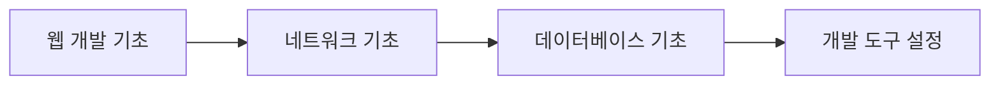
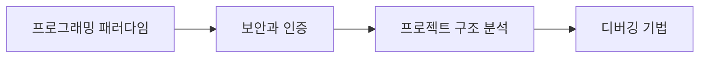
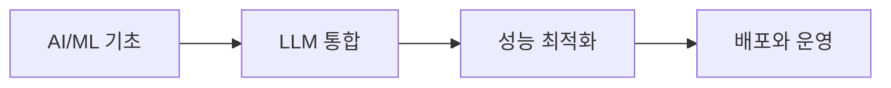

# 📚 LLM 채팅 시스템 - 기본 개념과 구현 구조

## 🎯 개요

이 문서 모음은 LLM 채팅 시스템 프로젝트의 **기본 개념부터 심화 구현**까지 체계적으로 설명합니다.
웹 개발, 네트워크, 데이터베이스, AI/ML 등 프로젝트에 필요한 모든 기초 지식과 실제 구현 방법을 다룹니다.

## 📖 문서 구성

### 🚀 프로젝트 개요
**[프로젝트 개요 - LLM/백엔드/프론트엔드 통신과 구조](./00-프로젝트-개요.md)**
   - 전체 시스템 아키텍처
   - LLM 통합 구조
   - 백엔드와 프론트엔드 통신
   - 핵심 기능과 최적화

### 🌐 기초 개념
1. **[웹 개발 기초 개념](./01-웹개발-기초개념.md)**
   - 웹의 작동 원리
   - 클라이언트-서버 아키텍처
   - 프론트엔드 vs 백엔드
   - 웹 표준과 프로토콜

2. **[네트워크와 통신 기초](./02-네트워크와-통신-기초.md)**
   - OSI 7계층과 TCP/IP
   - HTTP/HTTPS 프로토콜
   - WebSocket 실시간 통신
   - API 통신 패턴

3. **[데이터베이스 기초](./03-데이터베이스-기초.md)**
   - 관계형 데이터베이스
   - SQL 기초
   - Django ORM
   - 데이터베이스 설계

### 💻 프로그래밍
4. **[프로그래밍 패러다임](./04-프로그래밍-패러다임.md)**
   - 객체지향 프로그래밍 (OOP)
   - 함수형 프로그래밍
   - 디자인 패턴
   - 클린 코드와 리팩토링

5. **[보안과 인증 기초](./05-보안과-인증-기초.md)**
   - 웹 보안 기초
   - 인증과 인가
   - 암호화와 해싱
   - 일반적인 보안 취약점

### 🤖 인공지능
6. **[AI/ML 기초 개념](./06-AI-ML-기초개념.md)**
   - 기계학습 기초
   - 딥러닝과 신경망
   - 자연어 처리 (NLP)
   - 대규모 언어 모델 (LLM)

### 🤖 LLM 상세
10. **[LLM 로컬 실행 상세 가이드](./10-LLM-로컬실행-상세.md)**
   - LLM 작동 원리 (Transformer, Attention)
   - 오픈소스 LLM 모델 비교
   - Mistral 7B 선택 이유와 특징
   - 로컬 실행 환경 구성과 최적화

### 🔧 개발 환경
7. **[개발 도구와 환경 설정](./07-개발도구와-환경설정.md)**
   - 개발 환경 구성
   - 버전 관리 (Git)
   - 패키지 관리
   - 배포와 CI/CD

### 🏗️ 프로젝트 구조
8. **[프로젝트 구조 심화 분석](./08-프로젝트-구조-심화.md)**
   - 프로젝트 아키텍처 전체 분석
   - 백엔드 상세 구조
   - 프론트엔드 상세 구조
   - 데이터 플로우 분석

9. **[문제 해결과 디버깅](./09-문제해결과-디버깅.md)**
   - 디버깅 기초
   - 일반적인 오류와 해결법
   - 디버깅 도구와 기법
   - 성능 문제 해결

## 🎓 학습 로드맵

### 입문자 (1-2개월)


### 중급자 (2-3개월)


### 고급자 (3-4개월)


## 🚀 프로젝트 실행 가이드

### 1. 환경 설정
```bash
# Python 가상환경
python -m venv venv
source venv/bin/activate  # Mac/Linux
venv\Scripts\activate     # Windows

# 의존성 설치
cd backend
pip install -r requirements.txt

cd ../frontend-chat
npm install
```

### 2. 서버 실행
```bash
# 백엔드 (Terminal 1)
cd backend
python manage.py migrate
python manage.py runserver

# 프론트엔드 (Terminal 2)
cd frontend-chat
npm start
```

### 3. 접속
- 채팅 UI: http://localhost:3001
- 관리자 UI: http://localhost:3002
- API: http://localhost:8000/api

## 💡 핵심 개념 요약

### 아키텍처
- **3-Tier Architecture**: Presentation → Application → Data
- **MVC Pattern**: Model-View-Controller
- **RESTful API**: Resource 기반 API 설계
- **WebSocket**: 실시간 양방향 통신

### 기술 스택
| Layer | Technology | Purpose |
|-------|------------|---------|
| **Frontend** | React, TypeScript | 사용자 인터페이스 |
| **Backend** | Django, Python | 비즈니스 로직 |
| **Database** | SQLite, ChromaDB | 데이터 저장 |
| **AI/ML** | Mistral 7B, llama-cpp | 언어 모델 |

### 주요 패턴
- **Singleton**: LLM 서비스 인스턴스
- **Observer**: WebSocket 이벤트
- **Repository**: 데이터 접근 추상화
- **Service Layer**: 비즈니스 로직 캡슐화

## 🔍 문제 해결 체크리스트

### 자주 발생하는 문제
1. ✅ Python/Node 버전 확인
2. ✅ 가상환경 활성화 확인
3. ✅ 의존성 설치 확인
4. ✅ 데이터베이스 마이그레이션
5. ✅ 환경 변수 설정
6. ✅ 포트 충돌 확인
7. ✅ CORS 설정

### 디버깅 순서
1. 오류 메시지 정확히 읽기
2. 로그 확인
3. 문제 재현
4. 문제 격리
5. 해결책 검색/적용
6. 테스트
7. 문서화

## 📚 추가 학습 자료

### 온라인 강의
- [CS50's Web Programming](https://cs50.harvard.edu/web/)
- [The Odin Project](https://www.theodinproject.com/)
- [freeCodeCamp](https://www.freecodecamp.org/)

### 책 추천
- Clean Code - Robert C. Martin
- Design Patterns - Gang of Four
- The Pragmatic Programmer
- You Don't Know JS

### 커뮤니티
- [Stack Overflow](https://stackoverflow.com/)
- [GitHub Discussions](https://github.com/features/discussions)
- [Dev.to](https://dev.to/)
- [Reddit Programming](https://www.reddit.com/r/programming/)

## 🎯 학습 목표

이 문서를 통해 다음을 달성할 수 있습니다:

1. ✨ **웹 개발의 전체 그림** 이해
2. 🔧 **실무에서 사용되는 기술** 습득
3. 🐛 **문제 해결 능력** 향상
4. 🏗️ **확장 가능한 구조** 설계
5. 🚀 **프로덕션 레벨 코드** 작성

## 🤝 기여 방법

1. 오타나 오류 발견 시 Issue 생성
2. 개선 사항 제안
3. 추가 예제 코드 제공
4. 번역 지원

## 📄 라이선스

이 문서는 교육 목적으로 자유롭게 사용할 수 있습니다.

---

**Happy Coding! 🚀**

질문이나 피드백은 언제든 환영합니다.