# 🏗️ 시스템 아키텍처 다이어그램

## 📊 전체 시스템 구조도

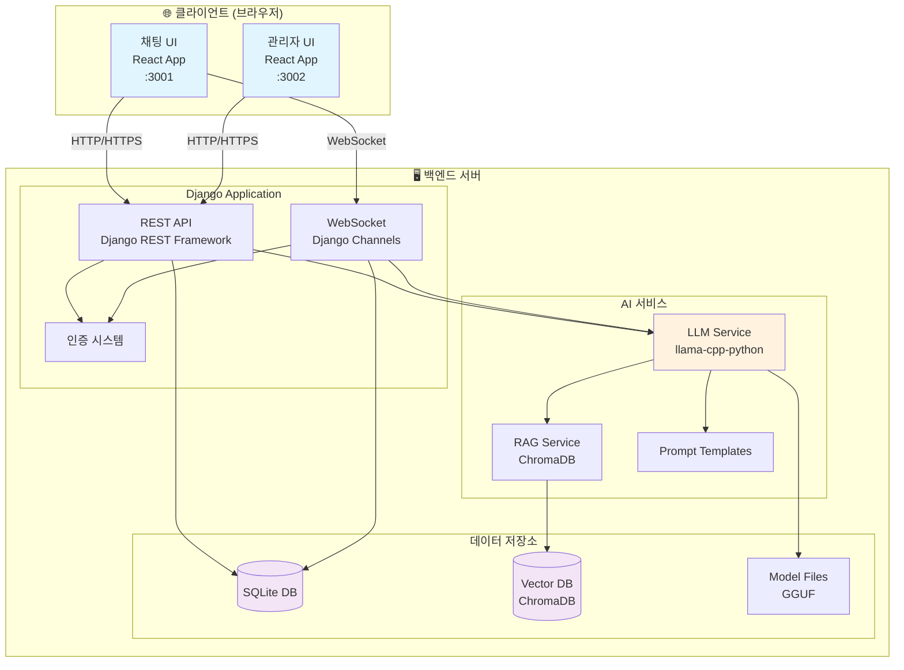

## 🔄 데이터 플로우 다이어그램

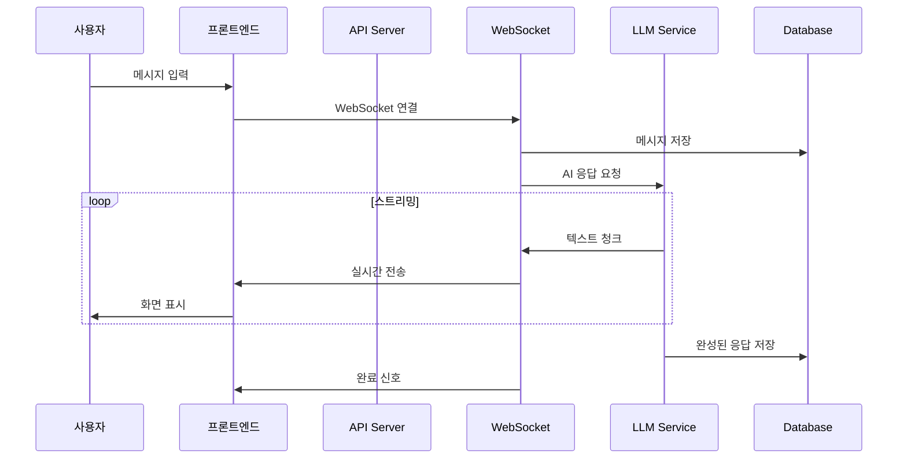

## 🗂️ 컴포넌트 아키텍처

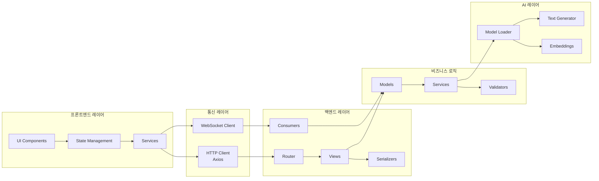

## 🔐 인증 플로우

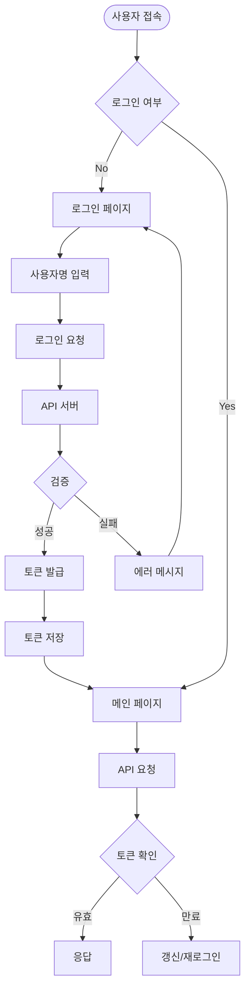

## 💾 데이터베이스 ERD

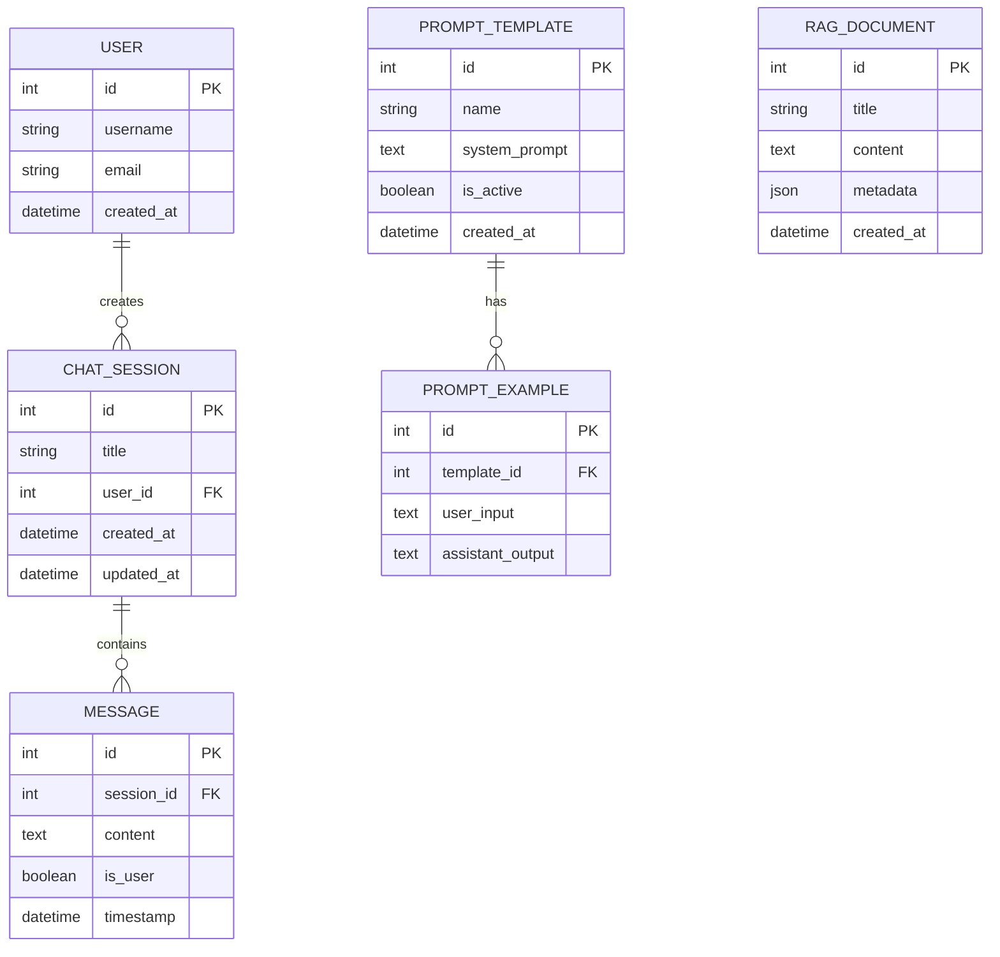

## 🚀 배포 아키텍처

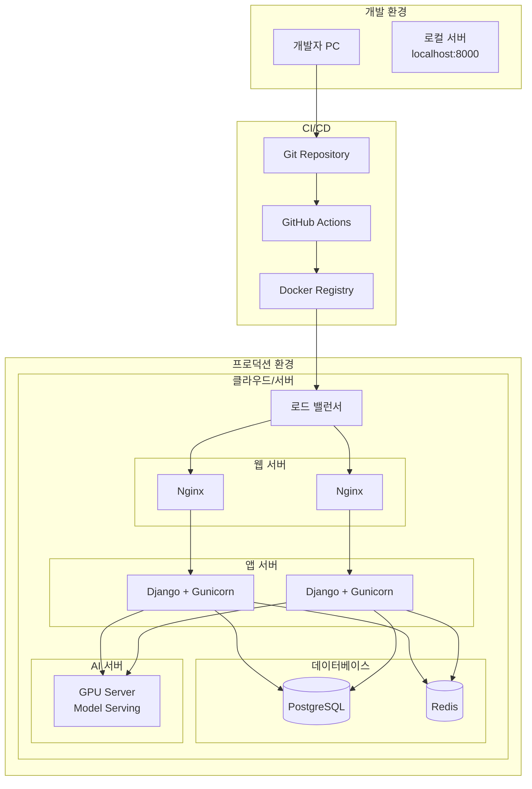

## 📈 성능 모니터링

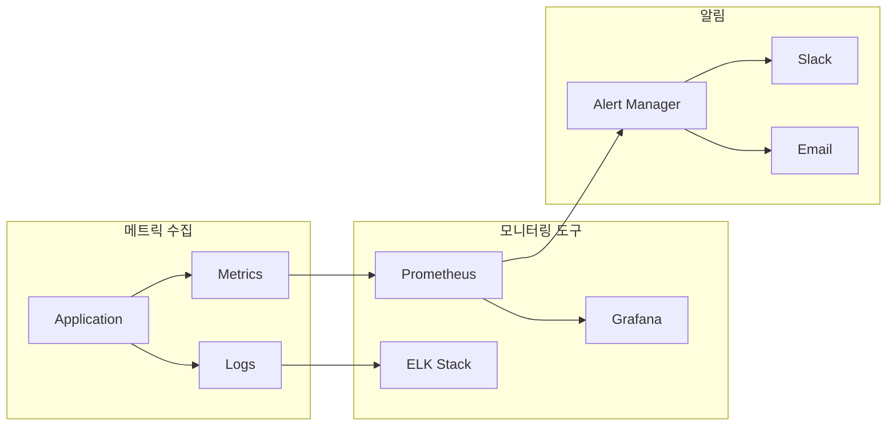

## 🔧 기술 스택 맵

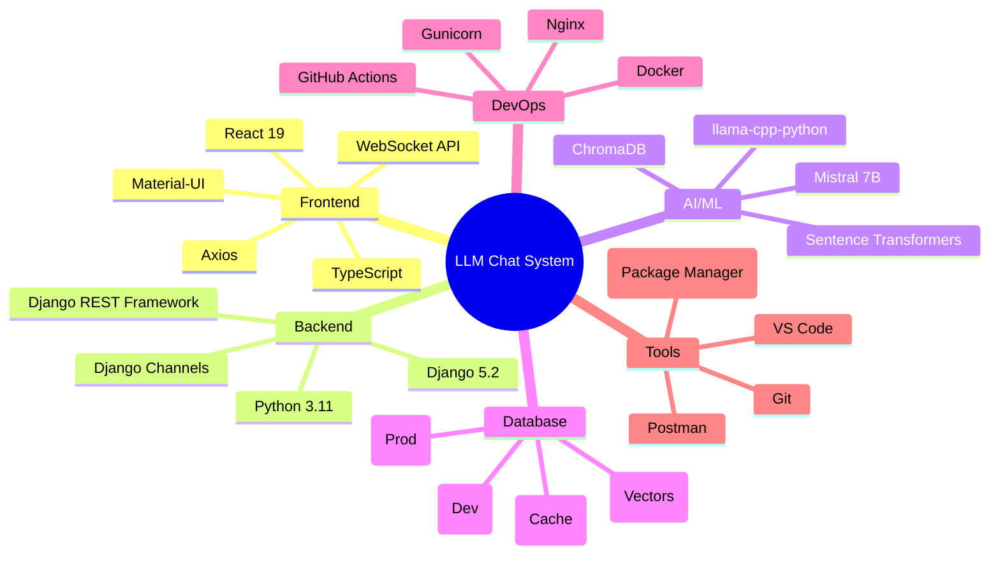

## 🎯 시스템 플로우 차트

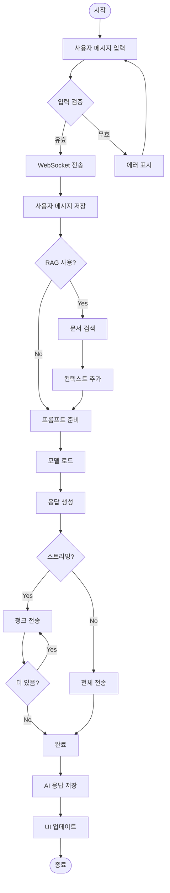

## 📱 반응형 디자인 구조

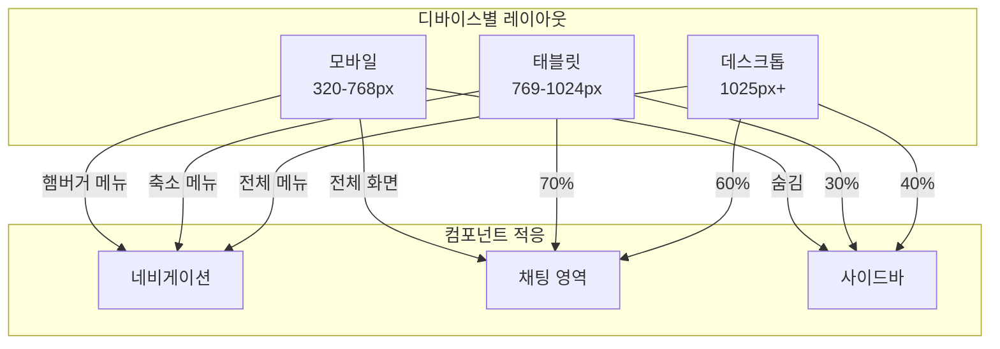

## 🔒 보안 아키텍처

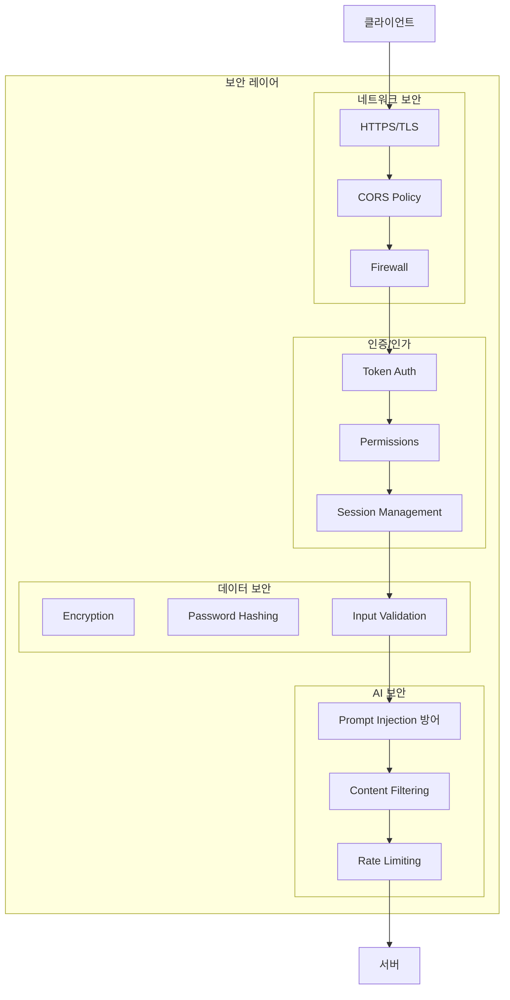

## 📚 참고 자료

### 시스템 설계
- [System Design Primer](https://github.com/donnemartin/system-design-primer)
- [웹 아키텍처 입문](https://blog.rhostem.com/posts/2018-07-22-web-architecture-101)

### 다이어그램 도구
- [Mermaid 공식 문서](https://mermaid.js.org/)
- [Draw.io](https://app.diagrams.net/)
- [Lucidchart](https://www.lucidchart.com/)

### 아키텍처 패턴
- [마이크로서비스 아키텍처](https://microservices.io/)
- [클린 아키텍처](https://blog.cleancoder.com/uncle-bob/2012/08/13/the-clean-architecture.html)

---

다음 문서: [08-실습-가이드.md](./08-실습-가이드.md) 에서 직접 코드를 수정해봐요!